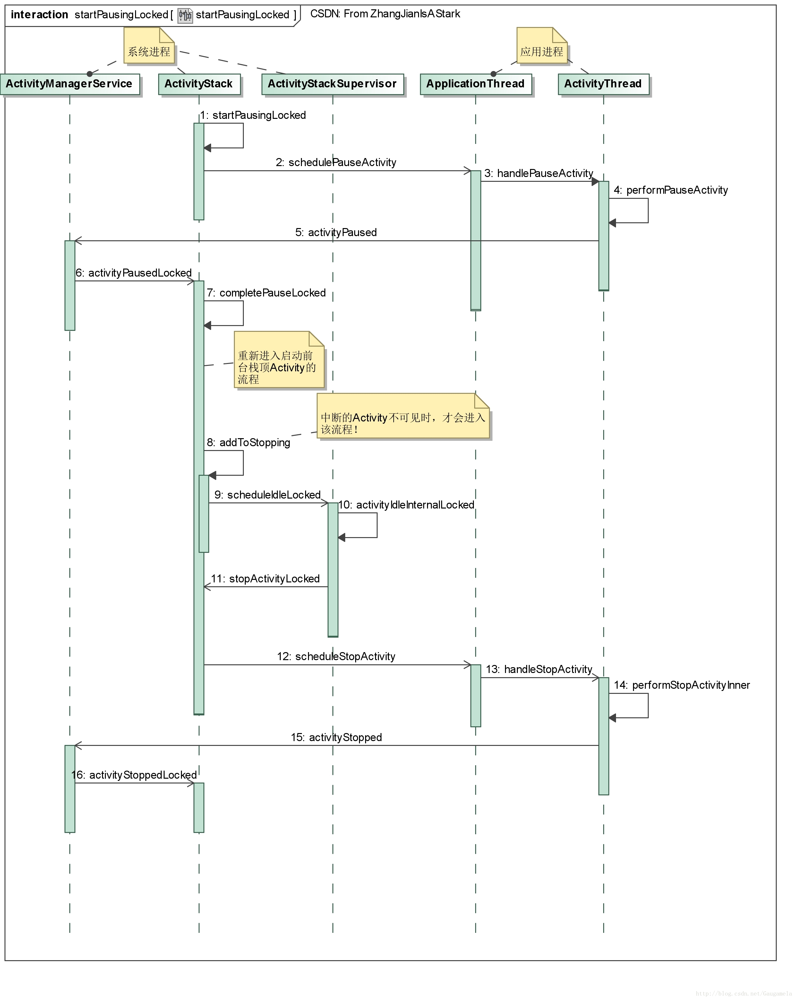

# 启动Activity的过程：三

之前的博客中提到过，在启动一个新Activity时，如果界面还存在其它的Activity，那么必须先中断其它的Activity。
因此，除了第一个启动的Home界面对应的Activity外，其它的Activity均需要进行此操作，详细过程在启动Activity的过程：一的第六部分进行了描述。

现在我们可以分析一下，这段之前略去的代码流程。

## 一、startPausingLocked函数

根据启动Activity的过程：一， 我们知道在启动Activity的过程中，当已经将Activity对应的Task移动到前台，同时将待启动的Activity放置到栈顶后，将会调用ActivityStack中的resumeTopActivityInnerLocked函数，在该函数中：
```java
private boolean resumeTopActivityInnerLocked(......) {
    ...........
    //mResumedActivity保存者当前在前台显示的Activity
    if (mResumedActivity != null) {
        .............
        //调用startPausingLocked函数，中断正在显示的Activity
        pausing |= startPausingLocked(userLeaving, false, true, dontWaitForPause);
    }
    if (pausing) {
        ..........
        return true;
    } ..........
    ............
}
```
此处，跟进一下startPausingLocked函数：
```java
//Start pausing the currently resumed activity.
final boolean startPausingLocked(boolean userLeaving, boolean uiSleeping, boolean resuming,
        boolean dontWait) {
    .................
    //mResumedActivity保存着当前正在显示的Activity
    ActivityRecord prev = mResumedActivity;
    .................
    mResumedActivity = null;
    //mPausingActivity保存准备中断的Activity
    mPausingActivity = prev;
    ................
    //更新状态
    prev.state = ActivityState.PAUSING;
    ................
    if (prev.app != null && prev.app.thread != null) {
        ................
        try {
            ............
            //通知该Activity所在的进程，调用schedulePauseActivity函数
            prev.app.thread.schedulePauseActivity(prev.appToken, prev.finishing,
                    userLeaving, prev.configChangeFlags, dontWait);
        } catch (Exception e) {
            ...............
        }
    } else {
        ..............
    }

    // If we are not going to sleep, we want to ensure the device is
    // awake until the next activity is started.
    if (!uiSleeping && !mService.isSleepingOrShuttingDownLocked()) {
        //在启动Activity的第二部分中提过
        //该WakeLock防止在Activity切换过程中，系统发生休眠
        //当Activity切换成功后，将会释放该WakeLock
        mStackSupervisor.acquireLaunchWakelock();
    }

    if (mPausingActivity != null) {
        // Have the window manager pause its key dispatching until the new
        // activity has started.  If we're pausing the activity just because
        // the screen is being turned off and the UI is sleeping, don't interrupt
        // key dispatch; the same activity will pick it up again on wakeup.
        if (!uiSleeping) {
            //暂停输入事件的派发
            prev.pauseKeyDispatchingLocked();
        } ........
        .........

        if (dontWait) {
            // If the caller said they don't want to wait for the pause, then complete
            // the pause now.
            completePauseLocked(false);
            return false;
        } else {
            // Schedule a pause timeout in case the app doesn't respond.
            // We don't give it much time because this directly impacts the
            // responsiveness seen by the user.
            Message msg = mHandler.obtainMessage(PAUSE_TIMEOUT_MSG);
            msg.obj = prev;
            prev.pauseTime = SystemClock.uptimeMillis();
            //延迟时间500ms，当这个消息被处理时，也会调用completePauseLocked函数
            mHandler.sendMessageDelayed(msg, PAUSE_TIMEOUT);
        }
    } else {
        .............
    }
}
```
容易看出，这段代码最主要的操作是与应用进程的ApplicationThread进行Binder通信，调用其schedulePauseActivity函数。
与之前的流程一样，ApplicationThread仅作为通信接口，它将发送消息触发进程的ActivityThread调用handlePauseActivity进行实际的操作。

## 二、handlePauseActivity函数
```java
private void handlePauseActivity(IBinder token, boolean finished,
        boolean userLeaving, int configChanges, boolean dontReport, int seq) {
    ActivityClientRecord r = mActivities.get(token);
    ..............
    if (r != null) {
        ..............
        r.activity.mConfigChangeFlags |= configChanges;
        //执行pause的实际操作
        performPauseActivity(token, finished, r.isPreHoneycomb(), "handlePauseActivity");
        ..............
        // Tell the activity manager we have paused.
        if (!dontReport) {
            try {
                //通知AMS
                ActivityManagerNative.getDefault().activityPaused(token);
            } catch (RemoteException ex) {
                throw ex.rethrowFromSystemServer();
            }
        }
        mSomeActivitiesChanged = true;
    }
}
```
这段代码比较简单，就是调用performPauseActivity完成中断Activity的实际工作，然后再通过Binder通信通知AMS中断完成。
我们稍微看一下performPauseActivity函数：
```java
final Bundle performPauseActivity(IBinder token, boolean finished,
        boolean saveState, String reason) {
    ActivityClientRecord r = mActivities.get(token);
    return r != null ? performPauseActivity(r, finished, saveState, reason) : null;
}

final Bundle performPauseActivity(ActivityClientRecord r, boolean finished,
        boolean saveState, String reason) {
    ................
    // Next have the activity save its current state and managed dialogs...
    if (!r.activity.mFinished && saveState) {
        //完成调用Activity的onSaveInstanceState接口等操作
        callCallActivityOnSaveInstanceState(r);
    }

    //调用Activity的onPause接口
    performPauseActivityIfNeeded(r, reason);

    // Notify any outstanding on paused listeners
    ArrayList<OnActivityPausedListener> listeners;
    synchronized (mOnPauseListeners) {
        //ActivityThread提供了对外接口registerOnActivityPausedListener
        //可以注册观察者监听某个Activity进入paused状态
        listeners = mOnPauseListeners.remove(r.activity);
    }

    int size = (listeners != null ? listeners.size() : 0);
    for (int i = 0; i < size; i++) {
        //回调
        listeners.get(i).onPaused(r.activity);
    }

    return !r.activity.mFinished && saveState ? r.state : null;
}
```
performPauseActivity整体的逻辑很清晰，就是调用Activity生命周期中对应的接口，同时通知观察者Activity paused。

现在我们将视线移回到AMS，看看定义于其中的activityPaused函数。
```java
public final void activityPaused(IBinder token) {
    final long origId = Binder.clearCallingIdentity();
    synchronized(this) {
        ActivityStack stack = ActivityRecord.getStackLocked(token);
        if (stack != null) {
            stack.activityPausedLocked(token, false);
        }
    }
    Binder.restoreCallingIdentity(origId);
}
```
从上面的代码可以看出，activityPaused的主要工作将交给ActivityStack的activityPausedLocked函数：
```java
final void activityPausedLocked(IBinder token, boolean timeout) {
    ...............
    final ActivityRecord r = isInStackLocked(token);
    if (r != null) {
        //从消息队列中移除该事件
        mHandler.removeMessages(PAUSE_TIMEOUT_MSG, r);
        if (mPausingActivity == r) {
            ..............
            completePauseLocked(true);
            return;
        } else {
            ................
        }
    }
    ...............
}
```
上述代码中的completePauseLocked函数，将负责完成本次中断Activity的剩余的工作，同时重新进入启动Activity的流程。
```java
//此处resumeNext的值为true
private void completePauseLocked(boolean resumeNext) {
    ActivityRecord prev = mPausingActivity;
    ..................
    if (prev != null) {
        final boolean wasStopping = prev.state == ActivityState.STOPPING;
        prev.state = ActivityState.PAUSED;
        if (prev.finishing) {
            ................
            //如果已经进入finishing状态，调用finishCurrentActivityLocked(本流程中，Activity还没有finishing)
            //此处参数为FINISH_AFTER_VISIBLE，仅将Activity加入到mStoppingActivities中
            prev = finishCurrentActivityLocked(prev, FINISH_AFTER_VISIBLE, false);
        } else if (prev.app != null) {
            .................
            //将Activity从等待可见的Activity中移除
            if (mStackSupervisor.mWaitingVisibleActivities.remove(prev)) {
                ...................
            }
            if (prev.deferRelaunchUntilPaused) {
                .............
            } else if (wasStopping) {
                .............
            } else if ((!prev.visible && !hasVisibleBehindActivity())
                    || mService.isSleepingOrShuttingDownLocked()) {
                // If we were visible then resumeTopActivities will release resources before
                // stopping.
                //如果Activity变为不可见时，才会进入此分支，本流程实际上不会直接进入该分支
                //但当Activity真的不见了，ActivityStack将调用makeInvisible，重新对中断Activity调用addToStopping函数
                //将暂停的Activity保存mStoppingActivities中
                addToStopping(prev, true /* immediate */);
            }
        } else {
            ..................
        }
        ..........

        //将mPausingActivity置为null
        mPausingActivity = null;
    }

    if (resumeNext) {
        final ActivityStack topStack = mStackSupervisor.getFocusedStack();
        if (!mService.isSleepingOrShuttingDownLocked()) {
            //将重新开始启动前台栈顶的Activity，由于此时mResumedActivity为null，于是进入到启动目标Activity的流程
            mStackSupervisor.resumeFocusedStackTopActivityLocked(topStack, prev, null);
        } else {
            ..............
        }
    }

    if (prev != null) {
        //将启动新的Activity，可以恢复事件分发
        prev.resumeKeyDispatchingLocked();
        ..................
    }
    ................
}
```
这部分代码的主要工作是：
- 1、若中断的Activity变为不可见时，调用addToStopping函数，将中断的Activity加入到mStoppingActivities；
- 2、将mPausingActivity置为null后，重新进入启动目标Activity的流程。

虽然本流程不会直接调用addToStopping函数，但我们还是进一步看看，中断之后的Activity变为不可见后将如何被AMS处理。

## 三、addToStopping函数
```java
//此流程中immediate的值为true
private void addToStopping(ActivityRecord r, boolean immediate) {
    if (!mStackSupervisor.mStoppingActivities.contains(r)) {
        mStackSupervisor.mStoppingActivities.add(r);
    }

    // If we already have a few activities waiting to stop, then give up
    // on things going idle and start clearing them out. Or if r is the
    // last of activity of the last task the stack will be empty and must
    // be cleared immediately.
    // 原生中MAX_STOPPING_TO_FORCE的值为3
    boolean forceIdle = mStackSupervisor.mStoppingActivities.size() > MAX_STOPPING_TO_FORCE
            || (r.frontOfTask && mTaskHistory.size() <= 1);

    if (immediate || forceIdle) {
        ............
        //ActivityStackSupervisor发送消息IDLE_NOW_MSG，最终由activityIdleInternalLocked函数处理
        mStackSupervisor.scheduleIdleLocked();
    } else {
        ................
    }
}
```
从上面的代码，可以看出启动Activity和中断Activity的最后一部均是调用activityIdleInternalLocked函数，
我们看看该函数中处理中断的Activity相关的流程：
```java
//中断Activity时，fromTimeout的值为true
final ActivityRecord activityIdleInternalLocked(final IBinder token, boolean fromTimeout,
        Configuration config) {
    ...............
    ActivityRecord r = ActivityRecord.forTokenLocked(token);
    if (r != null) {
        .........
        if (fromTimeout) {
            //该函数中也会调用mService.notifyAll()，因此会唤醒等待Activity启动的ActivityStarter
            //但ActivityStarter会检测到目标Activity还未可见，因此会重新进入等待状态
            reportActivityLaunchedLocked(fromTimeout, r, -1, -1);
        }
        .........
    }
    .........
    // Atomically retrieve all of the other things to do.
    final ArrayList<ActivityRecord> stops = processStoppingActivitiesLocked(true);
    NS = stops != null ? stops.size() : 0;
    ..........
    // Stop any activities that are scheduled to do so but have been
    // waiting for the next one to start.
    for (int i = 0; i < NS; i++) {
        r = stops.get(i);
        final ActivityStack stack = r.task.stack;
        if (stack != null) {
            if (r.finishing) {
                stack.finishCurrentActivityLocked(r, ActivityStack.FINISH_IMMEDIATELY, false);
            } else {
                //调用ActivityStack的stopActivityLocked函数
                stack.stopActivityLocked(r);
            }
        }
    }
    //AMS处理无用的进程等
    ...............
}
```
跟进一下ActivityStack的stopActivityLocked函数：
```java
final void stopActivityLocked(ActivityRecord r) {
    ..............
    //如果Activity携带了FLAG_ACTIVITY_NO_HISTORY，那么当这个Activity结束时，将从Task中被移除掉
    if ((r.intent.getFlags()&Intent.FLAG_ACTIVITY_NO_HISTORY) != 0
            || (r.info.flags&ActivityInfo.FLAG_NO_HISTORY) != 0) {
        if (!r.finishing) {
            if (!mService.isSleepingLocked()) {
                ...........
                //将destroy该Activity
                if (requestFinishActivityLocked(r.appToken, Activity.RESULT_CANCELED, null,
                        "stop-no-history", false)) {
                    ...............
                }
            } else {
                ..........
            }
        }
    }


    if (r.app != null && r.app.thread != null) {
        ...........
        try {
            ...................
            r.stopped = false;
            //状态更新为stopping
            r.state = ActivityState.STOPPING;
            ...................
            //调用ApplicationThread的scheduleStopActivity接口
            //将由ActivityThread的handleStopActivity函数进行实际的操作
            r.app.thread.scheduleStopActivity(r.appToken, r.visible, r.configChangeFlags);
            .............
            //发送超时信息，处理该消息时，将调用activityStoppedLocked函数
            Message msg = mHandler.obtainMessage(STOP_TIMEOUT_MSG, r);
            mHandler.sendMessageDelayed(msg, STOP_TIMEOUT);
        } catch (Exception e) {
            .......
        }
    }
}
```
这一部分最终还是需要依赖于进程的ActivityThread的handleStopActivity函数：
```java
private void handleStopActivity(IBinder token, boolean show, int configChanges, int seq) {
    ActivityClientRecord r = mActivities.get(token);
    .............
    //StopInfo是一个Runnable对象
    StopInfo info = new StopInfo();
    //调用Activity的onStop等接口
    performStopActivityInner(r, info, show, true, "handleStopActivity");
    .............
    //更新可见性
    updateVisibility(r, show);
    .............
    //StopInfo的run函数将被调用
    mH.post(info);
    mSomeActivitiesChanged = true;
}

private static class StopInfo implements Runnable {
    ............
    @Override public void run() {
        // Tell activity manager we have been stopped.
        try {
            ..........
            //通知AMS进行扫尾工作
            ActivityManagerNative.getDefault().activityStopped(
                    activity.token, state, persistentState, description);
        } catch (RemoteException ex) {
            ..........
        }
    }
}
```
最后看一下AMS的activityStopped函数：
```java
public final void activityStopped(.....) {
    ...........
    synchronized (this) {
        ActivityRecord r = ActivityRecord.isInStackLocked(token);
        if (r != null) {
            //调用ActivityStack的activityStoppedLocked函数
            r.task.stack.activityStoppedLocked(r, icicle, persistentState, description);
        }
    }

    //移除无用进程
    trimApplications();
    ...........
}
```
跟进ActivityStack的activityStoppedLocked函数：
```java
final void activityStoppedLocked(........) {
    ........
    if (!r.stopped) {
        ............
        mHandler.removeMessages(STOP_TIMEOUT_MSG, r);
        r.stopped = true;
        //变为stopped状态
        r.state = ActivityState.STOPPED;
        ............
    }
}
```
由此可见，当中断的Activity变为完全不可见后，它的onStop函数才会被调用。

## 四、总结



startPausingLocked的分析告一段落，这部分内容在了解整个Activity的启动流程后，还是比较好理解的。
主要就是调用前一个Activity的onPause等接口，使其处于中断状态，然后再进入到启动新Activity的流程中。
此外，当被中断的Activity变为完全不可见，将调用其onStop接口。
