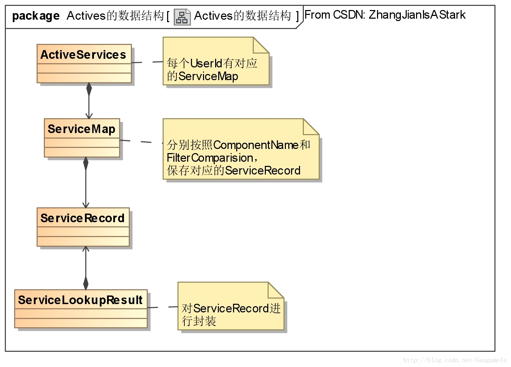
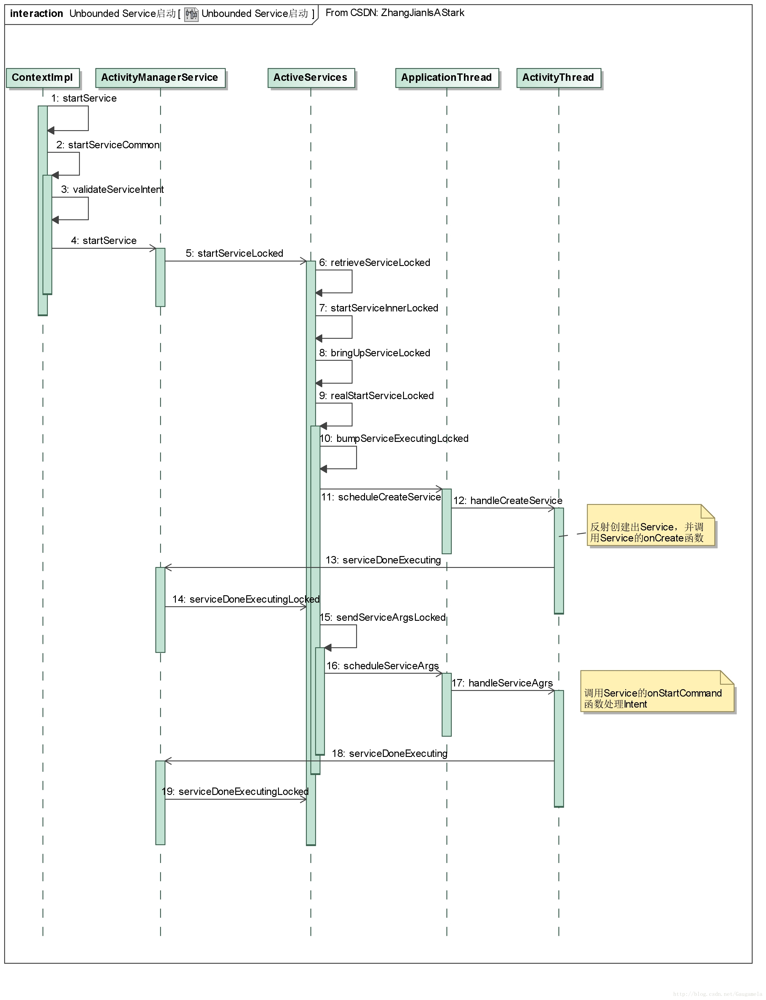
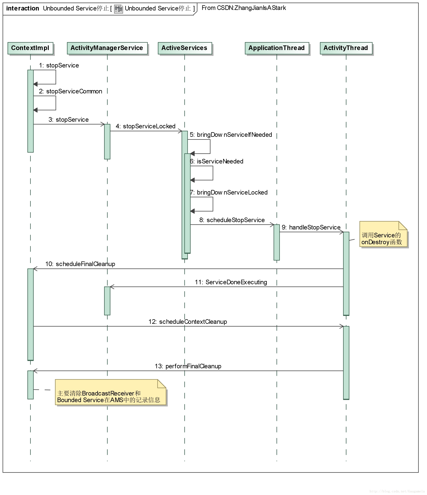
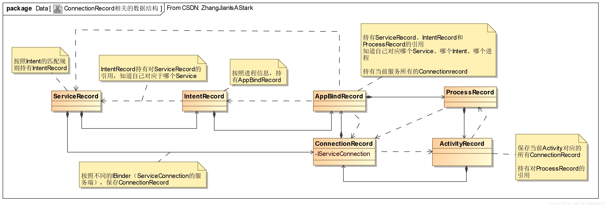
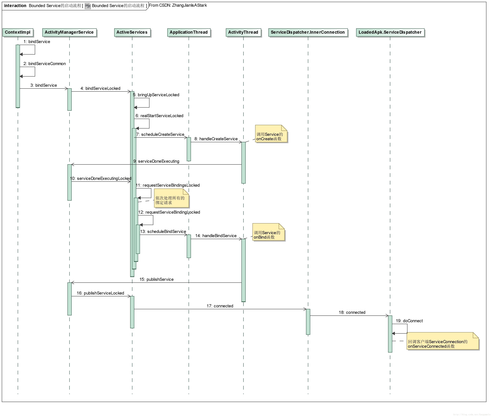
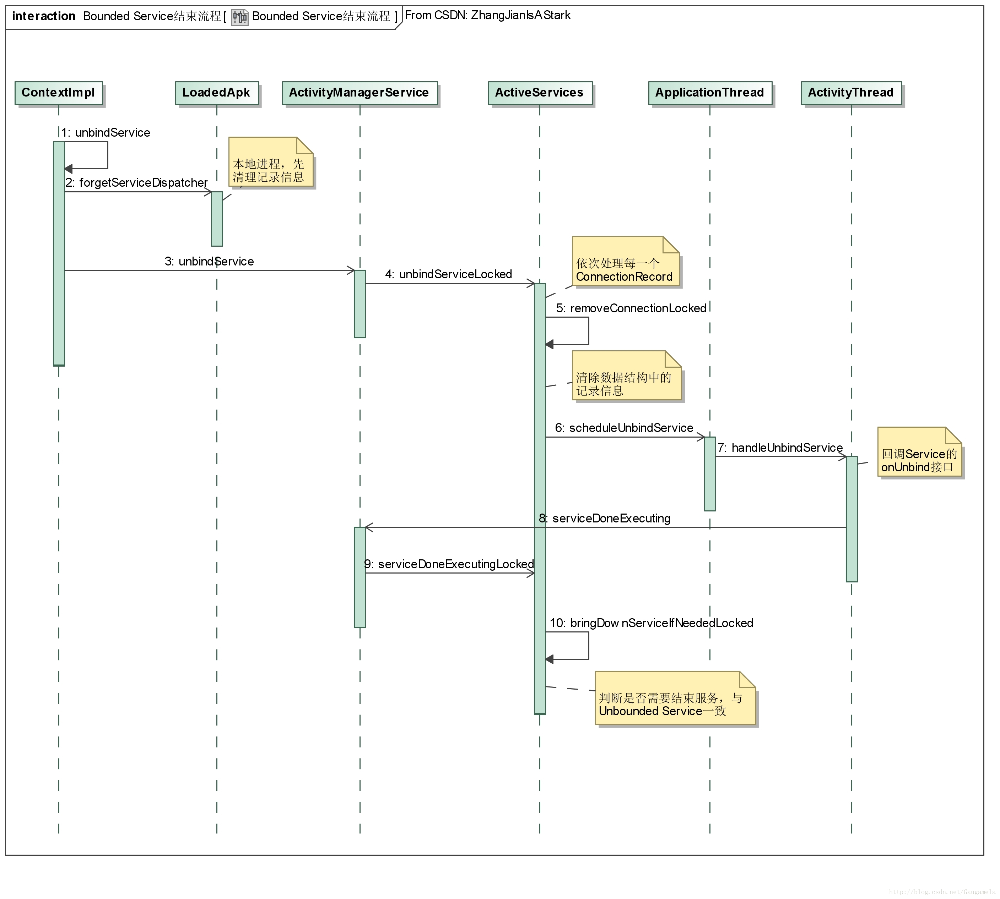

# Service 流程分析

## 一、基础知识
Service通常被称之为“后台服务”，具体是指其本身的运行并不依赖于用户可视的UI界面。
例如：点击界面的音乐播放键，由Service进行实际的音乐播放工作。即使用户离开此界面，音乐仍能够继续播放。

不过Service与Activity等相同，都是运行于当前进程的主线程中。
因此一些耗时操作一般并没有放在Service中进行，而是在Service中启动一个工作线程来进行实际的操作。

### 1 Service的注册
在定义Service时，需要在AndroidManifest.xml中进行声明。
只有这样，PKMS在初始化时，才能通过解析AndroidManifest.xml，得到该Service的信息。
在客户端实际使用Service时，将申请服务的请求发往AMS，后者将通过PKMS提供的信息，检索到具体的Service。

Service在AndroidManifest.xml中的声明，语法格式如下所示：
```xml
<service android:enabled=["true" | "false"]
    android:exported[="true" | "false"]
    android:icon="drawable resource"
    android:label="string resource"
    android:name="string"
    android:permission="string"
    android:process="string">
    <intent-filter >
        <action android:name="com.android.server.TestService.TestAction" />
    </intent-filter>
</service>
```
可以看出，Service相关的标签，与android中其它组件基本相同，此处不作赘述。

### 2 启动方式
一般而言，从Service的启动方式上，可以将Service分为Unbounded Service和Bounded Service。

#### 2.1 Unbounded Service
Unbounded Service是指：客户端调用ContextImpl的startService等函数启动的Service。
这种启动方式的核心代码片段如下：
```java
..............
Intent serviceIntent = new Intent(mContext, TestService.class);
serviceIntent.putExtra("Args", mArgs);
mContext.startService(serviceIntent);
..............
```
从上面的代码可以看出，客户端组件通过调用startService函数，向Service端发送一个Intent，该Intent中可以携带具体的业务请求信息。
Service启动后，会根据Intent中的请求，执行实际的业务。

通常情况下，Service启动、处理完请求后，并不会返回启动结果（除非在业务逻辑中主动进行通知）。
即使启动Service的应用组件已经被销毁了，服务将一直在后台运行。

因此，当客户端不再需要使用Service的服务时，需要主动调用ContextImpl的stopService函数。
此外，从在Service内部，也可以在执行完具体的业务后，通过stopSelf函数停止其本身。

Unbounded Service的基本实现方式如下所示：
```java
public class TestService extends Service {
    @Override
    public IBinder onBind(Intent intent) {
        return null;
    }

    @Override
    public void onCreate() {
        super.onCreate();
        ...........
    }

    @Override
    public int onStartCommand(Intent intent, int flags, int startId) {
        super.onStartCommand(intent, flags, startId);
        ..............
        return START_STICKY;
    }

     @Override
     public void onDestroy() {
         super.onDestroy();
        ..........
    }
}
```

其中，onBind函数是Service基类中的唯一抽象方法，子类必须实现。对于Unbounded Service而言，此函数直接返回 null 即可。
onCreate、onStartCommand和onDestroy都是Unbounded Service相应生命周期阶段的回调函数。

当客户端调用startService启动服务时，AMS收到请求信息后，将判断对应Service是否启动过。
如果Service还未启动，将首先回调Service的onCreate函数，然后再执行onStartCommand函数。
当客户端再次调用startService时，AMS判断Service已经启动，将只调用Service的onStartCommand函数。

在Service的onStartCommand函数中，将根据Intent的信息进行实际的业务处理。
注意到onStartCommand函数会返回一个Int型的值，该值与系统的进程管理有关，主要的取值范围如下：
- START_STICKY：

当Service因为内存不足而被系统kill后，在接下来的某个时间内，当系统内存足够可用的情况下，系统将会尝试重新创建此Service；
一旦创建成功后，将回调onStartCommand方法，但一般情况下，参数中的Intent将是null。

- START_NOT_STICKY：

当Service因为内存不足而被系统kill后，在接下来的某个时间内，即使系统内存足够可用，系统也不会尝试重新创建此Service。

- START_REDELIVER_INTENT：

与START_STICKY相同，当Service因为内存不足而被系统kill后，在接下来的某个时间内，当系统内存足够可用的情况下，系统将会尝试重新创建此Service；唯一不同的是，Service创建成功后，回调onStartCommand方法时，传入的参数将是最后一次调用startService时使用的intent。

需要注意的是，只有系统kill掉Service时上述返回值才有意义，如果是人为地kill掉Service进程，系统不会按照onStartCommand的返回值重启Service。

最后，客户端无论调用多少次startService，只需要一次stopService即可将此Service终止（毕竟onCreate函数也之调用过一次），此时AMS将回调Service的onDestroy函数。

#### 2.2 Bounded Service
Bounded Service一般使用过程如下：
- 1、服务端定义继承于基类Service的服务，并重写其onBind方法。

在此方法中，需要返回具体的Binder对象供客户端使用。

- 2、客户端通过实现ServiceConnection接口，自定义ServiceConnection对象，

在其中实现onServiceConnected函数，用于回调获取服务端提供的Binder对象。
同时，客户端也可以选择性地实现onServiceDisconnected接口，以便在与Service解绑时执行一些操作。

- 3、客户端调用bindService函数与Service端绑定，该函数的参数中包含服务对应的Intent和自定义的ServiceConnection对象。

与Unbounded Service一样，若Service未启动，AMS将负责启动Service，然后才会调用Service的onBind方法，得到服务端返回Binder对象。
一旦得到Binder对象后，AMS将回调ServiceConnection中实现的onServiceConnected函数，将Binder对象返回给客户端。

- 4、客户端得到Binder对象后，就可以通过Binder对象调用Service提供的公有函数，完成实际的业务请求。

Service端收到业务请求后，就可以执行对应的处理。

- 5、当客户端不再需要使用服务时，就需要通过调用unbindService函数，解除与Service的绑定。

若客户端实现了ServiceConnection的onServiceDisconnected接口，那么与Service解绑后，onServiceDisconnected将被AMS回调。

网上使用Bounded Service的代码示例较多，此处就不再具体给出，可以参考这篇博客Android总结篇系列：Android Service。
我们仅看看源码中的使用方式，例如在packages/services/mms/src/com/android/mms/service/SendRequest.java中：
```java
/**
* Sends the MMS through through the carrier app.
*/
private final class CarrierSendManager extends CarrierMessagingServiceManager {
    ........
    void sendMms(Context context, String carrierMessagingServicePackage,
            CarrierSendCompleteCallback carrierSendCompleteCallback) {
        mCarrierSendCompleteCallback = carrierSendCompleteCallback;
        //调用父类CarrierMessagingServiceManager的bindToCarrierMessagingService函数
        if (bindToCarrierMessagingService(context, carrierMessagingServicePackage)) {
            .............
        } else {
            ..............
        }
    }
}
```
看看bindToCarrierMessagingService函数：
```java
public boolean bindToCarrierMessagingService(Context context, String carrierPackageName) {
    .........
    //显示指定服务的action和package
    Intent intent = new Intent(CarrierMessagingService.SERVICE_INTERFACE);
    intent.setPackage(carrierPackageName);
    //客户端定义自己的ServiceConnection
    mCarrierMessagingServiceConnection = new CarrierMessagingServiceConnection();

    //作为客户段绑定服务端
    return context.bindService(intent, mCarrierMessagingServiceConnection,
            Context.BIND_AUTO_CREATE);
}
```

根据IntentAMS将绑定CarrierMessagingService，其onBind函数如下：
```java
public @Nullable IBinder onBind(@NonNull Intent intent) {
    if (!SERVICE_INTERFACE.equals(intent.getAction())) {
        return null;
    }
    //mWrapper的类型为ICarrierMessagingWrapper，继承ICarrierMessagingService.Stub
    //即以AIDL的方式返回Binder对象
    return mWrapper;
}
```

最后看看客户端CarrierMessagingServiceConnection的onServiceConnected函数：
```java
public void onServiceConnected(ComponentName name, IBinder service) {
    //按照AIDL的规则，得到Binder对象
    //之后，客户端就可以按照AIDL定义的接口，调用服务端的接口
    onServiceReady(ICarrierMessagingService.Stub.asInterface(service));
}
```

### 3 生命周期
这里写图片描述


两种Service生命周期对应的回调函数，可以用上面这张比较经典的图来表示，其中：
- Unbounded Service回调函数的顺序依次为：onCreate、onStartCommand、onDestroy；
- Bounded Service回调函数的顺序依次为：onCreate、onBind、onUnbind、onDestroy。

后文分析源码时，可以看到具体的调用过程，此处不做赘述。

### 4 显示启动和隐式启动
最后谈一下Service的显示启动和隐式启动。

#### 4.1 显示启动

显示启动是指：
  客户端将service的具体名称写入到Intent中，此时AMS就可以直接根据名称来找到对应的service。

代码示例：
```java
//1、startService显示启动服务
...........
Intent startIntent = new Intent();
ComponentName componentName = new ComponentName(
        "com.android.server",
        "com.android.server.TestService");
startIntent.setComponent(componentName);
mContext.startService(startIntent);
............
```
可以看到显示启动服务，就是在Intent中指定ComponentName。
ComponentName由具体的包名和类名组成。

如果启动的service与当前组件在同一个包内，也可以使用下述方式显示启动service：
```java
//2、startService显示启动同一个包中的服务
...........
Intent startIntent = new Intent(mContext, TestService.class);
mContext.startService(startIntent);
............
```
同样，bindService也可以显示启动服务，对应的写法如下：

```java
//3、bindService显示启动服务
............
Intent bindIntent = new Intent();
ComponentName componentName = new ComponentName(
        "com.android.server",
        "com.android.server.TestService");
bindIntent.setComponent(componentName);
mContext.bindService(bindIntent, mConnection, Context.BIND_AUTO_CREATE);
............
```

#### 4.2 隐式启动

隐示启动是指：
  客户端通过在intent中添加service申明的Action，此时AMS通过Action来匹配具体的service。
这种启动方式要求，service在定义Action时，要尽可能的和其它服务区分开来。
通常来说，Action将被命名为具体包名、类名和Action名的组合。

代码示例：
```java
............
Intent startIntent = new Intent();
startIntent.setAction("com.android.server.TestService.TestAction");
mContext.startService(startIntent);
............
```
需要注意的是：Android 5.0以后，只能以显示方式来启动Service，隐式启动服务将抛出异常。

接下来，我们分析一下这两种类型的服务对应的源码流程。

## 二、Unbounded Service的启动流程

### 1 ContextImpl中的startService

我们从ContextImpl中的startService函数入手，看看Unbounded Service的启动流程。
```java
public ComponentName startService(Intent service) {
    .............
    return startServiceCommon(service, mUser);
}

private ComponentName startServiceCommon(Intent service, UserHandle user) {
    try {
        //判断Intent中是否符合要求
        validateServiceIntent(service);

        //Intent可能跨进程传输，因此先要做一下安全性检查
        service.prepareToLeaveProcess(this);

        //通过AMS的接口拉起服务
        ComponentName cn = ActivityManagerNative.getDefault().startService(
                mMainThread.getApplicationThread(), service, service.resolveTypeIfNeeded(
                        getContentResolver()), getOpPackageName(), user.getIdentifier());
        ...............
        return cn;
    } catch (RemoteException e) {
        ................
    }
}
```

从上面的代码可以看出，拉起服务还是要依赖于AMS的接口。
在这里，我们进一步看看validateServiceIntent函数：
```java
private void validateServiceIntent(Intent service) {
    //Intent中既没有指定Component，也没有指定Package，即以隐式启动的方式拉起服务
    if (service.getComponent() == null && service.getPackage() == null) {
        //当版本大于Android L，即Android 5.0时，会抛出异常
        if (getApplicationInfo().targetSdkVersion >= Build.VERSION_CODES.LOLLIPOP) {
            IllegalArgumentException ex = new IllegalArgumentException(
                    "Service Intent must be explicit: " + service);
            throw ex;
        } else {
            //低版本只是打印log而已
            Log.w(TAG, "Implicit intents with startService are not safe: " + service
                    + " " + Debug.getCallers(2, 3));
        }
    }
}
```
validateServiceIntent就是上文提到的，Android 5.0后不再支持隐式启动Service的原因。

### 2 AMS中的startService
接下来，我们看看AMS中的startService函数：
```java
public ComponentName startService(IApplicationThread caller, Intent service,
        String resolvedType, String callingPackage, int userId)
        throws TransactionTooLargeException {
    //参数有效性检查
    .................
    synchronized(this) {
        ..........
        //mServices在AMS初始化时得到，类型为ActiveServices
        ComponentName res = mServices.startServiceLocked(caller, service,
                resolvedType, callingPid, callingUid, callingPackage, userId);
        ..........
        return res;
    }
}
```

#### 2.1 ActiveServices中的startServiceLocked

ActiveServices在AMS初始化时创建，用于管理AMS启动的Service。
上述代码进行参数有效性检查后，将调用ActiveServices的startServiceLocked函数。

我们分段看看startServiceLocked函数：

##### 2.1.1 startServiceLocked Part-I
```java
ComponentName startServiceLocked(IApplicationThread caller, Intent service, String resolvedType,
        int callingPid, int callingUid, String callingPackage, final int userId)
        throws TransactionTooLargeException {
    ................
    final boolean callerFg;
    if (caller != null) {
        //通过AMS得到调用方的进程信息
        final ProcessRecord callerApp = mAm.getRecordForAppLocked(caller);
        ................
        //判断调用方是否属于前台进程
        callerFg = callerApp.setSchedGroup != ProcessList.SCHED_GROUP_BACKGROUND;
    } else {
        callerFg = true;
    }

    //检索待启动的Service
    ServiceLookupResult res =
            retrieveServiceLocked(service, resolvedType, callingPackage,
                    callingPid, callingUid, userId, true, callerFg, false);
    ..................
    //从ServiceLookupResult中取出ServiceRecord
    ServiceRecord r = res.record;
    .................
```

startServiceLocked函数的第一部分，主要是利用参数信息检索出待启动的Service，这部分工作主要由retrieveServiceLocked函数完成。
由于retrieveServiceLocked使用的频率较高（后文还会遇到），同时涉及到ActivesService管理Service的一些数据结构，
因此这里深入分析一下该函数：
```java
private ServiceLookupResult retrieveServiceLocked(.......) {
    ServiceRecord r = null;
    ..........
    //得到当前用户的UserId
    userId = mAm.mUserController.handleIncomingUser(callingPid, callingUid, userId, false,
            ActivityManagerService.ALLOW_NON_FULL_IN_PROFILE, "service", null);

    //每个UserId有对应的ServiceMap，统一保存在ActiveServices中
    ServiceMap smap = getServiceMap(userId);

    //对于显示启动
    final ComponentName comp = service.getComponent();
    if (comp != null) {
        //根据ComponentName从ServiceMap中取出对应的ServiceRecord
        r = smap.mServicesByName.get(comp);
    }

    //对于隐式启动
    if (r == null && !isBindExternal) {
        Intent.FilterComparison filter = new Intent.FilterComparison(service);
        //根据Intent对应的Filter，从ServiceMap中取出匹配的ServiceRecord
        r = smap.mServicesByIntent.get(filter);
    }

    //特殊情况的处理
    //对于包含FLAG_EXTERNAL_SERVICE的service，将运行于调用方进程中
    //对于这种特殊服务，
    //如果根据Component或Filter找到了一个正在运行的Service，但其运行进程与当前调用进程不一致
    //那么必须重新在调用进程中创建该ServiceRecord，于是将r置为null
    if (r != null && (r.serviceInfo.flags & ServiceInfo.FLAG_EXTERNAL_SERVICE) != 0
            && !callingPackage.equals(r.packageName)) {
        // If an external service is running within its own package, other packages
        // should not bind to that instance.
        r = null;
    }

    //以上均是在缓存信息中，查找ServiceRecord
    //如果查询不到，则必须通过PKMS进行查找
    if (r == null) {
        try {
            //PKMS根据参数得到对应Pkg中Serivce的ResolveInfo
            ResolveInfo rInfo = AppGlobals.getPackageManager().resolveService(service,
                    resolvedType, ActivityManagerService.STOCK_PM_FLAGS
                            | PackageManager.MATCH_DEBUG_TRIAGED_MISSING,
                    userId);

            //从ResolveInfo中取出ServiceInfo
            ServiceInfo sInfo =
                    rInfo != null ? rInfo.serviceInfo : null;

            //构造出Service对应的ComponentName
            ComponentName name = new ComponentName(
                    sInfo.applicationInfo.packageName, sInfo.name);

            //特殊情况处理
            if ((sInfo.flags & ServiceInfo.FLAG_EXTERNAL_SERVICE) != 0) {
                if (isBindExternal) {
                    ..............
                    // Run the service under the calling package's application.
                    //FLAG_EXTERNAL_SERVICE将运行在调用方进程中，此处就是修改PKMS检索出的ServiceInfo
                    //先得到调用方的应用信息
                    ApplicationInfo aInfo = AppGlobals.getPackageManager().getApplicationInfo(
                            callingPackage, ActivityManagerService.STOCK_PM_FLAGS, userId);
                    ............
                    //将ServiceInfo中的信息，改为调用方应用的信息
                    sInfo = new ServiceInfo(sInfo);
                    sInfo.applicationInfo = new ApplicationInfo(sInfo.applicationInfo);
                    sInfo.applicationInfo.packageName = aInfo.packageName;
                    sInfo.applicationInfo.uid = aInfo.uid;
                    name = new ComponentName(aInfo.packageName, name.getClassName());
                    service.setComponent(name);
                } else {
                    //抛出异常
                    .....
                }
            } else if(isBindExternal) {
                //抛出异常
                ............
            }

            //多用户的处理
            if (userId > 0) {
                //检查服务是否为单例且可被调用的
                if (mAm.isSingleton(sInfo.processName, sInfo.applicationInfo,
                        sInfo.name, sInfo.flags)
                        && mAm.isValidSingletonCall(callingUid, sInfo.applicationInfo.uid)) {
                    //对于多用户而言，每个用户启动的服务，运行于对应用户所在进程组中
                    //但如果待启动服务为单例的，那么该服务还是得运行在系统用户的进程组中
                    //于是此次将userId置为0
                    userId = 0;

                    //ServiceMap都被调整为系统用户对应的
                    smap = getServiceMap(0);
                }
                sInfo = new ServiceInfo(sInfo);
                //此处使用了userId
                sInfo.applicationInfo = mAm.getAppInfoForUser(sInfo.applicationInfo, userId);
            }

            r = smap.mServicesByName.get(name);
            if (r == null && createIfNeeded) {
                ..............
                //创建出对应的ServiceRecord
                r = new ServiceRecord(mAm, ss, name, filter, sInfo, callingFromFg, res);
                ..............
                //保存到ServiceMap中
                smap.mServicesByName.put(name, r);
                smap.mServicesByIntent.put(filter, r);
            }
        } catch(RemoteException ex) {
            ...........
        }
    }

    if (r != null) {
        //进行一些权限检查和有效性检查
        .................

        //没有问题时，返回正常结果
        return new ServiceLookupResult(r, null);
    }
    return null;
}
```

retrieveServiceLocked函数看起来比较长，但逻辑还是比较清晰的，最主要的步骤是：
- 1、从ActiveServices保存的一些服务对应的记录信息中，找出ServiceRecord；
- 2、如果没有找到ServiceRecord，就通过PKMS找出对应的Service信息，然后重新构建出ServiceRecord；
- 3、将ServiceRecord保存到ActiveServices的数据结构中。

其中，由于考虑到了带有FLAG_EXTERNAL_SERVICE的Service及单例Service的情况，

因此单独进行了处理，在了解整体逻辑后，单独看这些特殊处理还是比较好理解的。

ActiveServices中，保存ServiceRecord涉及的数据结构主要如下图所示：



##### 2.1.2 startServiceLocked Part-II

接下来我们继续看看startServiceLocked下一部分的内容：
```java
    //进行一些检查工作
    .............

    //如果这个服务在重启列表中，清空对应的信息
    if (unscheduleServiceRestartLocked(r, callingUid, false)) {
        .................
    }

    r.lastActivity = SystemClock.uptimeMillis();
    r.startRequested = true;
    r.delayedStop = false;

    //startService可以多次向Service传递信息，每次的信息都是一个StartItem，对应着一个StartId
    r.pendingStarts.add(new ServiceRecord.StartItem(r, false, r.makeNextStartId(),
            service, neededGrants))；
    ............
    //addToStarting决定是否将待启动的Service
    //加入到ActiveServices维护的mStartingBackground队列
    boolean addToStarting = false;

    //如果启动服务的不是前台进程
    //同时服务对应的ServiceRecord中没有记录对应进程的信息（即初次使用）
    if (!callerFg && r.app == null
            //并且user已经启动过其它进程
            && mAm.mUserController.hasStartedUserState(r.userId)) {

        //通过AMS查询Service对应的进程信息
        ProcessRecord proc = mAm.getProcessRecordLocked(r.processName, r.appInfo.uid, false);

        //若Service对应的进程未启动，或优先级过低，则有可能需要延迟启动服务
        if (proc == null || proc.curProcState > ActivityManager.PROCESS_STATE_RECEIVER) {
            // If this is not coming from a foreground caller, then we may want
            // to delay the start if there are already other background services
            // that are starting. This is to avoid process start spam when lots
            // of applications are all handling things like connectivity broadcasts.
            .....................
            if (r.delayed) {
                // This service is already scheduled for a delayed start; just leave
                // it still waiting.
                return r.name;
            }

            //若当前用户启动的后台服务数量过多，则延迟启动服务
            if (smap.mStartingBackground.size() >= mMaxStartingBackground) {
                ................
                smap.mDelayedStartList.add(r);
                r.delayed = true;
                return r.name;
            }
            ..............
            addToStarting = true;
        } else if (proc.curProcState >= ActivityManager.PROCESS_STATE_SERVICE) {
            addToStarting = true;
            ................
        } ..........
        ............
    } ............
    ...............
    return startServiceInnerLocked(smap, service, r, callerFg, addToStarting);
}
```

上面这段代码主要是：判断当前Service是否需要延迟启动。
若需要延迟启动，则将ServiceRecord保存到smap中的mDelayedStartList中，并结束本启动流程；
否则，调用startServiceInnerLocked函数，进入启动Service的下一个阶段。

#### 2.2 ActiveServices中的startServiceInnerLocked
接下来，我们看看startServiceInnerLocked函数对应的流程：
```java
ComponentName startServiceInnerLocked(ServiceMap smap, Intent service, ServiceRecord r,
        boolean callerFg, boolean addToStarting) throws TransactionTooLargeException {
    ServiceState stracker = r.getTracker();
    if (stracker != null) {
        //更新ServiceRecord的ServiceState
        stracker.setStarted(true, mAm.mProcessStats.getMemFactorLocked(), r.lastActivity);
    }
    r.callStart = false;
    ..................
    //主要工作通过bringUpServiceLocked函数完成
    String error = bringUpServiceLocked(r, service.getFlags(), callerFg, false, false);
    ..................
    //上文提到的，后台进程启动的service才有可能将addToStarting置为true
    if (r.startRequested && addToStarting) {
        boolean first = smap.mStartingBackground.size() == 0;

        //将ServiceRecord加入到smap中的mStartingBackground中
        smap.mStartingBackground.add(r);

        //设置启动Service的超时时间
        r.startingBgTimeout = SystemClock.uptimeMillis() + BG_START_TIMEOUT;
        .............
        if (first) {
            //first为true，说明之前mStartingBackground中的Service处理完毕
            //调用smap的rescheduleDelayedStarts函数
            smap.rescheduleDelayedStarts();
        }
    } else if (callerFg) {
        //若当前Service被后台进程启动过，现在重新被前台进程启动
        //则将其从mStartingBackground中移除，并调用rescheduleDelayedStarts函数（后台服务少了一个，故可能可以继续处理等待的延迟服务）
        //若mDelayedStartList存在该服务的记录，移除对应的信息
        smap.ensureNotStartingBackground(r);
    }

    return r.name;
}
```

从上面的代码可以看出，启动Service的流程中，接下来的工作主要将由bringUpServiceLocked函数来完成。
在进一步分析bringUpServiceLocked函数前，我们先来看看ActiveServices内部类ServiceMap中的rescheduleDelayedStarts函数。
这个函数遇见的频率比较高，值得深入分析一下：
```java
void rescheduleDelayedStarts() {
    //前面的注释已经提到过，后台进程启动Service超时会发送MSG_BG_START_TIMEOUT消息
    //该消息被处理时，也会调用rescheduleDelayedStarts函数
    //因此，进入该函数时，先移除掉该信息
    removeMessages(MSG_BG_START_TIMEOUT);

    final long now = SystemClock.uptimeMillis();
    for (int i=0, N=mStartingBackground.size(); i<N; i++) {
        ServiceRecord r = mStartingBackground.get(i);

        //将超时的Service从mStartingBackground中移除
        if (r.startingBgTimeout <= now) {
            Slog.i(TAG, "Waited long enough for: " + r);
            mStartingBackground.remove(i);
            N--;
            i--;
        }
    }

    //存在延迟Service，同时后台Service较少时
    while (mDelayedStartList.size() > 0
            && mStartingBackground.size() < mMaxStartingBackground) {
        ServiceRecord r = mDelayedStartList.remove(0);
        .................
        r.delayed = false;
        try {
            //启动延迟Service，启动后会修改mStartingBackground.size
            startServiceInnerLocked(this, r.pendingStarts.get(0).intent, r, false, true);
        } catch (TransactionTooLargeException e) {
            ..........
        }

        if (mStartingBackground.size() > 0) {
            ServiceRecord next = mStartingBackground.get(0);
            //决定延迟发送消息的时间
            long when = next.startingBgTimeout > now ? next.startingBgTimeout : now;
            ................
            Message msg = obtainMessage(MSG_BG_START_TIMEOUT);
            //一旦超时，就会发送MSG_BG_START_TIMEOUT
            sendMessageAtTime(msg, when);
        }
        .....................
    }
}
```

rescheduleDelayedStarts的流程还是比较好理解的，主要工作其实就是两个：
- 1、判断mStartingBackground中启动的Service是否超时
- 2、判断能否启动mDelayedStartList中，被延迟启动的服务。

#### 2.3 ActiveServices中的bringUpServiceLocked
现在我们回过头来，继续跟进启动Service接下来的流程，即bringUpServiceLocked函数：
```java
private String bringUpServiceLocked(ServiceRecord r, int intentFlags, boolean execInFg,
        boolean whileRestarting, boolean permissionsReviewRequired)
        throws TransactionTooLargeException {
    ....................

    //处理Service已经启动的情况
    //此时只是发送新的StartItem
    if (r.app != null && r.app.thread != null) {
        //将调用sendServiceArgsLocked函数，后文会遇到
        sendServiceArgsLocked(r, execInFg, false);
        return null;
    }

    if (!whileRestarting && r.restartDelay > 0) {
        // If waiting for a restart, then do nothing.
        return null;
    }
    .............

    //以下的代码主要是为了保持数据的一致性
    //为了健壮，变得冗余

    // We are now bringing the service up, so no longer in the
    // restarting state.
    if (mRestartingServices.remove(r)) {
        r.resetRestartCounter();
        clearRestartingIfNeededLocked(r);
    }

    // Make sure this service is no longer considered delayed, we are starting it now.
    if (r.delayed) {
        ............
        getServiceMap(r.userId).mDelayedStartList.remove(r);
        r.delayed = false;
    }

    // Make sure that the user who owns this service is started.  If not,
    // we don't want to allow it to run.
    if (!mAm.mUserController.hasStartedUserState(r.userId)) {
        ...........
        bringDownServiceLocked(r);
        return msg;
    }

    // Service is now being launched, its package can't be stopped.
    try {
        AppGlobals.getPackageManager().setPackageStoppedState(
                r.packageName, false, r.userId);
    } catch (RemoteException e) {
    } catch (IllegalArgumentException e) {
        .............
    }

    final boolean isolated = (r.serviceInfo.flags&ServiceInfo.FLAG_ISOLATED_PROCESS) != 0;
    final String procName = r.processName;
    ProcessRecord app;

    if (!isolated) {
        //取出ServiceRecord对应的进程信息
        app = mAm.getProcessRecordLocked(procName, r.appInfo.uid, false);
        ..............
        //如果对应进程已经启动
        if (app != null && app.thread != null) {
            try {
                app.addPackage(r.appInfo.packageName, r.appInfo.versionCode, mAm.mProcessStats);
                //启动服务
                realStartServiceLocked(r, app, execInFg);
                return null;
            } catch (TransactionTooLargeException e) {
                throw e;
            } catch (RemoteException e) {
                ...............
            }
        }
    } else {
        // If this service runs in an isolated process, then each time
        // we call startProcessLocked() we will get a new isolated
        // process, starting another process if we are currently waiting
        // for a previous process to come up.  To deal with this, we store
        // in the service any current isolated process it is running in or
        // waiting to have come up.
        //对于“孤立”的Service而言，其ServiceRecord中记录着它将运行的进程
        //此处，若isolatedProc为null，则表明需要启动新的进程; 不为null，说明正在等待进程的启动
        app = r.isolatedProc;
    }

    // Not running -- get it started, and enqueue this service record
    // to be executed when the app comes up.
    if (app == null && !permissionsReviewRequired) {
        //启动服务对应的进程
        if ((app=mAm.startProcessLocked(procName, r.appInfo, true, intentFlags,
                "service", r.name, false, isolated, false)) == null) {
            ............
            //进程启动失败，将停止服务
            bringDownServiceLocked(r);
            return msg;
        }
        if (isolated) {
            r.isolatedProc = app;
        }
    }

    if (!mPendingServices.contains(r)) {
        //mPendingServices保存待启动服务，当进程启动后，会重新启动该服务
        mPendingServices.add(r);
    }

    //服务还未完成启动，就收到结束请求时，会直接停止该服务
    if (r.delayedStop) {
        // Oh and hey we've already been asked to stop!
        r.delayedStop = false;
        if (r.startRequested) {
            ..........
            stopServiceLocked(r);
        }
    }

    return null;
}
```

bringUpServiceLocked函数比较长，主要是其内部包含了多个场景下的处理流程，其中比较主要的是：
- 1、service已经启动过，则调用sendServiceArgsLocked函数，将新的待处理信息发送给Service；
- 2、service未启动过，但对应的进程已启动，那么调用realStartServiceLocked函数，启动服务即可；
- 3、service对应的进程并没有启动，那么先启动进程。

这里我们跟进第2种场景的流程即可。

对于第1种场景，当第2种场景中的服务启动后，仍将利用sendServiceArgsLocked函数中的流程，将Intent消息发往Service处理；

对于第3种场景，当进程启动后，与之前的博客分析Activity和BroadcastReceiver流程类似，

在AMS的attachApplicationLocked函数中，将启动等待的service。这部分代码如下所示：
```java
private final boolean attachApplicationLocked(IApplicationThread thread,
        int pid) {
    ................
    // Find any services that should be running in this process...
    if (!badApp) {
        try {
            //attachApplicationLocked处理等待的启动服务
            //其中将所有mPendingServices与进程信息进行匹配，然后调用realStartServiceLocked启动对应Service
            didSomething |= mServices.attachApplicationLocked(app, processName);
        } catch (Exception e) {
            ................
            badApp = true;
        }
    }
    .................
}
```

#### 2.4 ActiveServices中的realStartServiceLocked

现在我们来看看ActiveServices中的realStartServiceLocked函数：
```java
private final void realStartServiceLocked(ServiceRecord r,
        ProcessRecord app, boolean execInFg) throws RemoteException {
    ............
    //对服务的状态进行记录
    bumpServiceExecutingLocked(r, execInFg, "create");

    //更新进程对应的优先级信息
    //这两个函数多次出现，以后分析AMS进程管理时，单独分析
    mAm.updateLruProcessLocked(app, false, null);
    mAm.updateOomAdjLocked();

    boolean created = false;
    try {
        ................
        //更改进程状态为PROCESS_STATE_SERVICE
        app.forceProcessStateUpTo(ActivityManager.PROCESS_STATE_SERVICE);

        //Binder通信，发送消息给进程的ApplicationThread，创建服务
        app.thread.scheduleCreateService(r, r.serviceInfo,
                mAm.compatibilityInfoForPackageLocked(r.serviceInfo.applicationInfo),
                app.repProcState);
        .............
        created = true;
    } catch (DeadObjectException e) {
        .........
        //失败，此处会kill掉进程
        mAm.appDiedLocked(app);
        throw e;
    } finally {
        //服务创建失败
        if (!created) {
            // Keep the executeNesting count accurate.
            //更新相关的统计信息
            final boolean inDestroying = mDestroyingServices.contains(r);
            serviceDoneExecutingLocked(r, inDestroying, inDestroying);
        }

        // Cleanup.
        if (newService) {
            app.services.remove(r);
            r.app = null;
        }

        // Retry.
        if (!inDestroying) {
            //安排服务重启
            //将根据服务的重启次数，决定是否继续重启，以及重启的时间间隔
            scheduleServiceRestartLocked(r, false);
        }
    }

    ...............
    //Service被绑定过，才会调用onBind函数，后文介绍Bounded Service会遇到相关流程
    requestServiceBindingsLocked(r, execInFg);

    //如果客户端Bind Service成功，按需更新服务端进程优先级
    updateServiceClientActivitiesLocked(app, null, true);

    // If the service is in the started state, and there are no
    // pending arguments, then fake up one so its onStartCommand() will
    // be called.
    if (r.startRequested && r.callStart && r.pendingStarts.size() == 0) {
        //构造StartItem
        r.pendingStarts.add(new ServiceRecord.StartItem(r, false, r.makeNextStartId(),
                null, null));
    }

    //果然会调用到sendServiceArgsLocked发送参数
    sendServiceArgsLocked(r, execInFg, true);

    //如果Service是延迟启动的，那么此时可以将其从mDelayedStartList移除
    if (r.delayed) {
        ..........
        getServiceMap(r.userId).mDelayedStartList.remove(r);
        r.delayed = false;
    }

    //若Service被要求停止，那么结束服务
    if (r.delayedStop) {
        ......
        r.delayedStop = false;
        if (r.startRequested) {
            ...........
            stopServiceLocked(r);
        }
    }
}
```

从代码来看，对于Unbounded Service而言，realStartServiceLocked函数最主要的工作是：
- 1、利用bumpServiceExecutingLocked函数，记录ServiceRecord的执行状态；
- 2、利用scheduleCreateService函数，创建出Service对象；
- 3、利用sendServiceArgsLocked函数，将Intent中的信息递交给Service处理。

接下来，我们重点来分析一下这三个函数。

##### 2.4.1 bumpServiceExecutingLocked
这个函数被调用的频率比较高，当AMS向Service发送命令时，就会利用该函数修改ServiceRecord中的一些信息：

```java
private final void bumpServiceExecutingLocked(ServiceRecord r, boolean fg, String why) {
    ..............
    long now = SystemClock.uptimeMillis();

    //executeNesting用于记录Service待处理的请求数量
    if (r.executeNesting == 0) {
        //处理第一个命令时，即初次启动Service时

        r.executeFg = fg;
        ServiceState stracker = r.getTracker();
        if (stracker != null) {
            //记录时间
            stracker.setExecuting(true, mAm.mProcessStats.getMemFactorLocked(), now);
        }

        if (r.app != null) {
            //更新进程ProcessRecord中关于Service的记录
            r.app.executingServices.add(r);
            r.app.execServicesFg |= fg;

            if (r.app.executingServices.size() == 1) {
                //设置启动Service超时的时间
                //即Service初次启动时，如果进程中只有这一个Service
                //那么一旦启动超时，将触发AMS发送ANR
                scheduleServiceTimeoutLocked(r.app);
            }
        }
    } else if (r.app != null && fg && !r.app.execServicesFg) {
        //前台进程向后台服务发送命令时，也会设置超时时间，一旦超时，也会ANR

        //发送一次后，该值变为true，相当与变成前台服务了
        r.app.execServicesFg = true;

        scheduleServiceTimeoutLocked(r.app);
    }
    r.executeFg |= fg;
    //每处理一个命令，executeNesting均会+1
    r.executeNesting++;
    r.executingStart = now;
}
```

bumpServiceExecutingLocked函数主要用于将进程的ProcessRecord信息，与ServiceRecord关联起来。
同时，更新ServiceRecord中的一些信息，并设置命令超时的时间。

这里我们跟进一下scheduleServiceTimeoutLocked函数，看看Service命令执行超时的后果：
```java
void scheduleServiceTimeoutLocked(ProcessRecord proc) {
    //安排Service执行命令的超时时间，那么进程得存活，同时其中存在运行的Service
    if (proc.executingServices.size() == 0 || proc.thread == null) {
        return;
    }

    long now = SystemClock.uptimeMillis();
    Message msg = mAm.mHandler.obtainMessage(
                ActivityManagerService.SERVICE_TIMEOUT_MSG);
    msg.obj = proc;
    mAm.mHandler.sendMessageAtTime(msg,
            //前台超时的时间为20s，后台为200s
            proc.execServicesFg ? (now+SERVICE_TIMEOUT) : (now+ SERVICE_BACKGROUND_TIMEOUT));
}
```

一旦Service执行命令超时，SERVICE_TIMEOUT_MSG将触发ActiveServices的serviceTimeout函数：
```java
void serviceTimeout(ProcessRecord proc) {
    String anrMessage = null;

    synchronized(mAm) {
        if (proc.executingServices.size() == 0 || proc.thread == null) {
            return;
        }

        final long now = SystemClock.uptimeMillis();
        //在maxTime之前开始执行的命令都是超时的
        final long maxTime =  now -
                (proc.execServicesFg ? SERVICE_TIMEOUT : SERVICE_BACKGROUND_TIMEOUT);
        ServiceRecord timeout = null;
        long nextTime = 0;
        for (int i=proc.executingServices.size()-1; i>=0; i--) {
            ServiceRecord sr = proc.executingServices.valueAt(i);
            if (sr.executingStart < maxTime) {
                //找到超时的ServiceRecord
                timeout = sr;
                break;
            }

            if (sr.executingStart > nextTime) {
                //nextTime的值，等于所有待处理Service命令，启动时间的最大值
                //用于触发下一次超时处理
                nextTime = sr.executingStart;
            }
        }

        //如果超时，同时进程还存活着
        if (timeout != null && mAm.mLruProcesses.contains(proc)) {
            //打印dump信息等
            ..........
            anrMessage = "executing service " + timeout.shortName;
        } else {
            //没有超时，则根据nextTime定义下一次发送SERVICE_TIMEOUT_MSG的时间
            Message msg = mAm.mHandler.obtainMessage(
                    ActivityManagerService.SERVICE_TIMEOUT_MSG);
            msg.obj = proc;
            mAm.mHandler.sendMessageAtTime(msg, proc.execServicesFg
                    ? (nextTime+SERVICE_TIMEOUT) : (nextTime + SERVICE_BACKGROUND_TIMEOUT));
        }
    }

    if (anrMessage != null) {
        //发生了ANR，会杀死进程，记录和显示一些信息
        mAm.mAppErrors.appNotResponding(proc, null, null, false, anrMessage);
    }
}
```

##### 2.4.2 scheduleCreateService
现在我们回过头来看看realStartServiceLocked调用的scheduleCreateService函数。

调用ApplicationThread的scheduleCreateService函数后，将向ActivityThread发送H.CREATE_SERVICE消息，
由ActivityThread的handleCreateService函数进行处理。
```java
private void handleCreateService(CreateServiceData data) {
    ....................
    //得到Service对应的LoadedApk信息
    LoadedApk packageInfo = getPackageInfoNoCheck(
            data.info.applicationInfo, data.compatInfo);
    Service service = null;
    try {
        java.lang.ClassLoader cl = packageInfo.getClassLoader();
        //通过反射创建出实例
        service = (Service) cl.loadClass(data.info.name).newInstance();
    } catch (Exception e) {
        ..................
    }

    try {
        ............
        //创建service的Android运行环境
        ContextImpl context = ContextImpl.createAppContext(this, packageInfo);
        //实际工作类为ContextImpl，其代理设置为service
        context.setOuterContext(service);

        Application app = packageInfo.makeApplication(false, mInstrumentation);

        //此时Service才算运行在Android环境中了
        //此处传递的this是ActivityThread，这就是大家常说的：service也是运行在主线程中的原因
        //因此在service中执行耗时操作，最好也利用HandlerThread
        //例如ConnectivityService、NetworkManagementService都是这么干的
        service.attach(context, this, data.info.name, data.token, app,
                ActivityManagerNative.getDefault());

        //调用Service的onCreate函数
        service.onCreate();

        //mServices中存储了ActivityThread中运行的服务
        //key值为Service对应的IBinder，是从Service对应的ServiceRecord中取出的
        mServices.put(data.token, service);
        try {
            //通知AMS service启动成功，进行取消超时消息等操作
            //后文再分析该函数
            ActivityManagerNative.getDefault().serviceDoneExecuting(
                    data.token, SERVICE_DONE_EXECUTING_ANON, 0, 0);
        } catch (RemoteException e) {
            throw e.rethrowFromSystemServer();
        }
    } catch (Exception e) {
        .............
    }
}
```

##### 2.4.3 sendServiceArgsLocked
sendServiceArgsLocked函数，需要将Intent信息发送给Service进行处理。
```java
private final void sendServiceArgsLocked(ServiceRecord r, boolean execInFg,
        boolean oomAdjusted) throws TransactionTooLargeException {
    ...............
    //本次需发送的信息，在调用sendServiceArgsLocked前，已经加入到了pendingStarts中
    //通过循环，将pending的信息发送完
    while (r.pendingStarts.size() > 0) {
        ...........
        try {
            //依次取出
            si = r.pendingStarts.remove(0);
            ............
            si.deliveredTime = SystemClock.uptimeMillis();
            //记录发送时间和发送次数
            r.deliveredStarts.add(si);
            si.deliveryCount++;
            ...........
            int flags = 0;
            //发送次数大于1，添加对应flag
            if (si.deliveryCount > 1) {
                flags |= Service.START_FLAG_RETRY;
            }

            //这个应该是service被kill掉后，系统重启服务发送的Intent，于是添加对应的flag
            if (si.doneExecutingCount > 0) {
                flags |= Service.START_FLAG_REDELIVERY;
            }

            //Binder通信给ApplicationThread
            r.app.thread.scheduleServiceArgs(r, si.taskRemoved, si.id, flags, si.intent);
        } ..........
        ...........
    }
}
```
Service对应进程ApplicationThread的scheduleServiceArgs函数被调用后，将发送H.SERVICE_ARGS消息，
触发其ActivityThread调用handleServiceArgs处理：
```java
private void handleServiceArgs(ServiceArgsData data) {
    //取出IBinder对应的Service
    Service s = mServices.get(data.token);

    if (s != null) {
        try {
            .........
            int res;
            //通常情况，taskRemoved为false
            if (!data.taskRemoved) {
                //调用Service的onStartCommand函数，处理Intent携带的内容
                res = s.onStartCommand(data.args, data.flags, data.startId);
            } else {
                s.onTaskRemoved(data.args);
                res = Service.START_TASK_REMOVED_COMPLETE;
            }

            //在通知AMS消息处理完成前，现完成本地等待处理的任务
            //这里与启动BroadcastReceiver对应进程的情况相似
            //进程可能是由于创建Service才被启动的，Service处理完毕后，AMS可能进行进程管理
            //杀死Service对应进程，因此先确保工作做完
            QueuedWork.waitToFinish();

            try {
                //再次调用AMS的serviceDoneExecuting函数，通知AMS消息处理完毕
                //本次的flag为SERVICE_DONE_EXECUTING_START
                ActivityManagerNative.getDefault().serviceDoneExecuting(
                        data.token, SERVICE_DONE_EXECUTING_START, data.startId, res);
            } catch (RemoteException e) {
                throw e.rethrowFromSystemServer();
            }
            ensureJitEnabled();
        } catch(Exception e) {
            ........
        }
    }
}
```

不难看出handleServiceArgs函数主要是调用Service的onStartCommand函数处理Intent，
然后再次调用AMS的serviceDoneExecuting函数通知执行结果。

前面我们分析Service的基础知识提到过，onStartCommand函数被调用后，有相应的返回值。
因此我们来看看AMS的serviceDoneExecuting函数，如何处理这部分返回值。
```java
public void serviceDoneExecuting(IBinder token, int type, int startId, int res) {
    synchronized(this) {
        ............
        mServices.serviceDoneExecutingLocked((ServiceRecord)token, type, startId, res);
    }
}
```

AMS还是将Service相关的具体工作交给ActiveServices处理：
```java
void serviceDoneExecutingLocked(ServiceRecord r, int type, int startId, int res) {
    //Service每执行完一次命令都会通知AMS，serviceDoneExecutingLocked将被多次调用
    //因此，该函数中需要处理的场景比较多

    //先判断该Service是否destroy
    boolean inDestroying = mDestroyingServices.contains(r);

    if (r != null) {
        //Service的onStartCommand函数被调用后，通知AMS的type为SERVICE_DONE_EXECUTING_START
        if (type == ActivityThread.SERVICE_DONE_EXECUTING_START) {
            // This is a call from a service start...  take care of
            // book-keeping.
            r.callStart = true;

            //处理onStartCommand的返回值
            switch (res) {
                case Service.START_STICKY_COMPATIBILITY:
                case Service.START_STICKY: {
                    // We are done with the associated start arguments.
                    //找到startId对应的StartItem，并移除(true)
                    r.findDeliveredStart(startId, true);

                    // Don't stop if killed.
                    //这个值置为false后，Service被杀掉还有机会重启
                    r.stopIfKilled = false;
                    break;
                }
                case Service.START_NOT_STICKY: {
                    // We are done with the associated start arguments.
                    //找到startId对应的StartItem，并移除(true)
                    r.findDeliveredStart(startId, true);

                    if (r.getLastStartId() == startId) {
                        // There is no more work, and this service
                        // doesn't want to hang around if killed.
                        //服务kill掉，不再重启
                        r.stopIfKilled = true;
                    }
                    break;
                }
                case Service.START_REDELIVER_INTENT: {
                    // We'll keep this item until they explicitly
                    // call stop for it, but keep track of the fact
                    // that it was delivered.
                    //找到startId对应的StartItem，不移除(false)
                    ServiceRecord.StartItem si = r.findDeliveredStart(startId, false);
                    if (si != null) {
                        si.deliveryCount = 0;
                        si.doneExecutingCount++;
                        // Don't stop if killed.
                        r.stopIfKilled = true;
                    }
                    break;
                }
                //略去不常见的处理
                .............
            }
        } else if (type == ActivityThread.SERVICE_DONE_EXECUTING_STOP) {
            //Service的onStop函数被调用时，通知AMS的type为SERVICE_DONE_EXECUTING_STOP
            //打一些log而已，无实际操作
            ..................
        }
        ..........
        serviceDoneExecutingLocked(r, inDestroying, inDestroying);
        ..........
    } else {
        ........
    }
}
```

上面的serviceDoneExecutingLocked函数，主要是针对onStartCommand的返回值进行一些操作，
然后调用重载后的serviceDoneExecutingLocked：
```java
private void serviceDoneExecutingLocked(ServiceRecord r, boolean inDestroying,
        boolean finishing) {
    ...............
    //ServiceRecord的一个命令执行完毕，executeNesting -1
    //这些操作与前面提过的bumpServiceExecutingLocked函数，一一对应
    r.executeNesting--;

    //所有命令执行完毕
    if (r.executeNesting <= 0) {
        if (r.app != null) {
            ..............
            r.app.execServicesFg = false;
            //ServiceRecord被从executingServices移除，处理超时消息时，不会处理该Service
            r.app.executingServices.remove(r);

            //整个进程所有的Service命令均处理完毕
            if (r.app.executingServices.size() == 0) {
                ............
                //移除time out消息
                mAm.mHandler.removeMessages(ActivityManagerService.SERVICE_TIMEOUT_MSG, r.app);
            } else if (r.executeFg) {
                // Need to re-evaluate whether the app still needs to be in the foreground.
                for (int i=r.app.executingServices.size()-1; i>=0; i--) {
                    if (r.app.executingServices.valueAt(i).executeFg) {
                        //有一个Service是前台服务，则app仍是前台的
                        r.app.execServicesFg = true;
                        break;
                    }
                }
            }

            if (inDestroying) {
                .......
                mDestroyingServices.remove(r);
                r.bindings.clear();
            }
            mAm.updateOomAdjLocked(r.app);
        }

        r.executeFg = false;
        if (r.tracker != null) {
            //更新ServiceRecord的ServiceState
            r.tracker.setExecuting(false, mAm.mProcessStats.getMemFactorLocked(),
                    SystemClock.uptimeMillis());
            if (finishing) {
                r.tracker.clearCurrentOwner(r, false);
                r.tracker = null;
            }
        }

        if (finishing) {
            //若Service结束，将其从进程对应的记录信息中移除
            if (r.app != null && !r.app.persistent) {
                r.app.services.remove(r);
                .............
            }
            r.app = null;
        }
    }
}
```

从上面的代码可以看出，这个serviceDoneExecutingLocked函数进行的扫尾工作，主要是为了更新ServiceRecord的相关信息。
这些信息将被用于判断Service执行命令时是否超时，同时对进程管理也有一定的影响。

至此，Unbounded Service的启动过程分析完毕。
整个流程中的函数调用关系还是很清晰的，只是涉及到Service状态的管理，于是会有一些琐碎的分支。
其中部分函数，Bounded Service启动时也会调用。

这部分的流程可以简化为下图：



## 三、Unbounded Service的结束流程
接下来，我们看看Unbounded Service的结束流程。

### 1 ContextImpl中的stopService
与启动流程类似，我们从ContextImpl的stopService函数开始，看看Unbounded Service的结束流程。
```java
public boolean stopService(Intent service) {
    ..............
    //直接调用stopServiceCommon
    return stopServiceCommon(service, mUser);
}

private boolean stopServiceCommon(Intent service, UserHandle user) {
    try {
        //同样确保为L以上，为显示调用
        validateServiceIntent(service);
        ..........
        int res = ActivityManagerNative.getDefault().stopService(.......);
        .........
        return res != 0;
    } catch (RemoteException e) {
        ..............
    }
}
```

ContextImpl中仅仅检查了Intent的合理性，主要工作仍委托给AMS处理。

### 2 AMS中的stopService
```java
public int stopService(IApplicationThread caller, Intent service,
        String resolvedType, int userId) {
    //参数检查
    ...........
    synchronized(this) {
        return mServices.stopServiceLocked(caller, service, resolvedType, userId);
    }
}
```

不出所料，AMS将结束Service的工作交给ActiveServices处理。
```java
int stopServiceLocked(IApplicationThread caller, Intent service,
        String resolvedType, int userId) {
    //参数检查
    ..........
    // If this service is active, make sure it is stopped.
    //前文已经分析过retrieveServiceLocked函数，此处将检索出待停止的ServiceRecord
    ServiceLookupResult r = retrieveServiceLocked(service, resolvedType, null,
            Binder.getCallingPid(), Binder.getCallingUid(), userId, false, false, false);

    if (r != null) {
        if (r.record != null) {
            ..........
            try {
                stopServiceLocked(r.record);
            } finally {
                .........
            }
            return 1;
        }
        return -1;
    }
    return 0;
}
```

跟进重载后的stopServiceLocked函数：
```java
private void stopServiceLocked(ServiceRecord service) {
    if (service.delayed) {
        // If service isn't actually running, but is is being held in the
        // delayed list, then we need to keep it started but note that it
        // should be stopped once no longer delayed.
        //这个服务还未启动，将delayedStop置为true
        //当系统处理Service的启动请求后，检验到该标识，会再次调用stopService函数
        ........
        service.delayedStop = true;
        return;
    }
    .............
    //更新ServiceRecord的状态信息
    service.startRequested = false;
    if (service.tracker != null) {
        service.tracker.setStarted(false, mAm.mProcessStats.getMemFactorLocked(),
                SystemClock.uptimeMillis());
    }
    bringDownServiceIfNeededLocked(service, false, false);
}
```

上述代码没有什么特别的地方，主要更新ServiceRecord的状态信息，然后调用bringDownServiceIfNeededLocked函数。

### 3 ActiveServices中的bringDownServiceIfNeededLocked

从函数名可以看出，该函数主要判断能否停止该服务。
```java
private final void bringDownServiceIfNeededLocked(ServiceRecord r, boolean knowConn,
        boolean hasConn) {
    //判断服务是否还有存在的必要
    if (isServiceNeeded(r, knowConn, hasConn)) {
        return;
    }

    // Are we in the process of launching?
    //Service还未启动，不需要停止
    if (mPendingServices.contains(r)) {
        return;
    }

    //进入结束服务的流程
    bringDownServiceLocked(r);
}
```

上面代码中，主要由isServiceNeeded函数判断Service是否还有存在的必要。
我们分析一下该函数：
```java
//该流程中，参数knowConn和hasConn均为false
private final boolean isServiceNeeded(ServiceRecord r, boolean knowConn, boolean hasConn) {
    // Are we still explicitly being asked to run?
    //在进入bringDownServiceIfNeededLocked函数前，startRequested已经置为false了
    if (r.startRequested) {
        return true;
    }

    // Is someone still bound to us keepign us running?
    if (!knowConn) {
        //如果其它客户端，携带BIND_AUTO_CREATE标志，绑定过该Service
        //那么hasConn被置为true
        hasConn = r.hasAutoCreateConnections();
    }

    if (hasConn) {
        return true;
    }

    return false;
}
```

通过上述代码，我们知道一个Service如果同时以Bounded Service和Unbounded Service存在，
那么必须解绑后，才能被stopService结束。

### 4 ActiveServices中的bringDownServiceLocked
接下来，我们继续跟进结束Service流程中的bringDownServiceLocked函数：
```java
private final void bringDownServiceLocked(ServiceRecord r) {
    // Report to all of the connections that the service is no longer
    // available.
    //从之前的isServiceNeeded函数来看
    //只有BIND_AUTO_CREATE创建的ServiceConnection，才能阻止Service被终止
    //因此，Service是可以有普通的ServiceConnection的
    for (int conni=r.connections.size()-1; conni>=0; conni--) {
        ArrayList<ConnectionRecord> c = r.connections.valueAt(conni);
        for (int i=0; i<c.size(); i++) {
            ConnectionRecord cr = c.get(i);
            // There is still a connection to the service that is
            // being brought down.  Mark it as dead.
            cr.serviceDead = true;

            try {
                //通知客户端，Service不行了
                //其实就是调用客户端ServiceConnection的onServiceDisconnected接口
                cr.conn.connected(r.name, null);
            } catch (Exception e) {
                .............
            }
        }
    }

    // Tell the service that it has been unbound.
    //Unbounded Service也可以被绑定，此处执行unBindService相关的工作
    if (r.app != null && r.app.thread != null) {
        for (int i=r.bindings.size()-1; i>=0; i--) {
            IntentBindRecord ibr = r.bindings.valueAt(i);
            ..............
            if (ibr.hasBound) {
                try {
                    //如前文所术，执行命令时，就会调用bumpServiceExecutingLocked，更新ServiceRecord的状态
                    bumpServiceExecutingLocked(r, false, "bring down unbind");

                    mAm.updateOomAdjLocked(r.app);

                    ibr.hasBound = false;

                    //进行unBindService相关的工作
                    r.app.thread.scheduleUnbindService(r,
                            ibr.intent.getIntent());
                } catch (Exception e) {
                }
            }
        }
    }

    //清除smap等数据结构中的记录
    final ServiceMap smap = getServiceMap(r.userId);
    smap.mServicesByName.remove(r.name);
    smap.mServicesByIntent.remove(r.intent);
    r.totalRestartCount = 0;
    unscheduleServiceRestartLocked(r, 0, true);

    // Also make sure it is not on the pending list.
    for (int i=mPendingServices.size()-1; i>=0; i--) {
        if (mPendingServices.get(i) == r) {
            mPendingServices.remove(i);
            ............
        }
    }
    .................
    if (r.app != null) {
        ...........
        //从进程对应的记录信息中移除Service相关的信息
        r.app.services.remove(r);
        ...........
        if (r.app.thread != null) {
            .............
            try {
                bumpServiceExecutingLocked(r, false, "destroy");

                //待结束的服务加入到mDestroyingServices中
                mDestroyingServices.add(r);

                r.destroying = true;
                mAm.updateOomAdjLocked(r.app);

                //通知进程结束服务
                r.app.thread.scheduleStopService(r);
            } catch() {
                ..........
            }
        } else {
            ..........
        }
    } else {
        ..........
    }
    .................
    //更新ServiceRecord的相关状态
    long now = SystemClock.uptimeMillis();
    if (r.tracker != null) {
        r.tracker.setStarted(false, memFactor, now);
        r.tracker.setBound(false, memFactor, now);
        if (r.executeNesting == 0) {
            r.tracker.clearCurrentOwner(r, false);
            r.tracker = null;
        }
    }

    //一个后台服务结束后，将调用rescheduleDelayedStarts函数
    //启动mDelayedStartList中延迟启动的服务
    smap.ensureNotStartingBackground(r);
}
```

从上面的代码可以看出，bringDownServiceLocked函数是Service结束流程中的主力(Unbouneed Service和Bounded Service最终均依赖它结束Service流程)，

其主要共走包括：
- 1、通知与Service绑定的客户端，该Service不可用；同时，通知对应进程进行unBindService的工作。
- 2、通知Service所在进程，调用Service的onDestroy函数。
- 3、更新ServiceRecord的状态，同时调用ensureNotStartingBackground函数，在必要时启动mDelayedStartList中的服务。

unBindService相关的操作，后文分析Bounded Service的结束流程时还会碰到，此处先略去。
先看看调用ApplicationThread的scheduleStopService函数后的流程。

### 5 ActivityThread中的handleStopService
ApplicationThread的scheduleStopService函数被调用后，将发送H.STOP_SERVICE消息，触发ActivityThread调用handleStopService处理：
```java
private void handleStopService(IBinder token) {
    //从ActivityThread的记录信息中，移除Service
    Service s = mServices.remove(token);
    if (s != null) {
        try {
            ...........
            //调用Service的onDestroy函数
            s.onDestroy();

            Context context = s.getBaseContext();
            if (context instanceof ContextImpl) {
                inal String who = s.getClassName();
                /进行清除工作
                ((ContextImpl) context).scheduleFinalCleanup(who, "Service");
            }

            //在返回AMS消息前，先完成进程中的重要事件
            QueuedWork.waitToFinish();

            try {
                //前文已经介绍过serviceDoneExecuting函数，通知AMS Service处理完相关的命令
                ActivityManagerNative.getDefault().serviceDoneExecuting(
                        token, SERVICE_DONE_EXECUTING_STOP, 0, 0);
            } catch (RemoteException e) {
                ...............
            }
        } catch(Exception e) {
            ..........
        }
    } else {
        .......
    }
}
```

从上面的代码可以看出，handleStopService负责调用Service的onDestroy函数，
然后通知ContextImpl进行Service结束后的清理工作，最后通知AMS命令执行完毕。

此处，我们看看ContextImpl的scheduleFinalCleanup函数：
```java
final void scheduleFinalCleanup(String who, String what) {
    //还是依靠ActivityThread进行实际的清理个工作
    mMainThread.scheduleContextCleanup(this, who, what);
}
```
ActivityThread的scheduleContextCleanup函数，将发送CLEAN_UP_CONTEXT信息，
最终仍会调用ContextImpl的performFinalCleanup函数进行处理。

```java
final void performFinalCleanup(String who, String what) {
    //mPackageInfo的类型为LoadedApk
    //此处getOuterContext传入的是Service
    mPackageInfo.removeContextRegistrations(getOuterContext(), who, what);
}
```

我们看看LoadedApk中的removeContextRegistrations函数：
```java
public void removeContextRegistrations(Context context,
        String who, String what) {
    ...............
    synchronized (mReceivers) {
        //此时，传入的是Service对应的Context（其实就是Service）
        //因此rmap为null
        ArrayMap<BroadcastReceiver, LoadedApk.ReceiverDispatcher> rmap =
                mReceivers.remove(context);
        if (rmap != null) {
            for (int i = 0; i < rmap.size(); i++) {
                LoadedApk.ReceiverDispatcher rd = rmap.valueAt(i);
                ...........
                try {
                    //通知AMS移除BroadcastReceiver相关的信息
                    ActivityManagerNative.getDefault().unregisterReceiver(
                            rd.getIIntentReceiver());
                } catch (RemoteException e) {
                    throw e.rethrowFromSystemServer();
                }
            }
            mUnregisteredReceivers.remove(context);
        }
    }

    synchronized (mServices) {
        //只有Bounded Service才会被加入到mServices中
        ArrayMap<ServiceConnection, LoadedApk.ServiceDispatcher> smap =
                mServices.remove(context);
        if (smap != null) {
            for (int i = 0; i < smap.size(); i++) {
                LoadedApk.ServiceDispatcher sd = smap.valueAt(i);
                ............
                try {
                    //通知AMS， Service解绑
                    ActivityManagerNative.getDefault().unbindService(
                            sd.getIServiceConnection());
                } catch (RemoteException e) {
                    throw e.rethrowFromSystemServer();
                }
                ...........
            }
        }
        mUnboundServices.remove(context);
    }
}
```

现在我们明白了，scheduleFinalCleanup的工作，主要针对于BroadcastReceiver和Bounded Service，
目的是清理它们在AMS中的相关信息。

至此，Unbounded Service的主要流程分析完毕，在之前分析startService的基础上，理解stopService的流程还是比较容易的。
以下是stopService中最主要步骤对应的流程图：



## 四、Bounded Service的启动流程

分析完Unbounded Service的基本流程后，我们再来看看Bounded Service相关的流程。

### 1 ContextImpl的bindService
先从ContextImpl的bindService开始，分析Bounded Service的启动流程。
```java
public boolean bindService(Intent service, ServiceConnection conn,
        int flags) {
    ...............
    return bindServiceCommon(service, conn, flags, mMainThread.getHandler(),
            Process.myUserHandle());
}

private boolean bindServiceCommon(Intent service, ServiceConnection conn, int flags, Handler
        handler, UserHandle user) {
    IServiceConnection sd;
    ...............
    if (mPackageInfo != null) {
        //得到ServiceConnetion的Binder通信端
        sd = mPackageInfo.getServiceDispatcher(conn, getOuterContext(), handler, flags);
    } else {
        ................
    }

    //与Unbounded Service一样，检查Intent是否符合要求
    validateServiceIntent(service);

    try {
        ..........
        //调用AMS的bindService接口
        //ServiceConnection对应的Binder通信服务端将注册到AMS
        int res = ActivityManagerNative.getDefault().bindService(
                mMainThread.getApplicationThread(), getActivityToken(), service,
                service.resolveTypeIfNeeded(getContentResolver()),
                sd, flags, getOpPackageName(), user.getIdentifier());
        .................
    } catch (RemoteException e) {
        ...........
    }
}
```

从上面的代码可以看出，bindServiceCommon会将请求bindService的请求发送给AMS处理。
不过，在分析AMS中的bindService前，我们不妨先看看LoadedApk中的getServiceDispatcher函数：
```java
public final IServiceConnection getServiceDispatcher(ServiceConnection c,
        Context context, Handler handler, int flags) {
    synchronized (mServices) {
        LoadedApk.ServiceDispatcher sd = null;
        ArrayMap<ServiceConnection, LoadedApk.ServiceDispatcher> map = mServices.get(context);
        if (map != null) {
            sd = map.get(c);
        }
        if (sd == null) {
            //初始时，需要创建ServiceConnection对应的ServiceDispatcher
            sd = new ServiceDispatcher(c, context, handler, flags);
            if (map == null) {
                map = new ArrayMap<ServiceConnection, LoadedApk.ServiceDispatcher>();

                //然后将ServiceDispatcher加入到mServices中
                //前面分析Unbounded Service的结束流程时已经提到过
                //Bounded Service结束时，ContextImpl中的scheduleFinalCleanup函数
                //就会清理mServices中的信息
                mServices.put(context, map);
            }
            map.put(c, sd);
        } else {
            //检查参数的有效性
            sd.validate(context, handler);
        }

        //返回LoadedApk.ServiceDispatcher.InnerConnection
        return sd.getIServiceConnection();
    }
}
```

客户端调用bindService时，需要传入自定义的ServiceConnection。
从上面的代码可以看出，getServiceDispatcher函数将为初次使用的ServiceConnection创建ServiceDispatcher，
同时返回其对应的InnerConnection。

如下面的代码所示，InnerConnection继承IServiceConnection.Stub，将作为Binder通信的服务端，供AMS回调。
```java
private static class InnerConnection extends IServiceConnection.Stub {
    ..................
}
```

### 2 AMS中的bindService
接下来，我们看看AMS的bindService函数：
```java
public int bindService(IApplicationThread caller, IBinder token, Intent service,
        String resolvedType, IServiceConnection connection, int flags, String callingPackage,
        int userId) throws TransactionTooLargeException {
    //参数有效性检查
    ...............
    synchronized(this) {
        //调用ActiveServices的接口
        return mServices.bindServiceLocked(caller, token, service,
                resolvedType, connection, flags, callingPackage, userId);
    }
}
```

AMS的bindService函数进行一些参数检查后，就将工作递交给了ActiveServices的bindServiceLocked函数。
bindServiceLocked函数较长，我们分段进行分析。

#### 2.1 bindServiceLocked Part-I
```java
 int bindServiceLocked(IApplicationThread caller, IBinder token, Intent service,
         String resolvedType, final IServiceConnection connection, int flags,
         String callingPackage, final int userId) throws TransactionTooLargeException {
    .................
    //得到客户端进程信息
    final ProcessRecord callerApp = mAm.getRecordForAppLocked(caller);
    .............
    ActivityRecord activity = null;
    //如果是一个Activity绑定Service, 那么该Activity必须是有效的
    if (token != null) {
        //判断Activity是否存在于Task中
        activity = ActivityRecord.isInStackLocked(token);
        ..................
        if (activity == null) {
            //activity无效时，无法绑定
            ......
            return 0;
        }
    }

    //一些特殊标志位的处理
    .................

    //判断调用方是否来自前台
    final boolean callerFg = callerApp.setSchedGroup != ProcessList.SCHED_GROUP_BACKGROUND;

    //BIND_EXTERNAL_SERVICE，使外部的isolated service使用本App的package name和userId
    //之前启动Ubounded Service时，也介绍过这种特殊的Service
    final boolean isBindExternal = (flags & Context.BIND_EXTERNAL_SERVICE) != 0;

    //与startService的流程一样，检索待启动的服务
    ServiceLookupResult res =
            retrieveServiceLocked(service, resolvedType, callingPackage, Binder.getCallingPid(),
                    Binder.getCallingUid(), userId, true, callerFg, isBindExternal);
    ...............
    ServiceRecord s = res.record;

    //特殊情况的权限检查
    ...............
```

bindServiceLocked的第一阶段，主要是进行一些条件检查、根据参数初始化一些变量，
然后利用retrieveServiceLocked函数检索出待启动服务对应的ServiceRecord。

#### 2.2 bindServiceLocked Part-II
```java
    try {
        //从待重启服务中，移除当前的Service
        if (unscheduleServiceRestartLocked(s, callerApp.info.uid, false)) {
            .............
        }

        if ((flags&Context.BIND_AUTO_CREATE) != 0) {
            s.lastActivity = SystemClock.uptimeMillis();
            //Service初次被绑定时，更改其状态信息
            if (!s.hasAutoCreateConnections()) {
                // This is the first binding, let the tracker know.
                ServiceState stracker = s.getTracker();

                if (stracker != null) {
                    stracker.setBound(true, mAm.mProcessStats.getMemFactorLocked(),
                            s.lastActivity);
                }
            }
        }
        ...............
        //将绑定的发起方和接收方关联起来，同时保存在AMS定义的数据结构中
        mAm.startAssociationLocked(callerApp.uid, callerApp.processName, callerApp.curProcState,
                s.appInfo.uid, s.name, s.processName);

        //根据Intent信息，检索出对应的IntentBindRecord(记录Intent，能启动哪个Service)
        //进一步从IntentBindRecord中检索出AppBindRecord (记录进程，与哪个Service绑定)
        //初次绑定时，将分别创建出IntentBindRecord和AppBindRecord
        AppBindRecord b = s.retrieveAppBindingLocked(service, callerApp);

        //构造注册connection对应的ConnectionRecord
        ConnectionRecord c = new ConnectionRecord(b, activity,
                connection, flags, clientLabel, clientIntent);

        //以下都是更新ServiceRecord中的数据结构
        IBinder binder = connection.asBinder();

        //ServiceRecord中按照Connection的Binder保存ConnectionRecord
        ArrayList<ConnectionRecord> clist = s.connections.get(binder);
        if (clist == null) {
            clist = new ArrayList<ConnectionRecord>();
            s.connections.put(binder, clist);
        }
        //新的ConnectionRecord保存到ServiceRecord和AppBinderRecord中
        clist.add(c);
        b.connections.add(c);

        if (activity != null) {
            if (activity.connections == null) {
                activity.connections = new HashSet<ConnectionRecord>();
            }
            //如果Activity是绑定的发起方，那么ActiivtyRecord中也会记录ConnectionRecord
            activity.connections.add(c);
        }

        //AppBinderRecord的client就是进程对应ProcessRecord
        b.client.connections.add(c);
```

bindServiceLocked的第二部分看起来比较繁琐，主要进行ConnectionRecord相关的一系列数据结构的更新。
这些数据结构的关系，大概如下图所示，这里的UML图并不严格，仅表示它们之间的关系：



#### 2.3 bindServiceLocked Part-III
```java
        //一些特殊flag的处理
        ....................
        //如果Service所在进程之前已经启动过
        if (s.app != null) {
            //更新Service对应进程的优先级
            updateServiceClientActivitiesLocked(s.app, c, true);
        }
        .............
        //ActiveServices也将按照ServiceConnection的Binder保存ConnectionRecord
        clist = mServiceConnections.get(binder);
        //注意到同一个Binder可以对应多个ConnectionRecord
        //这是因为，客户端可以用同一个ServiceConnection绑定多个Service
        //每次绑定时，都会生成对应的ConnectionRecord，但这些ConnectionRecord共用相同的Binder
        if (clist == null) {
            clist = new ArrayList<ConnectionRecord>();
            mServiceConnections.put(binder, clist);
        }
        clist.add(c);
```

bindServiceLocked的第三部分，比较值得关注的是，更新Service所在进程优先级的函数updateServiceClientActivitiesLocked：
```java
private boolean updateServiceClientActivitiesLocked(ProcessRecord proc,
        ConnectionRecord modCr, boolean updateLru) {
    if (modCr != null && modCr.binding.client != null) {
        if (modCr.binding.client.activities.size() <= 0) {
            // This connection is from a client without activities, so adding
            // and removing is not interesting.

            // Service被一个其它的有Activity的进程绑定时，才会改变其所在进程的优先级
            return false;
        }
    }

    boolean anyClientActivities = false;
    //轮寻进程中的每一个ServiceRecord
    for (int i=proc.services.size()-1; i>=0 && !anyClientActivities; i--) {
        ServiceRecord sr = proc.services.valueAt(i);

        //轮寻每个ServiceRecord对应的ConnectionRecord
        for (int conni=sr.connections.size()-1; conni>=0 && !anyClientActivities; conni--) {
            ArrayList<ConnectionRecord> clist = sr.connections.valueAt(conni);

            //轮寻每一个ConnectionRecord
            for (int cri=clist.size()-1; cri>=0; cri--) {
                ConnectionRecord cr = clist.get(cri);

                //Connection所在进程不存在，或与ServiceRecord在同一进程，continue
                if (cr.binding.client == null || cr.binding.client == proc) {
                    // Binding to ourself is not interesting.
                    continue;
                }

                //所在进程的Activity数量大于0，break
                if (cr.binding.client.activities.size() > 0) {
                    anyClientActivities = true;
                    break;
                }
            }
        }
    }

    if (anyClientActivities != proc.hasClientActivities) {
        proc.hasClientActivities = anyClientActivities;
        //参数中的updateLru为true
        if (updateLru) {
            //更新进程优先级
            mAm.updateLruProcessLocked(proc, anyClientActivities, null);
        }
        return true;
    }
    return false;
}
```

上面更新Service所在进程优先级的思路，从结果来看可以简化为：

如果当前Service所在进程，存在一个Service（一个进程内可以运行多个Service），
是由另一个含有Activity的进程绑定时（不论是否从Activity绑定），就会更新当前Service所在进程的优先级。

#### 2.4 bindServiceLocked Part-IV
bindServiceLocked的前三部分，都是一些琐碎的细节，实际上实际的工作还是由第4部分完成。
```java
        if ((flags&Context.BIND_AUTO_CREATE) != 0) {
            ............
            //如同Unbounded Service，仍然调用bringUpServiceLocked函数启动Service
            //正常时，返回null
            if (bringUpServiceLocked(s, service.getFlags(), callerFg, false,
                permissionsReviewRequired) != null) {
                return 0;
            }
        }
```

从代码可以看出，启动Servic仍是依靠bringUpServiceLocked函数。

bringUpServiceLocked函数中大部分的流程与Unbouned Service启动相似，只是在realStartServiceLocked函数中，
在回调Service的onCreate接口之后，回调Service的onStartCommand函数之前，需要执行requestServiceBindingsLocked函数：
```java
private final void requestServiceBindingsLocked(ServiceRecord r, boolean execInFg)
        throws TransactionTooLargeException {
    //前面介绍ConnectionRecord的数据结构时已经提到过
    //bindService时，新的ConnectionRecord将加入到ServiceRecord的bindings中
    //此处依次处理所有的绑定请求
    for (int i=r.bindings.size()-1; i>=0; i--) {
        IntentBindRecord ibr = r.bindings.valueAt(i);
        //只要一次绑定失败，立即break
        if (!requestServiceBindingLocked(r, ibr, execInFg, false)) {
            break;
        }
    }
}
```

我们跟进一下requestServiceBindingLocked函数：
```java
private final boolean requestServiceBindingLocked(ServiceRecord r, IntentBindRecord i,
        boolean execInFg, boolean rebind) throws TransactionTooLargeException {
    //Service启动后，才会将ProcessRecord存入到ServiceRecord中
    if (r.app == null || r.app.thread == null) {
        // If service is not currently running, can't yet bind.
        return false;
    }

    //IntentBindRecord被处理过后，requested将被置为true
    //因此只有第一次处理的请求，和重新绑定时，才会处理
    //这就是，客户端第一次绑定Service时，onBind函数才会被回调的原因
    if ((!i.requested || rebind) && i.apps.size() > 0) {
        try {
            //前文已经介绍过，发送消息前记录ServiceRecord状态信息，判断ANR等
            bumpServiceExecutingLocked(r, execInFg, "bind");

            r.app.forceProcessStateUpTo(ActivityManager.PROCESS_STATE_SERVICE);

            //调用ApplicationThread的scheduleBindService函数
            r.app.thread.scheduleBindService(r, i.intent.getIntent(), rebind,
                     r.app.repProcState);

            if (!rebind) {
                 i.requested = true;
            }
            i.hasBound = true;
            i.doRebind = false;
        } catch (TransactionTooLargeException e) {
            ..........
            final boolean inDestroying = mDestroyingServices.contains(r);
            //通知AMS
            serviceDoneExecutingLocked(r, inDestroying, inDestroying);
            throw e;
        } catch (RemoteException e) {
            .......
            final boolean inDestroying = mDestroyingServices.contains(r);
            serviceDoneExecutingLocked(r, inDestroying, inDestroying);
            return false;
        }
    }
    return true;
}
```

ApplicationThread的scheduleBindService函数被调用后，将发送BIND_SERVICE消息，
触发ActivityThread的handleBindService进行处理：
```java
private void handleBindService(BindServiceData data) {
    Service s = mServices.get(data.token);
    ...............
    if (s != null) {
        try {
            ............
            try {
                if (!data.rebind) {
                    //调用Service的onBind函数
                    IBinder binder = s.onBind(data.intent);

                    //调用AMS的publishService函数，发布服务
                    ActivityManagerNative.getDefault().publishService(
                            data.token, data.intent, binder);
                } else {
                    s.onRebind(data.intent);
                    ActivityManagerNative.getDefault().serviceDoneExecuting(
                            data.token, SERVICE_DONE_EXECUTING_ANON, 0, 0);
                }
                ensureJitEnabled();
            } catch(RemoteException ex) {
                ..........
            }
        } catch (Exception e) {
            ...........
        }
    }
}
```
从上面的代码可以看出，handleBindService调用Service的onBind函数后，将调用AMS的publishService函数发布该服务：
```java
public void publishService(IBinder token, Intent intent, IBinder service) {
    //检查参数的有效性
    ..........
    synchronized(this) {
        .......
        //调用ActiveServices的publishServiceLocked
        mServices.publishServiceLocked((ServiceRecord)token, intent, service);
    }
}
```

跟进ActiveServices的publishServiceLocked函数：
```java
void publishServiceLocked(ServiceRecord r, Intent intent, IBinder service) {
    .........
    try {
        .......
        if (r != null) {
            Intent.FilterComparison filter
                    = new Intent.FilterComparison(intent);
            IntentBindRecord b = r.bindings.get(filter);

            if (b != null && !b.received) {
                //Service返回的Binder保存到IntentBinderRecord中
                //这样下次调用bindService时，就可以直接从IntentBinderRecord中返回Service的Binder对象了
                //毕竟从上述流程也可以看出，只有第一次Bind Service时才会调用Service的onBind接口
                b.binder = service;
                b.requested = true;
                b.received = true;

                //轮寻找出需要回调的ServiceConnection
                for (int conni=r.connections.size()-1; conni>=0; conni--) {
                    ArrayList<ConnectionRecord> clist = r.connections.valueAt(conni);
                    for (int i=0; i<clist.size(); i++) {
                        ConnectionRecord c = clist.get(i);
                        //多个客户端以相同的Intent绑定服务时，均会回调
                        if (!filter.equals(c.binding.intent.intent)) {
                            .....................
                        }

                        try {
                            //进行回调
                             c.conn.connected(r.name, service);
                        } catch (Exception e) {
                            .........
                        }
                    }
                }
            }
        }
        //进行扫尾工作
        serviceDoneExecutingLocked(r, mDestroyingServices.contains(r), false);
    } finally {
        .......
    }
}
```
至此，我们知道了第一次绑定Service时，ServiceConnection是如何被回调的。

#### 2.5 bindServiceLocked Part-V
现在我们看看bindServiceLocked的最后一部分：
```java
        .............
        //当Service已经启动过，并且以对应的Intent绑定过时
        //可直接进行回调，返回IntentBinderRecord中的binder对象
        if (s.app != null && b.intent.received) {
            // Service is already running, so we can immediately
            // publish the connection.
            try {
                //回调InnerConnection的connected
                c.conn.connected(s.name, b.intent.binder);
            } catch(Exception e) {
                ............
            }

            // If this is the first app connected back to this binding,
            // and the service had previously asked to be told when
            // rebound, then do so.
            //处理重新绑定的情况
            if (b.intent.apps.size() == 1 && b.intent.doRebind) {
                requestServiceBindingLocked(s, b.intent, callerFg, true);
            }
        } else if (!b.intent.requested) {
            //客户端不使用BIND_AUTO_CREATE flag绑定服务时，
            //若对应服务并没有启动，但服务端进程启动了，就会进入这个分支
            //requestServiceBindingLocked检测到对应服务没有启动，不会进行实际的绑定工作
            requestServiceBindingLocked(s, b.intent, callerFg, false);
        }
        ..............
    } finally {
        ........
    }

    return 1;
}
```
至此，客户端与Service绑定相关的工作结束，可以看看对应的回调流程。

### 3 InnerConnection中的bindService
前文中已经提到过，客户端注册到AMS的Binder通信服务端，实际上是LoadedApk的内部类ServiceDispatcher中的InnerConnection。
因此客户端与Service绑定成功后，AMS回调的是InnerConnection中的connected函数：
```java
public void connected(ComponentName name, IBinder service) throws RemoteException {
    LoadedApk.ServiceDispatcher sd = mDispatcher.get();
    if (sd != null) {
        //调用ServiceDispatcher的connected函数
        sd.connected(name, service);
    }
}
```

可以看出InnerConnection仅作为一个通信接口，直接将工作递交给ServiceDispatcher处理。
我们跟进ServiceDispatcher，看看它的connected函数：
```java
public void connected(ComponentName name, IBinder service) {
    if (mActivityThread != null) {
        //第三个参数表示command的类型，此时为0
        mActivityThread.post(new RunConnection(name, service, 0));
    } else {
        doConnected(name, service);
    }
}
```

RunConnection为ServiceDispatcher定义的内部类，我们看看它的run函数:
```java
public void run() {
    if (mCommand == 0) {
        //最终调用ServiceDispatcher中的doConnected函数
        doConnected(mName, mService);
    } else if (mCommand == 1) {
        doDeath(mName, mService);
    }
}

public void doConnected(ComponentName name, IBinder service) {
    ServiceDispatcher.ConnectionInfo old;
    ServiceDispatcher.ConnectionInfo info;

    synchronized (this) {
        ..........
        old = mActiveConnections.get(name);
        //之前已经回调过，不再继续处理
        if (old != null && old.binder == service) {
            // Huh, already have this one.  Oh well!
            return;
        }

        if (service != null) {
            // A new service is being connected... set it all up.
            //创建一个ConnectionInfo
            info = new ConnectionInfo();
            info.binder = service;
            info.deathMonitor = new DeathMonitor(name, service);
            try {
                //监听Service死亡信息
                service.linkToDeath(info.deathMonitor, 0);

                //按组建名保存ConnectionInfo
                mActiveConnections.put(name, info);
            } catch (RemoteException e) {
                // This service was dead before we got it...  just
                // don't do anything with it.
                mActiveConnections.remove(name);
                return;
            }
        } else {
            // The named service is being disconnected... clean up.
            mActiveConnections.remove(name);
        }

        if (old != null) {
            old.binder.unlinkToDeath(old.deathMonitor, 0);
        }
    }

    // If there was an old service, it is not disconnected.
    if (old != null) {
        //如果存在旧的连接，回调ServiceConnection的onServiceDisconnected函数
        mConnection.onServiceDisconnected(name);
    }
    // If there is a new service, it is now connected.
    if (service != null) {
        //回调ServiceConnection的onServiceConnected函数
        mConnection.onServiceConnected(name, service);
    }
}
```

从以上ServiceDispatcher的逻辑来看，客户端可以用同一个ServiceConnection绑定多个Service，
绑定成功后为每个Service创建对应的ConnectionInfo，并按Service组件名保存到mActiveConnections中。
因此，ServiceConnection回调接口的参数中，携带了ComponetName，用于指定连接或断开的具体Service。

至此，Bounded Service的启动流程分析完毕，整个流程可简化为下图：



## 五、Bounded Service的结束流程
最后，我们来看看Bounded Service结束的流程。

### 1 ContextImpl的unbindService
我们从ContextImpl的unbindService开始分析整个流程：
```java
//与该ServiceConnection绑定的所有Service解绑
public void unbindService(ServiceConnection conn) {
    ...........
    if (mPackageInfo != null) {
        //利用forgetServiceDispatcher函数，得到待解绑ServiceConnection的Binder服务端
        IServiceConnection sd = mPackageInfo.forgetServiceDispatcher(
                getOuterContext(), conn);
        try {
            //调用AMS的unbindService函数
            ActivityManagerNative.getDefault().unbindService(sd);
        } catch (RemoteException e) {
            ...........
        }
    } else {
        .............
    }
}
```

在分析AMS的unbindService前，我们先看看LoadedApk中的forgetServiceDispatcher函数：
```java
public final IServiceConnection forgetServiceDispatcher(Context context,
        ServiceConnection c) {
    synchronized (mServices) {
        //根据客户端的Context，得到其map
        ArrayMap<ServiceConnection, LoadedApk.ServiceDispatcher> map
                = mServices.get(context);
        LoadedApk.ServiceDispatcher sd = null;
        if (map != null) {
            //根据ServiceConnection得到对应的ServiceDispatcher
            sd = map.get(c);
            if (sd != null) {
                //进行相关的清除操作
                map.remove(c);

                //调用ServiceDispatcher的doForget函数
                sd.doForget();
                if (map.size() == 0) {
                    mServices.remove(context);
                }

                ......
                //返回Binder服务端，即InnerConnection
                return sd.getIServiceConnection();
            }
        }
        ..............
    }
}
```

跟进一下ServiceDispatcher的doForget函数：
```java
void doForget() {
    synchronized(this) {
        //清除mActiveConnections记录的所有ConnectionInfo信息
        for (int i=0; i<mActiveConnections.size(); i++) {
            ServiceDispatcher.ConnectionInfo ci = mActiveConnections.valueAt(i);
            ci.binder.unlinkToDeath(ci.deathMonitor, 0);
        }
        mActiveConnections.clear();
        mForgotten = true;
    }
}
```
从上面的代码可以看出，在将解绑请求发往AMS之前，客户端所在进程的LoadApk会先清除ServiceConnection相关的记录信息。

### 2 AMS的unbindService

接下来，我们看看AMS的unbindService函数：
```java
public boolean unbindService(IServiceConnection connection) {
    synchronized (this) {
        //实际工作递交个ActiveServices处理
        return mServices.unbindServiceLocked(connection);
    }
}
```

跟进ActiveServices的unbindServiceLocked函数：
```java
boolean unbindServiceLocked(IServiceConnection connection) {
    IBinder binder = connection.asBinder();
    ............
    //得到Connection对应的ConnectionRecord
    //这里其实也说明了，一个ServiceConnection（一个binder）可以绑定多个服务
    //每个Service有对应的ConnectionRecord
    ArrayList<ConnectionRecord> clist = mServiceConnections.get(binder);
    ...........
    try {
        while (clist.size() > 0) {
            ConnectionRecord r = clist.get(0);
            //进行清除操作
            removeConnectionLocked(r, null, null);
            ...................
        }
    } finally {
        ...........
    }
    return true;
}
```
从代码来看，ActiveServices的unbindServiceLocked函数，将利用removeConnectionLocked函数处理ServiceConnection对应的每一个ConnectionRecord。

### 3 ActiveServices的removeConnectionLocked

现在继续跟进removeConnectionLocked函数：
```java
void removeConnectionLocked(
        ConnectionRecord c, ProcessRecord skipApp, ActivityRecord skipAct) {
    IBinder binder = c.conn.asBinder();
    AppBindRecord b = c.binding;
    ServiceRecord s = b.service;

    //与bindService添加数据结构信息对应，此时开始清理对应的数据结构
    ArrayList<ConnectionRecord> clist = s.connections.get(binder);
    if (clist != null) {
        clist.remove(c);
        if (clist.size() == 0) {
            s.connections.remove(binder);
        }
    }
    b.connections.remove(c);

    if (c.activity != null && c.activity != skipAct) {
        if (c.activity.connections != null) {
            c.activity.connections.remove(c);
        }
    }

    if (b.client != skipApp) {
        b.client.connections.remove(c);
        .............
        if (s.app != null) {
            //重新更新Service进程的优先级信息
            updateServiceClientActivitiesLocked(s.app, c, true);
        }
    }

    clist = mServiceConnections.get(binder);
    if (clist != null) {
        clist.remove(c);
        if (clist.size() == 0) {
            mServiceConnections.remove(binder);
        }
    }

    //取消客户端和服务端之间的关联性
    mAm.stopAssociationLocked(b.client.uid, b.client.processName, s.appInfo.uid, s.name);

    if (b.connections.size() == 0) {
        b.intent.apps.remove(b.client);
    }

    if (!c.serviceDead) {
        .............
        if (s.app != null && s.app.thread != null && b.intent.apps.size() == 0
            && b.intent.hasBound) {
            try {
                bumpServiceExecutingLocked(s, false, "unbind");
                ...................
                b.intent.hasBound = false;
                b.intent.doRebind = false;
                //调用ApplicationThread的scheduleUnbindService函数
                s.app.thread.scheduleUnbindService(s, b.intent.intent.getIntent());
            } catch (Exception e) {
                .............
            }
        }

        // If unbound while waiting to start, remove the pending service
        mPendingServices.remove(s);

        //如果是以BIND_AUTO_CREATE启动的服务
        if ((c.flags&Context.BIND_AUTO_CREATE) != 0) {
            boolean hasAutoCreate = s.hasAutoCreateConnections();
            .................
            //与Unbounded Service一样，调用bringDownServiceIfNeededLocked判断是否需要结束服务
            bringDownServiceIfNeededLocked(s, true, hasAutoCreate);
        }
    }
}
```

从上面的代码可以看出，ActiveServices的removeConnectionLocked函数，
主要用于清除ConnectionRecord对应的记录信息；
然后调用ApplicationThread的scheduleUnbindService函数；
最后与Unbounded Service一样，调用bringDownServiceIfNeededLocked函数，在必要是清理服务。
从上文的分析来看，Service被清理时，才会统一回调ServiceConnection的onServiceDisconnected函数。

### 4 ApplicationThread的scheduleUnbindService

ApplicationThread的scheduleUnbindService函数被调用时，将发送UNBIND_SERVICE，触发ActivityThread调用handleUnbindService：
```java
private void handleUnbindService(BindServiceData data) {
    //根据token找出解绑的Service
    Service s = mServices.get(data.token);

    if (s != null) {
        try {
            .........
            //回调Service的onUnbind函数
            //一般返回false
            boolean doRebind = s.onUnbind(data.intent);
            try {
                if (doRebind) {
                    ActivityManagerNative.getDefault().unbindFinished(
                            data.token, data.intent, doRebind);
                } else {
                    //通知AMS unBind请求处理完毕
                    ActivityManagerNative.getDefault().serviceDoneExecuting(
                            data.token, SERVICE_DONE_EXECUTING_ANON, 0, 0);
                }
            } catch (RemoteException ex) {
                ..........
            }
        } catch (Exception e) {
            ............
        }
    }
}
```

至此，Bounded Service结束流程分析完毕，对应的流程图可简化为下图：



## 六、总结

本篇博客从Service的基础知识入手，记录了Service的基本用法和注意事项。

对于APK开发而言，掌握这一部分足以解决一般的问题。
后面主要分析了Android N中，Service启动和结束相关的流程。
通过分析源码流程，可以明白Service的一些技术细节，明白Service相关特性的原因。
