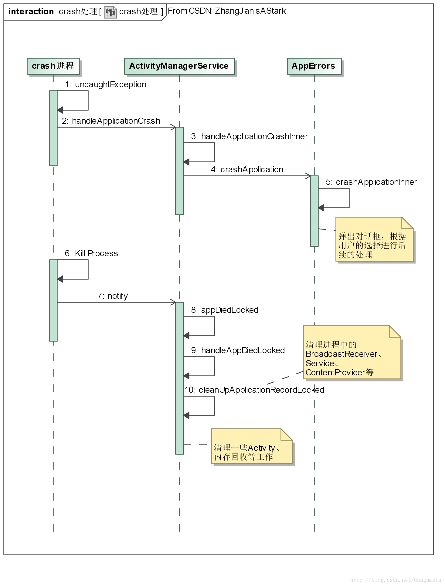

# App的Crach处理

## 一、设置异常处理器

在Android平台中，应用进程fork出来后会为虚拟机设置一个未截获异常处理器，
即在程序运行时，如果有任何一个线程抛出了未被截获的异常，
那么该异常最终会抛给未截获异常处理器处理。

我们首先看看Android N中设置异常处理器的这部分代码。

在ZygoteInit.java的runSelectLoop中：
```java
private static void runSelectLoop(String abiList) throws MethodAndArgsCaller {
    ...........
    while (true) {
        ..........
        for (int i = pollFds.length - 1; i >= 0; --i) {
            ..........
            if (i == 0) {
                //zygote中的server socket收到消息后，建立起ZygoteConnection
                ZygoteConnection newPeer = acceptCommandPeer(abiList);
                peers.add(newPeer);
                fds.add(newPeer.getFileDesciptor());
            } else {
                //ZygoteConnection建立后，收到消息调用自己的runOnce函数
                boolean done = peers.get(i).runOnce();
                .............
            }
        }
    }
}
```

我们知道zygote启动后，会在自己的进程中定义一个server socket，专门接收创建进程的消息。
如上面的代码所示，收到创建进程的消息后，zygote会创建出ZygoteConnection，并调用其runOnce函数：
```java
boolean runOnce() throws ZygoteInit.MethodAndArgsCaller {
    ...............
    try {
        ...........
        //fork出子进程
        pid = Zygote.forkAndSpecialize(.......);
    } catch (ErrnoException ex) {
        ............
    } catch (IllegalArgumentException ex) {
        ...........
    } catch (ZygoteSecurityException ex) {
        ..........
    }

    try {
        if (pid == 0) {
            ........
            //进程fork成功后，进行处理
            handleChildProc(parsedArgs, descriptors, childPipeFd, newStderr);
            ........
        } else {
            ...........
        }
    } finally {
        ..........
    }
}
```

我们跟进一下handleChildProc函数：
```java
private void handleChildProc(......) {
    ............
    if (parsedArgs.invokeWith != null) {
        ..........
    } else {
        //进入到RuntimeInit中的zygoteInit函数
        RuntimeInit.zygoteInit(parsedArgs.targetSdkVersion,
                parsedArgs.remainingArgs, null /* classLoader */);
    }
}
```

顺着流程看一看RuntimeInit中的zygoteInit函数：
```java
public static final void zygoteInit(int targetSdkVersion, String[] argv, ClassLoader classLoader)
        throws ZygoteInit.MethodAndArgsCaller {
    ............
    //跟进commonInit
    commonInit();
    ............
}

private static final void commonInit() {
    ...........
    /* set default handler; this applies to all threads in the VM */
    //到达目的地！
    Thread.setDefaultUncaughtExceptionHandler(new UncaughtHandler());
    ...........
}
```

从上面的代码可以看出，fork出进程后，将在进程commonInit的阶段设置异常处理器UncaughtHandler。

## 二、异常处理的流程

### 1、UncaughtHandler的异常处理

接下来我们看看UncaughtHandler如何处理未被捕获的异常。
```java
private static class UncaughtHandler implements Thread.UncaughtExceptionHandler {
    public void uncaughtException(Thread t, Throwable e) {
        try {
            // Don't re-enter -- avoid infinite loops if crash-reporting crashes.
            if (mCrashing) return;
            mCrashing = true;

            if (mApplicationObject == null) {
                Clog_e(TAG, "*** FATAL EXCEPTION IN SYSTEM PROCESS: " + t.getName(), e);
            } else {
                //打印进程的crash信息
                .............
            }
            .............
            // Bring up crash dialog, wait for it to be dismissed
            //调用AMS的接口，进行处理
            ActivityManagerNative.getDefault().handleApplicationCrash(
                    mApplicationObject, new ApplicationErrorReport.CrashInfo(e));
        } catch (Throwable t2) {
            if (t2 instanceof DeadObjectException) {
                // System process is dead; ignore
            } else {
                try {
                    Clog_e(TAG, "Error reporting crash", t2);
                } catch (Throwable t3) {
                    // Even Clog_e() fails!  Oh well.
                }
            }
        } finally {
            // Try everything to make sure this process goes away.
            //crash的最后，会杀死进程
            Process.killProcess(Process.myPid());
            //并exit
            System.exit(10);
        }
    }
}
```

从代码来看，UncaughtHandler对异常的处理流程比较清晰，基本上就是：

- 1、记录log信息；
- 2、调用AMS的接口进行一些处理；
- 3、杀死出现crash的进程。

其中比较重要的应该是AMS处理crash的流程，接下来我们跟进一下这部分流程的代码。

### 2、AMS的异常处理
```java
public void handleApplicationCrash(IBinder app, ApplicationErrorReport.CrashInfo crashInfo) {
    //得到crash app对应的信息
    ProcessRecord r = findAppProcess(app, "Crash");
    final String processName = app == null ? "system_server"
            : (r == null ? "unknown" : r.processName);

    //调用handleApplicationCrashInner进一步处理
    handleApplicationCrashInner("crash", r, processName, crashInfo);
}

void handleApplicationCrashInner(String eventType, ProcessRecord r, String processName,
        ApplicationErrorReport.CrashInfo crashInfo) {
    ...............
    //Write a description of an error (crash, WTF, ANR) to the drop box.
    //记录信息到drop box
    addErrorToDropBox(eventType, r, processName, null, null, null, null, null, crashInfo);

    //调用内部类AppErrors的crashApplication函数
    mAppErrors.crashApplication(r, crashInfo);
}
```

我们跟进一下AppErrors类中的crashApplication函数：
```java
/**
* Bring up the "unexpected error" dialog box for a crashing app.
* Deal with edge cases (intercepts from instrumented applications,
* ActivityController, error intent receivers, that sort of thing).
*/
void crashApplication(ProcessRecord r, ApplicationErrorReport.CrashInfo crashInfo) {
    final long origId = Binder.clearCallingIdentity();
    try {
        //实际的处理函数为crashApplicationInner
        crashApplicationInner(r, crashInfo);
    } finally {
        Binder.restoreCallingIdentity(origId);
    }
}
```

此处实际的处理函数为crashApplicationInner。
```java
void crashApplicationInner(ProcessRecord r, ApplicationErrorReport.CrashInfo crashInfo) {
    long timeMillis = System.currentTimeMillis();

    //从应用进程传递过来的crashInfo中获取相关的信息
    String shortMsg = crashInfo.exceptionClassName;
    String longMsg = crashInfo.exceptionMessage;
    String stackTrace = crashInfo.stackTrace;
    ................

    AppErrorResult result = new AppErrorResult();
    TaskRecord task;
    synchronized (mService) {
        /**
        * If crash is handled by instance of {@link android.app.IActivityController},
        * finish now and don't show the app error dialog.
        */
        //通知观察者处理crash
        //如果存在观察者且能够处理crash，那么不显示error dialog
        //例如在进行Monkey Test，那么可设置检测到crash后，就停止测试等
        if (handleAppCrashInActivityController(r, crashInfo, shortMsg, longMsg, stackTrace,
                timeMillis)) {
            return;
        }

        /**
        * If this process was running instrumentation, finish now - it will be handled in
        * {@link ActivityManagerService#handleAppDiedLocked}.
        */
        if (r != null && r.instrumentationClass != null) {
            return;
        }

        // Log crash in battery stats.
        if (r != null) {
            mService.mBatteryStatsService.noteProcessCrash(r.processName, r.uid);
        }

        AppErrorDialog.Data data = new AppErrorDialog.Data();
        data.result = result;
        data.proc = r;

        // If we can't identify the process or it's already exceeded its crash quota,
        // quit right away without showing a crash dialog.
        // 调用makeAppCrashingLocked进行处理，如果返回false，则无需进行后续处理
        if (r == null || !makeAppCrashingLocked(r, shortMsg, longMsg, stackTrace, data)) {
            return;
        }

        //发送SHOW_ERROR_UI_MSG给mUiHandler，将弹出一个对话框，提示用户某进程crash
        //用户可以选择"退出"或"退出并报告"等
        //一般的厂商应该都定制了这个界面
        Message msg = Message.obtain();
        msg.what = ActivityManagerService.SHOW_ERROR_UI_MSG;

        task = data.task;
        msg.obj = data;
        mService.mUiHandler.sendMessage(msg);
    }

    //调用AppErrorResult的get函数，该函数是阻塞的，直到用户处理了对话框为止
    //注意此处涉及了两个线程的工作
    //crashApplicationInner函数工作在Binder调用所在的线程
    //对话框工作于AMS的Ui线程
    int res = result.get();

    Intent appErrorIntent = null;

    //以下开始根据对话框中用户的选择，进行对应的处理
    ...................
    //长时间未点击对话框或者点击取消，那么相当于选择强行停止crash进程
    if (res == AppErrorDialog.TIMEOUT || res == AppErrorDialog.CANCEL) {
        res = AppErrorDialog.FORCE_QUIT;
    }

    //根据res的值进行相应的处理
    synchronized (mService) {
        //选择不再提示错误
        if (res == AppErrorDialog.MUTE) {
            //将进程名加入到AMS的mAppsNotReportingCrashes表中
            stopReportingCrashesLocked(r);
        }

        //选择了重新启动
        if (res == AppErrorDialog.RESTART) {
            mService.removeProcessLocked(r, false, true, "crash");
            if (task != null) {
                try {
                    //尝试重启进程
                    mService.startActivityFromRecents(task.taskId,
                            ActivityOptions.makeBasic().toBundle());
                } catch (IllegalArgumentException e) {
                    // Hmm, that didn't work, app might have crashed before creating a
                    // recents entry. Let's see if we have a safe-to-restart intent.
                    if (task.intent.getCategories().contains(
                            Intent.CATEGORY_LAUNCHER)) {
                        //换一种方式重启
                        mService.startActivityInPackage(............);
                    }
                }
            }
        }

        //选择强行停止
        if (res == AppErrorDialog.FORCE_QUIT) {
            long orig = Binder.clearCallingIdentity();
            try {
                // Kill it with fire!
                //handleAppCrashLocked主要是结束activity，并更新oom_adj
                mService.mStackSupervisor.handleAppCrashLocked(r);

                if (!r.persistent) {
                    //如果不是常驻应用，则在此处kill掉
                    mService.removeProcessLocked(r, false, false, "crash");
                    mService.mStackSupervisor.resumeFocusedStackTopActivityLocked();
                }
            } finally {
                Binder.restoreCallingIdentity(orig);
            }
        }

        //选择强制停止并报告
        if (res == AppErrorDialog.FORCE_QUIT_AND_REPORT) {
            //该函数中将生成错误信息，并构造一个Intent用于拉起报告界面
            appErrorIntent = createAppErrorIntentLocked(r, timeMillis, crashInfo);
        }

        if (r != null && !r.isolated && res != AppErrorDialog.RESTART) {
            // XXX Can't keep track of crash time for isolated processes,
            // since they don't have a persistent identity.
            //记录crash时间
            mProcessCrashTimes.put(r.info.processName, r.uid,
                    SystemClock.uptimeMillis());
        }
    }

    if (appErrorIntent != null) {
        try {
            //如果选择了强制停止并报告，那么此时就会拉起报告界面
            mContext.startActivityAsUser(appErrorIntent, new UserHandle(r.userId));
        } catch (ActivityNotFoundException e) {
            ..............
        }
    }
}
```

整体来看AMS处理crash的流程还是相当清晰的：
- 1、首先记录crash相关的信息到drop box；
- 2、如果存在可以处理App crash的ActivityController，那么将crash交给它处理；否则，弹出crash对话框，然用户选择后续操作。
- 3、根据用户的选择，AMS可以进行重启应用、强行停止应用或拉起报告界面等操作。

不过上述流程中，在拉起对话框前，先调用了makeAppCrashingLocked函数。
若这个函数返回false，那么后续的流程就不会继续进行。
我们来看看这个函数的具体用途。

```java
private boolean makeAppCrashingLocked(ProcessRecord app,
        String shortMsg, String longMsg, String stackTrace, AppErrorDialog.Data data) {
    app.crashing = true;

    //就是创建一个对象，其中包含了所有的错误信息
    app.crashingReport = generateProcessError(app,
            ActivityManager.ProcessErrorStateInfo.CRASHED, null, shortMsg, longMsg, stackTrace);

    //前面的代码已经提到过，系统可以通过Intent拉起一个crash报告界面
    //startAppProblemLocked函数，就是在系统中找到这个报告界面对应的ComponentName
    //此外，如果crash应用正好在处理有序广播，那么为了不影响后续广播接受器的处理，
    //startAppProblemLocked会停止crash应用对广播的处理流程，
    //即后续的广播接受器可以跳过crash应用，直接开始处理有序广播
    startAppProblemLocked(app);

    //停止“冻结”屏幕
    app.stopFreezingAllLocked();

    //进行一些后续的处理
    //从代码来看，如果应用不是在1min内连续crash，该函数都会返回true
    return handleAppCrashLocked(app, "force-crash" /*reason*/, shortMsg, longMsg, stackTrace,
            data);
}
```

根据上面的代码，可以看出makeAppCrashingLocked函数最主要的工作主要有两个：
- 1、查找crash报告界面对应的componentName；
- 2、避免进程短时间内连续crash，导致频繁拉起对话框。

## 三、后续的清理工作

根据前面的流程，我们知道当进程crash后，最终将被kill掉，
此时AMS还需要完成后续的清理工作。

我们先来回忆一下进程启动后，注册到AMS的部分流程：
```java
//进程启动后，对应的ActivityThread会attach到AMS上
private final boolean attachApplicationLocked(IApplicationThread thread,
        int pid) {
    ............
    ProcessRecord app;
    if (pid != MY_PID && pid >= 0) {
        synchronized (mPidsSelfLocked) {
            app = mPidsSelfLocked.get(pid);
        }
    } else {
        app = null;
    }
    ............
    final String processName = app.processName;
    try {
        //生成了一个“讣告”接收者
        AppDeathRecipient adr = new AppDeathRecipient(
                app, pid, thread);
        thread.asBinder().linkToDeath(adr, 0);
        app.deathRecipient = adr;
    } catch (RemoteException e) {
        app.resetPackageList(mProcessStats);
        startProcessLocked(app, "link fail", processName);
        return false;
    }
    ................
}
```

从上面的代码可以看出，当进程注册到AMS时，AMS注册了一个“讣告”接收者注册到进程中。
因此，当crash进程被kill后，AppDeathRecipient中的binderDied函数将被回调：
```java
@Override
public void binderDied() {
    ..........
    synchronized(ActivityManagerService.this) {
        appDiedLocked(mApp, mPid, mAppThread, true);
    }
}
```

根据代码可知，接收到进程“死亡”的通知后，最后还是调用AMS的appDiedLocked函数进行处理：
```java
final void appDiedLocked(ProcessRecord app, int pid, IApplicationThread thread,
        boolean fromBinderDied) {
    // First check if this ProcessRecord is actually active for the pid.
    synchronized (mPidsSelfLocked) {
        ProcessRecord curProc = mPidsSelfLocked.get(pid);
        if (curProc != app) {
            ...........
            return;
        }
    }
    .............
    if (!app.killed) {
        if (!fromBinderDied) {
            Process.killProcessQuiet(pid);
        }
        killProcessGroup(app.uid, pid);
        app.killed = true;
    }
    //以上都是一些保证健壮性的代码

    if (app.pid == pid && app.thread != null &&
            app.thread.asBinder() == thread.asBinder()) {
        //进程是正常启动的，非测试启动，那么需要内存调整
        boolean doLowMem = app.instrumentationClass == null;
        boolean doOomAdj = doLowMem;

        if (!app.killedByAm) {
            ............
            mAllowLowerMemLevel = true;
        } else {
            mAllowLowerMemLevel = false;
            doLowMem = false;
        }
        ..............
        //handleAppDiedLocked进行实际的工作
        handleAppDiedLocked(app, false, true);

        if (doOomAdj) {
            //重新更新进程的oom_adj
            updateOomAdjLocked();
        }
        if (doLowMem) {
            //在必要时，触发系统中的进程做内存回收
            doLowMemReportIfNeededLocked(app);
        }
    }.........
    ..........
}
```

appDiedLocked函数中比较重要的是handleAppDiedLocked函数：
```java
private final void handleAppDiedLocked(ProcessRecord app,
        boolean restarting, boolean allowRestart) {
    int pid = app.pid;
    //进行进程中service、ContentProvider、BroadcastReceiver等的收尾工作
    //这个函数虽然很长，但实际的功能还是很清晰的，这里不作进一步展开
    //比较重要的是：1、对于crash进程中的Bounded Service而言，会清理掉service与客户端之间的联系；
    //此外若service的客户端重要性过低，还会被直接kill掉
    //2、清理ContentProvider时，在removeDyingProviderLocked函数中，可能清理掉其客户端进程(对于stable contentProvider而言)
    boolean kept = cleanUpApplicationRecordLocked(app, restarting, allowRestart, -1);
    if (!kept && !restarting) {
        //不再保留和重启时，从LRU表中移除
        removeLruProcessLocked(app);
        if (pid > 0) {
            ProcessList.remove(pid);
        }
    }

    ..................

    // Remove this application's activities from active lists.
    //进行Activity相关的收尾工作
    boolean hasVisibleActivities = mStackSupervisor.handleAppDiedLocked(app);

    app.activities.clear();

    if (app.instrumentationClass != null) {
        ..............
    }

    if (!restarting && hasVisibleActivities
            && !mStackSupervisor.resumeFocusedStackTopActivityLocked()) {
        // If there was nothing to resume, and we are not already restarting this process, but
        // there is a visible activity that is hosted by the process...  then make sure all
        // visible activities are running, taking care of restarting this process.
        // 从注释来看，若当前只有crash进程中存在可视Activity，那么AMS还是会试图重启该进程
        mStackSupervisor.ensureActivitiesVisibleLocked(null, 0, !PRESERVE_WINDOWS);
    }
}
```

上述代码中cleanUpApplicationRecordLocked函数，在此不做深入分析。其中唯一比较麻烦的就是Bounded Service和ContentProvider的清理，因为这两种组件全部要考虑其客户端进程。

## 四、总结



整体来讲，Android中进程crash后的处理流程基本上如上图所示。
这个流程相对来说是比较简单的，唯一麻烦点的地方可能是进程结束后，
AMS进行的清理工作。

