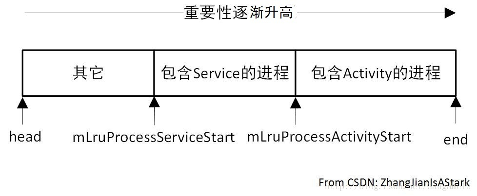

# 进程管理相关流程分析 一

Android框架定义了四大组件，一般的功能都是基于这些组件的。
因此， 在Android平台上开发时，很少会接触到进程的概念。

但根据前面分析Activity、Service和BroadcastReceiver的流程，
我们可以清晰地看到，所有这些组件最终还是要运行在具体的进程之中。
于是，AMS作为管理四大组件的核心服务，也承担起了进程管理的责任。

在AMS中，进程管理相关的函数分别为updateLruProcessLocked和updateOomAdjLocked。
这两个函数在之前的流程分析中多次遇到过，从这篇博客开始，我们一起来看看它们具体的工作流程。

## 一、Linux进程管理的基本概念
Android中进程管理相关的工作，实际上依赖于Linux的进程管理策略。
因此，先简单地了解一下Linux进程管理的基本概念。

### 1、Linux进程调度优先级和调度策略
调度优先级和调度策略，是操作系统对CPU资源进行管理和控制的依据。

##### 调度优先级：

我们知道，操作系统上运行的进程数量较多，同时CPU的资源是有限的。
因此，操作系统需要合理地为不同进程分配CPU资源。

调度优先级就是操作系统分配CPU资源给进程时，需要参考的一个重要指标。
一般而言，优先级较高的进程将更有机会得到CPU资源。

##### 调度策略：

调度策略用于描述，操作系统的调度模块，分配CPU资源给应用进程时，所遵循的规则。
即用于描述，将CPU控制权交给调度模块时，它如何决定下一个要运行的进程。

由于多个进程可能具有相同的调度优先级，因此调度模块不能仅按照各进程的调度优先级进行决策。
一个良好的调度策略，一定要兼顾到效率和公平性。

### Linux API：
Linux提供了两个API用于设置调度优先级及调度策略。

#### 1) 设置调度优先级的API为：
    int setpriority(int which, int who, int prio)

其中，which和who联合使用。

- 当which为PRIO_PROGRESS时，who代表一个进程，即pid；
- 当which为PRIO_PGROUP时，who代表一个进程组，即gid；
- 当which为PRIO_USER时，who代表一个用户，即uid。

prio用于设置进程的nice值，取值范围为-20～+19。
该值越大表示进程越友好(nice)，即对CPU资源的依赖越低。
于是，进程的prio值越大，其被调用的优先级越低。

#### 2) 设置调度策略的API为：
    int sched_setscheduler(pid_t pid, int policy, const struct sched_param *param)；

其中，pid表示进程id；

policy表示调度策略。

Linux定义了很多种调度策略，具体的内容可以参考相关的资料。

param参数中，最重要的是该结构体中的sched_priority变量。
该变量用于设置该调度策略下，进程的优先级。

### 2、Linux进程oom_adj的介绍
从Linux kernel 2.6.11开始，内核提供了进程的OOM控制机制。

目的是：
    当系统出现内存不足的情况时，内核可以根据进程的oom_adj值，来选择杀死一些进程，以回收内存。

oom_adj用于表示Linux进程内存资源的优先级，其可取值范围为-16至+15，数值越小， 被kill的可能性越低。
此外，还有一个特殊值-17，表示禁止系统在OOM情况下杀死该进程。

Linux没有提供单独的API用于设置进程的oom_adj，一般是向/proc/[pid]/oom_adj 文件中写入对应的oom_adj值。

在Linux kernel 2.6.36后，/proc/[pid]/oom_adj 被弃用了，改为 /proc/[pid]/oom_score_adj。
oom_score_adj对应的取值范围变为-1000到1000，仍然是数值越小，被kill概率越小。
此时，-1000表示禁止系统在OOM情况下杀死该进程。

AMS的updateOomAdjLocked函数，就借用了Linux中oom_adj的概念。

此外，Android为linux kernel新增了Low Memory Killer(LMK)机制。
LMK的配置文件中，预先定义了不同的内存阈值及对应的oom_adj。

当LMK监控到系统内存下降到某个阈值时，就会kill掉当前系统内，
oom_adj超过该阈值预定义oom_adj的所有进程。

例如，预定义一组对应关系，内存剩余2048KB时，oom_adj为0。
那么，当LMK监控到系统内存少于2048KB时，将kill掉系统内所有oom_adj大于0的进程。

以上是Linux进程管理的一些基本概念，
如果需要深入理解对应的过程，还是需要阅读相关源码和资料。
接下来，我们来看看Android中进程管理相关的内容。

## 二、Android中进程管理的基本概念

进程的调度优先级和和调度策略，主要通过Process.java提供的接口来设置，
由Linux来完成实际的工作。

### 1 Process类中的API
我们先看看Process类中，进程优先级相关的API：

以下两个函数主要用于设置线程对应的调度优先级：
```java
/**
* Set the priority of a thread, based on Linux priorities.
* @param tid The identifier of the thread/process to change.
* @param priority A Linux priority level, from -20 for highest scheduling
* priority to 19 for lowest scheduling priority.
*/
//设置tid对应线程的优先级
public static final native void setThreadPriority(int tid, int priority)
        throws IllegalArgumentException, SecurityException;

//设置调用线程对应的优先级
public static final native void setThreadPriority(int priority)
        throws IllegalArgumentException, SecurityException;
```

以下两个函数分别用于设置线程和进程对应的Group，不同的Group实际上对应者不同的调用策略：
```java
/**
* Sets the scheduling group for a thread.
* @hide
* @param tid The identifier of the thread to change.
* @param group The target group for this thread from THREAD_GROUP_*.
* /
public static final native void setThreadGroup(int tid, int group)
        throws IllegalArgumentException, SecurityException;

/**
* Sets the scheduling group for a process and all child threads
* @hide
* @param pid The identifier of the process to change.
* @param group The target group for this process from THREAD_GROUP_*.
*/
public static final native void setProcessGroup(int pid, int group)
        throws IllegalArgumentException, SecurityException;
```

不同的THREAD_GROUP_*，对应着不同的CPU共享方式，详细的内容可以参考源码对应的注释。

最后一个API与Linux中的sched_setscheduler接口对应，定义指定进程或线程的调度策略及相应的优先级。
```java
/**
* Set the scheduling policy and priority of a thread, based on Linux.
*
* @param tid The identifier of the thread/process to change.
* @param policy A Linux scheduling policy such as SCHED_OTHER etc.
* @param priority A Linux priority level in a range appropriate for the given policy.
*
*/
public static final native void setThreadScheduler(int tid, int policy, int priority)
        throws IllegalArgumentException;
```

从Process.java中API可以看出，这些接口的具体实现都是由native函数来完成，
定义于frameworks/base/core/jni/android_util_Process.cpp中。

我们以设定具体线程调度优先级的setThreadPriority函数为例，简单看看具体的实现：
```java
//这是对应的native函数
void android_os_Process_setThreadPriority(JNIEnv* env, jobject clazz,
        jint pid, jint pri) {
    ..............
    //调用androidSetThreadPriority函数
    int rc = androidSetThreadPriority(pid, pri);
    .............
}

int androidSetThreadPriority(pid_t tid, int pri) {
    ..........
    //set_sched_policy函数，将调用Linux的sched_setscheduler接口设置调度策略
    //具体的函数此处不做展开
    //后台线程的调度策略为SCHED_BATCH，前台为SCHED_NORMAL
    //此处调度策略对应的调度优先级为0
    if (pri >= ANDROID_PRIORITY_BACKGROUND) {
        rc = set_sched_policy(tid, SP_BACKGROUND);
    } else if (getpriority(PRIO_PROCESS, tid) >= ANDROID_PRIORITY_BACKGROUND) {
        rc = set_sched_policy(tid, SP_FOREGROUND);
    }
    ........

    //调用Linux的setpriority接口，设置调度优先级
    //注意到Linux不区分线程和进程，此处使用的均是PRIO_PROCESS
    if (setpriority(PRIO_PROCESS, tid, pri) < 0) {
        rc = INVALID_OPERATION;
    } else {
        errno = lasterr;
    }

    return rc;
}
```

Process.java中的其它接口，最终也均是调用之前介绍的Linux API完成具体的功能，不再进一步分析。

Android框架提供了接口，来设置调度策略及优先级，但系统本身更侧重于对进程内存的管理。
接下来我们主要分析一下，Android中内存相关的进程管理。
在此之前，还是要先了解一下基本概念。

### 2 进程分类

为了提高程序的启动速度，即使用户不再使用一个程序时（例如将程序切换到后台等），
Android系统也会尽可能长时间地保留该程序所在的进程（避免重新使用程序时，需要fork进程及创建Android运行环境等）。

但当内存资源紧张的时候，系统终究会为一些新的或者更重要的进程，杀死一些旧的进程来释放内存。
系统主要是根据进程中组件的运行状态，来决定每一个进程的重要性，从而决定哪个进程需要杀死，哪个进程需要保持。
于是，根据进程中运行组件的特点，Android将进程进行了分类。

以下按照重要性降低的顺序，列出不同种类进程的特点。

#### 2.1 Foreground进程(前台进程)

前台进程是指：用户完成当前工作而需要的进程。

进程至少具有以下条件中一项时，才能被称为前台进程：
- 1) 含有一个前台的Activity，即该Activity的onResume函数被调用过了，当前正显示在界面上。
- 2) 含有一个和前台Activity绑定的Service。
- 3) 含有一个运行在前台的Service，即该Service主动调用了startForeground函数；
- 4) 其中的某个Service正在调用其生命周期的函数（例如onCreate、onStart、onDestroy等)。
- 5) 其中某个BroadcastReceiver正在执行onReceive函数。

一般情况下，在特定的时刻，系统中也仅会有为数不多的几个前台进程。
这些前台进程的重要性最高，直到系统内存极低，以致于不能继续运行所有的前台进程时，
系统才会杀死其中的某个进程。

#### 2.2 Visible进程(可视进程)

可视进程是指：其中没有前台运行的组件，但仍然会对用户在屏幕看到的内容造成影响的进程。

此类进程需要满足下列条件中的一项：

- 1) 其中某个Activity不在前台，但仍然是可见的(即该Activity仅调用了onPause()方法，仍工作在前台，只不过部分界面被遮住。 例如，正在前台运行的Activity启动了一个对话框，这个对话框悬浮在这个activity之上）。
- 2) 其中的某个Service绑定到了一个可视(或前台)的activity（该activity已调用了onPause()方法）。

可视进程也是有着极高重要性的进程。
仅当为了保证前台进程能够继续运行时，系统才会杀死可视进程。

#### 2.3 Service进程(服务进程)

服务进程是指：不满足上面两种进程的条件，但是包含一个通过startService方法，启动的service的进程（service没有与前台或可视Activity绑定）。

虽然服务进程可能和用户可见的内容没有直接的联系，但它们所做的工作也是用户关心的，
系统会一直保留这类进程，直到为了保证前台和可见进程的运行时，才会杀死服务进程。

#### 2.4 Background进程(后台进程)

后台进程是指：不满足上面三种进程的条件，但包含当前对用户不可见的Activity的进程。

不可见的Activity是指，调用了onStop()方法的Activity。
后台进程不会对用户的体验造成任何影响，并且系统可以在前台进程、可视进程、服务进程需要内存资源的时候杀死该类进程。

通常系统中会有很多后台进程运行，并且这些后台进程被保存在一个最近最少使用列表(LRU，Least Recently Used)中，当系统需要内存时，将按照LRU中进程的顺序，依次杀死进程。这样做的好处就是保证用户最近看到的进程最后被杀死。

#### 2.5 Empty进程(空进程)
空进程是指：其中没有运行任何组件的进程。

系统保留空进程的原因是：提高组件的启动时间。当进程中的某项功能被需要时，可以直接启动对应组件，省去了fork进程、创建Android运行环境等工作。

系统经常会杀死这些空进程来保持整个系统资源和内核缓存之间的平衡。

#### 2.6 总结

Android根据进程中运行的最重要的组件，来划分进程的种类。
例如，如果一个进程中既有一个可视的activity，又有一个service，
那么这个进程属于可视进程而不是服务进程。

此外，根据上面的分类情况，我们知道了：

一个正在运行的Service所在的进程，重要性高于一个处于后台的activity所在的进程。

因此，如果一个activity要执行某个耗时操作时，最好将该操作递交给service处理，而不是仅仅创建一个工作线程。

同样，广播接收者在需要时，也应该将耗时工作递交给Service处理，而不是启动一个线程或滥用goAsync。

AMS中与进程分类思想关系比较密切的函数是updateLruProcessLocked，接下来我们一起来看看这个函数。

## 三、AMS中的updateLruProcessLocked

在AMS四大组件涉及的流程中，updateLruProcessLocked函数被多次调用，用于更新进程的使用情况。
当内存紧张时，将按照进程的种类及使用情况kill一些进程。
```java
...................
/**
* List of running applications, sorted by recent usage.
* The first entry in the list is the least recently used.
*/
final ArrayList<ProcessRecord> mLruProcesses = new ArrayList<ProcessRecord>();
...................
```

如上面的代码所示，在AMS中有一个成员变量mLruProcesses，
根据进程的使用时间及进程种类，按照重要性由低到高的顺序，
保存着进程对应的ProcessRecord信息。
即排在越前面的进程，优先级越低，在系统内存不足时，越有可能被kill。

updateLruProcessLocked函数被调用时，就会更新参数对应进程在mLruProcesses中的位置。

### 1 updateLruProcessLocked
下面我们分段来看看updateLruProcessLocked函数的代码流程。

#### 1.1 updateLruProcessLocked Part-I

```java
final void updateLruProcessLocked(ProcessRecord app, boolean activityChange,
        ProcessRecord client) {
    //判断进程中是否含有Activity
    final boolean hasActivity = app.activities.size() > 0 || app.hasClientActivities
            || app.treatLikeActivity;

    //目前，并没有考虑进程中是否含有Service
    //因此，虽然理论上定义了Service相关的进程分类，但并没有实现对应的管理策略
    //在以下代码中，hasService一直为false
    final boolean hasService = false; // not impl yet. app.services.size() > 0;

    if (!activityChange && hasActivity) {
        // The process has activities, so we are only allowing activity-based adjustments
        // to move it.  It should be kept in the front of the list with other
        // processes that have activities, and we don't want those to change their
        // order except due to activity operations.
        //当进程中包含Activity时，将由Activity决定该进程的排序
        //当activityChange为false时，说明进程并没有改变Activity的状态
        //因此，不调整进程在LRU中的位置
        return;
    }

    //每次更新LRU列表，都会分配对应的编号
    mLruSeq++;

    final long now = SystemClock.uptimeMillis();
    app.lastActivityTime = now;

    // First a quick reject: if the app is already at the position we will
    // put it, then there is nothing to do.
    if (hasActivity) {
        final int N = mLruProcesses.size();
        //该进程包含Activity，并且已经在LRU尾端(最新使用的)，不用更新
        if (N > 0 && mLruProcesses.get(N-1) == app) {
            if (DEBUG_LRU) Slog.d(TAG_LRU, "Not moving, already top activity: " + app);
            return;
        }
    } else {
        //不包含Activity，但在LRU其它分类的最尾段，不用更新
        if (mLruProcessServiceStart > 0
                && mLruProcesses.get(mLruProcessServiceStart-1) == app) {
            if (DEBUG_LRU) Slog.d(TAG_LRU, "Not moving, already top other: " + app);
            return;
    }

    //获取进程当前在LRU的位置
    //不存在则返回-1
    int lrui = mLruProcesses.lastIndexOf(app);

    //常驻进程不用管
    if (app.persistent && lrui >= 0) {
        // We don't care about the position of persistent processes, as long as
        // they are in the list.
        ...........
         return;
    }
.................
```

updateLruProcessLocked函数的第一部分主要是判断：是否需要调整进程在LRU表中的位置。

这部分的代码相当简单，但从中可以看出LRU中进程排列的规则，基本上可以用下图来表示：




LRU表按照顺序，重要性逐渐升高，即当系统需要内存时，将优先kill掉排在前面的进程。

整体来讲，后运行的进程，将插入到先运行的进程的后面，即LRU表的前面保存的是老旧的进程，后面保存的是用户使用的较新的进程。

此外，根据进程中运行组件的种类，LRU为进程定义了不同的重要程度。
如上图所示，包含Activity的进程最为重要，其次是包含Service的进程，最后是其它进程。
为此，LRU特意定义了两个索引mLruProcessServiceStart和mLruProcessActivityStart。
包含Activity的进程，将插入到mLruProcessActivityStart之后的位置；
不包含Activity，但包含Service的进程，将插入到mLruProcessServiceStart之后。

尽管从注释及上面的代码可以看出，目前的流程并没有判断进程中是否含有Service。
但从设计的角度来讲及进程的分类来看，这部分内容在后续的版本中应该会进行补充。

#### 1.2 updateLruProcessLocked Part-II
updateLruProcessLocked的第二部分，就要开始调整进程在LRU中的位置了。
```java
................
    //lrui>=0，说明LRU中之前记录过当前进程的信息
    //即该进程不是新创建的
    //那么在调整之前，需要先将之前的记录删除
    if (lrui >= 0) {
        //依次调整对应的索引值，结合前面的图，应该比较好理解
        if (lrui < mLruProcessActivityStart) {
            mLruProcessActivityStart--;
        }
        if (lrui < mLruProcessServiceStart) {
            mLruProcessServiceStart--;
        }

        //先将对应信息删除
        mLruProcesses.remove(lrui);
    }

    //nextIndex主要用于记录
    //当前进程绑定的Service或ContentProvider对应的进程，
    //应该插入的位置 （对应进程中仅含有Service和Provider时才需要处理）
    //后文将看到该值的使用情况
    int nextIndex;
................
```

上述代码的功能是：在更新位置之前，先移除LRU中旧有的信息。
接下来，将按照进程中运行组件的信息，更新进程的位置。

##### 1.2.1 更新Activity相关的进程

```java
..............
    //此处，更新Activity相关的进程
    if (hasActivity) {
        final int N = mLruProcesses.size();

        //if处理的情况是：进程本身没有运行Activity，但它的客户端中运行着Activity
        //此时将该进程插入到LRU中倒数第二个位置
        //倒数第一的位置，必须为包含实际Activity的进程
        if (app.activities.size() == 0 && mLruProcessActivityStart < (N - 1)) {
            // Process doesn't have activities, but has clients with
            // activities...  move it up, but one below the top (the top
            // should always have a real activity).
            ...................
            mLruProcesses.add(N - 1, app);

            // To keep it from spamming the LRU list (by making a bunch of clients),
            // we will push down any other entries owned by the app.
            // 下面的代码，是为了调整不同用户之间的公平性；
            // 当前用户新启动了一个进程，将该用户对应的其它进程，适当往前挪动一下 （优先被kill）
            final int uid = app.info.uid;
            for (int i = N - 2; i > mLruProcessActivityStart; i--) {
                ProcessRecord subProc = mLruProcesses.get(i);

                //当前用户的进程，连续的排在一起时，才需要调整
                //若之前已经有其它用户的进程，那么公平性已经得到保证，无需移动

                if (subProc.info.uid == uid) {
                    //满足条件时，将第i个与第i-1个交换位置
                    if (mLruProcesses.get(i - 1).info.uid != uid) {
                        ...........
                        ProcessRecord tmp = mLruProcesses.get(i);
                        mLruProcesses.set(i, mLruProcesses.get(i - 1));
                        mLruProcesses.set(i - 1, tmp);
                        i--;
                    }
                } else {
                    // A gap, we can stop here.
                    break;
                }
            }
        } else {
            // Process has activities, put it at the very tipsy-top.
            // 此处处理的是实际包含Activity的进程
            if (DEBUG_LRU) Slog.d(TAG_LRU, "Adding to top of LRU activity list: " + app);

            //直接增加到LRU的尾段
            mLruProcesses.add(app);
        }

        //若该进程绑定了仅含有Service或Provider的进程
        //这些进程将被插入到LRU中其它进程部分的尾端
        //后文将会看到
        nextIndex = mLruProcessServiceStart;
    } .............
...........
```

从上面的代码可以看出，Activity相关的进程重要程度很高。
即使某个进程中未运行Activity，只要其客户端中运行了Activity，那么仍将加入到LRU中靠后的位置。
这种进程实际上就有点前台进程和可视进程的感觉了。
不过对于这种进程，系统为了保证不同用户间的公平性，还进行了额外的调整。

对于实际运行着Activity的进程而言，处理就相对简单了，之间插入到LRU的最后。

##### 1.2.2 更新Service相关的进程

```java
...............
    else if (hasService) {
        .................
        //直接插入到LRU中Service部分的尾段
        //即当前mLruProcessActivityStart的位置
        //结合之前的图较易理解
        mLruProcesses.add(mLruProcessActivityStart, app);

        //同样，若该进程绑定了仅含有Service或Provider的进程
        //这些进程将被插入到LRU中其它进程部分的尾段、
        nextIndex = mLruProcessServiceStart;
        mLruProcessActivityStart++;
    } .........
............
```

上文也提到过，目前的处理流程其实并没有判断进程中是否含有Service，hasService的值一直为false。
此处为了代码的完备性，简单地处理了一下Service相关的进程。

可以看出Service相关的进程，就是简单的按照先后顺序进行排列。
感觉Android后续的版本要么完善这个部分，要么直接弃之不用了。

##### 1.2.3 更新其它进程
这部分代码开始处理与Service、Activity没有明显关联的进程。

```java
...........
    else  {
        ....................
        // Process not otherwise of interest, it goes to the top of the non-service area.
        //这种进程预期应该插入到LRU中其它进程的末尾，即mLruProcessServiceStart的位置
        int index = mLruProcessServiceStart;

        //如果该进程有客户端，那么需要根据客户端的位置进行调整
        if (client != null) {
            // If there is a client, don't allow the process to be moved up higher
            // in the list than that client.
            // 得到客户端在LRU中的位置 （最后一个）
            int clientIndex = mLruProcesses.lastIndexOf(client);
            ...............

            //clientIndex可能为-1或小于当前进程之前在LRU中的位置
            if (clientIndex <= lrui) {
                // Don't allow the client index restriction to push it down farther in the
                // list than it already is.

                //那么这种clientIndex没有参考意义，将其替换为当前进程之前在LRU中的位置
                clientIndex = lrui;
            }

            //从这段代码可以看出，客户端将把该进程“拉下水”
            //为了存活，当前进程最好的位置就是mLruProcessServiceStart
            //但如过有客户端的话，当前进程将被前移到客户端之前
            if (clientIndex >= 0 && index > clientIndex) {
                index = clientIndex;
            }
        }
        ...................
        //插入到对应位置，并更新参数
        mLruProcesses.add(index, app);
        //此时,若该进程绑定了仅含有Service或Provider的进程
        //这些进程将被插入到该进程的前面
        nextIndex = index-1;
        mLruProcessActivityStart++;
        mLruProcessServiceStart++;
    }
...........
```

从上面的代码来看，客户端进程的重要性是高于服务端进程的(服务端含有Activity时不在此范畴中)。
由于hasService的值为false，因此仅含有后台Service的进程也需要遵循此规则。

我是这么理解的：服务端存在的理由，就是满足客户端的需求。
因此若是没有任何客户端了，服务端也没有存在的意义了。
相反，即使没有了服务端，客户端自身也可以完成一些逻辑。

举例来说，那些仅含有ContentProvider、BroadcastReceiver等的进程，
其重要性显然低于客户端。

#### 1.3 updateLruProcessLocked Part-III
updateLruProcessLocked的最后一部分，处理当前进程绑定的Service、ContentProvider所在进程。

```java
..................
    // If the app is currently using a content provider or service,
    // bump those processes as well.
    for (int j=app.connections.size()-1; j>=0; j--) {
        //该进程绑定了其它服务
        ConnectionRecord cr = app.connections.valueAt(j);
        if (cr.binding != null && !cr.serviceDead && cr.binding.service != null
                && cr.binding.service.app != null
                && cr.binding.service.app.lruSeq != mLruSeq
                && !cr.binding.service.app.persistent) {
            //更新绑定的Service所在进程的排序
            nextIndex = updateLruProcessInternalLocked(cr.binding.service.app, now, nextIndex,
                    "service connection", cr, app);
        }
    }

    for (int j=app.conProviders.size()-1; j>=0; j--) {
        ContentProviderRecord cpr = app.conProviders.get(j).provider;
        if (cpr.proc != null && cpr.proc.lruSeq != mLruSeq && !cpr.proc.persistent) {
            //更新ContentProvider所在进程的顺序
            nextIndex = updateLruProcessInternalLocked(cpr.proc, now, nextIndex,
                    "provider reference", cpr, app);
        }
    }
}
```

这里主要调用updateLruProcessInternalLocked函数，完成实际的更新。

如果对应进程完成了更新操作，nextIndex就会减1，因此可以看出：
对于仅含有后台Service或ContentProvider的进程来说，包含Service的进程重要性更高。

### 2 updateLruProcessInternalLocked
在本文的最后，我们看看updateLruProcessInternalLocked函数的工作流程。

```java
//此处的index值，就是上文多次遇到的nextIndex
private int updateLruProcessInternalLocked(ProcessRecord app, long now, int index,
        String what, Object obj, ProcessRecord srcApp) {
    app.lastActivityTime = now;

    //从上文的调用逻辑来看，我们知道updateLruProcessInternalLocked函数的目的是
    //更新那些仅含有ContentProvider、后台Service等的进程

    //于是，当进程含有Activity时，不做更新，不修改nextIndex值
    if (app.activities.size() > 0) {
        // Don't want to touch dependent processes that are hosting activities.
        return index;
    }

    //得到这些进程原来在LRU中的位置
    int lrui = mLruProcesses.lastIndexOf(app);

    //异常的情况吧
    if (lrui < 0) {
        Slog.wtf(TAG, "Adding dependent process " + app + " not on LRU list: "
                + what + " " + obj + " from " + srcApp);
        return index;
    }

    //最近使用过，不做更新
    //即不会降低进程的重要性
    if (lrui >= index) {
        // Don't want to cause this to move dependent processes *back* in the
        // list as if they were less frequently used.
        return index;
    }

    //这应该对应着本身不含有Activity，但绑定了Activity的进程
    if (lrui >= mLruProcessActivityStart) {
        // Don't want to touch dependent processes that are hosting activities.
        return index;
    }

    mLruProcesses.remove(lrui);
    if (index > 0) {
        index--;
    }
    .................
    //将进程插入到nextIndex的位置
    mLruProcesses.add(index, app);
    return index;
}
```

从上面的代码来看，updateLruProcessInternalLocked不会降低那些仅含有ContentProvider、后台Service等的进程的重要性。
相反，因为有客户端需要使用这些进程的功能，系统向后移动了它们在LRU中的位置。
不过，正如前面updateLruProcessLocked第3部分描述的，这类进程的重要性始终低于其客户端。

## 四、总结
这一篇博客中，我们介绍了Linux和Android中进程管理的基本概念，
同时分析了AMS中updateLruProcessLocked函数相关的流程。
可以看出代码的实际逻辑和具体的概念还是有些偏差的，但主要思想基本一致。

不过对于Android而言，updateLruProcessLocked函数只完成了内存管理的一小部分工作。
AMS还会利用updateOomAdjLocked函数完成进程的oom_adj更新。
结合进程在LRU中的位置及对应的oom_adj，系统才能进行完整的进程内存管理。

考虑到updateOomAdjLocked函数的内容较多，需要单独用一篇文章进行分析。
