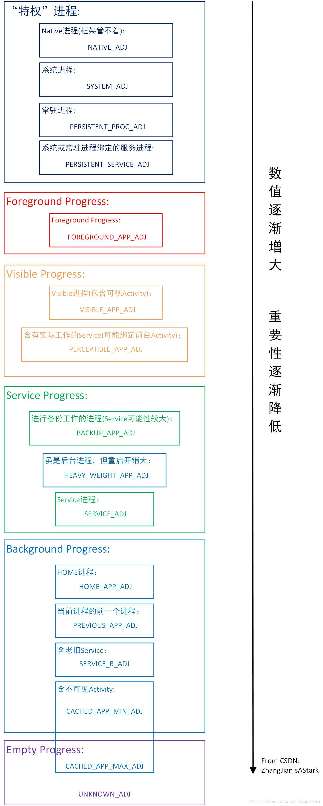
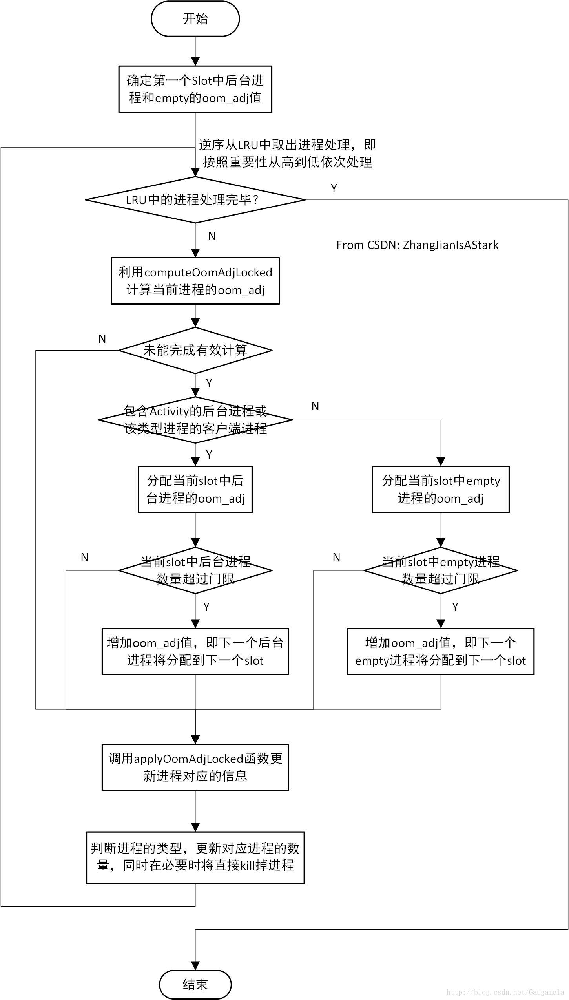

# 进程管理相关流程分析 二 updateOomAdjLocked

前一篇博客进程管理相关流程分析(1)里，
我们介绍了AMS中updateLruProcessLocked函数相关的流程。

updateLruProcessLocked只是按照进程中运行的组件，粗略地定义了不同进程的优先级。

实际上，Android根据进程的oom_adj进行了更加细致的进程分类，而AMS中的updateOomAdjLocked函数，就是用于更新进程的oom_adj值。

本篇博客中，我们来看看AMS中updateOomAdjLocked相关的流程。

## 一、ProcessList.java中的oom_adj

进程在不同场景下的oom_adj值，定义于ProcessList.java中。
考虑到updateOomAdjLocked函数极其的复杂，我们有必要先了解一下不同oom_adj的含义。
```java
final class ProcessList {
    ..............
    // OOM adjustments for processes in various states:

    // Uninitialized value for any major or minor adj fields
    // 未初始化时，定义为-10000
    static final int INVALID_ADJ = -10000;
    ..............

    // Adjustment used in certain places where we don't know it yet.
    // (Generally this is something that is going to be cached, but we
    // don't know the exact value in the cached range to assign yet.)
    // 如注释所述，过渡态的值
    static final int UNKNOWN_ADJ = 1001;

    // This is a process only hosting activities that are not visible,
    // so it can be killed without any disruption.
    // 从注释来看，这里应该是仅持有Activity的background进程对应的值，最小为900，最大为906
    // 实际上empty进程和background进程均会使用这些值
    static final int CACHED_APP_MAX_ADJ = 906;
    static final int CACHED_APP_MIN_ADJ = 900;

    // The B list of SERVICE_ADJ -- these are the old and decrepit
    // services that aren't as shiny and interesting as the ones in the A list.
    // 这里应该是对应持有老旧服务的background进程
    static final int SERVICE_B_ADJ = 800;

    // This is the process of the previous application that the user was in.
    // This process is kept above other things, because it is very common to
    // switch back to the previous app.
    // 当前页面对应进程的前一个进程
    // 例如，从A进程的Activity跳转到B进程的Activity
    // 此时B进程就是当前进程，A进程就是previous进程
    // 由于用户可能在A、B Activity之间切换，因此为previous进程赋予一个单独的oom_adj
    // 本质上来说，这仍是background进程
    static final int PREVIOUS_APP_ADJ = 700;

    // This is a process holding the home application -- we want to try
    // avoiding killing it, even if it would normally be in the background,
    // because the user interacts with it so much.
    // 用户经常会和home进程交互，因此单独为home进程赋予一个oom_adj
    // 一般情况下，home进程也可以归属到background进程
    static final int HOME_APP_ADJ = 600;

    // This is a process holding an application service -- killing it will not
    // have much of an impact as far as the user is concerned.
    // service进程
    static final int SERVICE_ADJ = 500;

    // This is a process with a heavy-weight application.  It is in the
    // background, but we want to try to avoid killing it.  Value set in
    // system/rootdir/init.rc on startup.
    // 对于heavy_weight进程，虽是后台进程，但重要性甚至大于service进程
    // 应该是该类型的进程，重新启动的成本太高了，因此尽量避免杀掉吧
    // 这是所谓的“尾大不掉”吧

    // 需要指出的是，这里的注释太老旧了，Android N里的路径已经是system/core/rootdir/init.rc
    // 同时，没有看到与heavy_weight相关的配置，个人觉得注释的意思是：
    // 可以按照需要自己配置吧，类似于init进程的写法：
    // # Set init and its forked children's oom_adj.
    // write /proc/1/oom_score_adj -1000
    static final int HEAVY_WEIGHT_APP_ADJ = 400;

    // This is a process currently hosting a backup operation.  Killing it
    // is not entirely fatal but is generally a bad idea.
    // 正在执行backup的进程
    // 与heavy_weight进程一样，android已经不完全按照进程的组件来划分重要性了
    // 还考虑了进程当前正在执行的操作
    static final int BACKUP_APP_ADJ = 300;

    // This is a process only hosting components that are perceptible to the
    // user, and we really want to avoid killing them, but they are not
    // immediately visible. An example is background music playback.
    // “perceptible”的意思是：可察觉到
    // 从这里来看，其实这种进程已经属于visible进程的范畴了，毕竟用户可以察觉到这种进程的存在
    // 不过这种进程属于不包含visible activity，但包含绑定了Activity的service
    static final int PERCEPTIBLE_APP_ADJ = 200;

    // This is a process only hosting activities that are visible to the
    // user, so we'd prefer they don't disappear.
    // visible进程， 侧重于包含visible activity
    static final int VISIBLE_APP_ADJ = 100;
    static final int VISIBLE_APP_LAYER_MAX = PERCEPTIBLE_APP_ADJ - VISIBLE_APP_ADJ - 1;

    // This is the process running the current foreground app.  We'd really
    // rather not kill it!
    // foreground进程
    static final int FOREGROUND_APP_ADJ = 0;

    // This is a process that the system or a persistent process has bound to,
    // and indicated it is important.
    // 系统进程或常驻进程绑定的service所在的进程
    static final int PERSISTENT_SERVICE_ADJ = -700;

    // This is a system persistent process, such as telephony.  Definitely
    // don't want to kill it, but doing so is not completely fatal.
    // 常驻进程
    static final int PERSISTENT_PROC_ADJ = -800;

    // The system process runs at the default adjustment.
    // 系统进程
    static final int SYSTEM_ADJ = -900;

    // Special code for native processes that are not being managed by the system (so
    // don't have an oom adj assigned by the system).
    // 框架层无法约束的native进程
    static final int NATIVE_ADJ = -1000;
    ..............
    // The minimum number of cached apps we want to be able to keep around,
    // without empty apps being able to push them out of memory.
    // 从注释来看，min_cached_apps不包含empty进程的数量
    static final int MIN_CACHED_APPS = 2;

    // The maximum number of cached processes we will keep around before killing them.
    // NOTE: this constant is *only* a control to not let us go too crazy with
    // keeping around processes on devices with large amounts of RAM.  For devices that
    // are tighter on RAM, the out of memory killer is responsible for killing background
    // processes as RAM is needed, and we should *never* be relying on this limit to
    // kill them.  Also note that this limit only applies to cached background processes;
    // we have no limit on the number of service, visible, foreground, or other such
    // processes and the number of those processes does not count against the cached
    // process limit.
    // 这里的注释需要看一看，这里应该指系统可保留的所有后台和empty进程最大值
    // MAX_CACHED_APPS不限制service, visible, foreground, or other such processes的数量
    // 仅仅作为参考值，系统并不会真的保留这么多后台进程，毕竟LMK将按需看kill them
    static final int MAX_CACHED_APPS = 32;
    ..............
    // The maximum number of empty app processes we will let sit around.
    //最多保留16个empty进程
    private static final int MAX_EMPTY_APPS = computeEmptyProcessLimit(MAX_CACHED_APPS);

    // The number of empty apps at which we don't consider it necessary to do
    // memory trimming.
    // Android依靠LMK杀死进程来释放内存
    // 当empty进程数少于这个门限（8）时，说明LMK已经杀死了一部分empty进程
    // 于是AMS主动释放一些应用的内存
    static final int TRIM_EMPTY_APPS = MAX_EMPTY_APPS/2;

    // The number of cached at which we don't consider it necessary to do
    // memory trimming.
    // 与TRIM_EMPTY_APPS的用途类似
    // 当后台进程少于该门限(5)时，AMS主动释放一些应用的内存
    static final int TRIM_CACHED_APPS = (MAX_CACHED_APPS-MAX_EMPTY_APPS)/3;
    ...................
    //以下是之前博客提到过的，LMK预定义的阈值，这里区分了高内存和低内存的机器
    //例如对于低内存机器而言，当内存小于12288KB时，就要kill掉oom_adj大于FOREGROUND_APP_ADJ的进程
    //对于高内存的机器而言，当内存小于73728时，才kill掉oom_adj大于FOREGROUND_APP_ADJ的进程

    // These are the various interesting memory levels that we will give to
    // the OOM killer.  Note that the OOM killer only supports 6 slots, so we
    // can't give it a different value for every possible kind of process.
    private final int[] mOomAdj = new int[] {
            FOREGROUND_APP_ADJ, VISIBLE_APP_ADJ, PERCEPTIBLE_APP_ADJ,
            BACKUP_APP_ADJ, CACHED_APP_MIN_ADJ, CACHED_APP_MAX_ADJ
    };
    // These are the low-end OOM level limits.  This is appropriate for an
    // HVGA or smaller phone with less than 512MB.  Values are in KB.
    private final int[] mOomMinFreeLow = new int[] {
            12288, 18432, 24576,
            36864, 43008, 49152
    };
    // These are the high-end OOM level limits.  This is appropriate for a
    // 1280x800 or larger screen with around 1GB RAM.  Values are in KB.
    private final int[] mOomMinFreeHigh = new int[] {
            73728, 92160, 110592,
            129024, 147456, 184320
    };
}
```

ProcessList.java中定义的oom_adj值较多，由此可见Android对于进程的管理考虑的很细，这也意味着对应的工作流程会很复杂。
除去oom_adj的定义外，ProcessList.java中还定义了一些门限值，决定系统在合适的时候，主动进行一些内存回收工作，后文分析具体代码流程时将会遇到。根据自己分析源码的感受，个人觉得对这些变量有一些了解，是理解具体流程的必要条件。

这里按照Android对进程的分类，粗略划分一下不同oom_adj对应的场景，以便后文的分析：



这里唯一要注意的是：CACHED_APP_MIN_ADJ和CACHED_APP_MAX_ADJ的分配，跨越了后台进程和Empty进程的范畴。

Android并不是kill掉所有Empty进程后，才kill后台进程。
它是将CACHED_APP_MIN_ADJ和CACHED_APP_MAX_ADJ之间的范围，分成多个slot。
然后在每个slot中，分别分配一定量的后台进程和Empty进程。
在单独的slot中，会先kill掉empty进程，后kill掉后台进程。
只有当一个slot中的进程kill完毕后，才会kill掉下一个slot中的进程。
我们将从后面的代码中，得到对应的分析依据，这里先有个印象即可。

## 二、AMS中的updateOomAdjLocked
AMS中有几个重载的updateOomAdjLocked函数，我们从比较通用的一个入手进行分析。
该updateOomAdjLocked函数较长，分段进行分析。

### 1 updateOomAdjLocked Part-I
```java
final void updateOomAdjLocked() {
    //正常情况下，resumedAppLocked返回当前正处于前台的Activity，即AMS维护的mResumedActivity
    //如果没有mResumedActivity，则返回前台Task中的mPausingActivity或最顶端的Activity
    final ActivityRecord TOP_ACT = resumedAppLocked();

    //得到当前前台Activity对应进程信息
    final ProcessRecord TOP_APP = TOP_ACT != null ? TOP_ACT.app : null;
    ..................
    //得到LRU表中，统计进程的数量
    final int N = mLruProcesses.size();
    ..................
    // Reset state in all uid records.
    // UidRecord用于记录某个用户组中的进程运行状态
    // 该对象可以记录用户组中的进程数量，但只记录最重要进程的状态，
    // 即优先级最高进程的状态决定了用户组的状态
    for (int i=mActiveUids.size()-1; i>=0; i--) {
        final UidRecord uidRec = mActiveUids.valueAt(i);
        ............
        //重置
        uidRec.reset();
    }

    //更新Task的mLayerRank变量
    //Task中无可见Activity时，mLayerRank为-1
    //Task有可见Activity时，按显示的先后，mLayerRank逐渐增加
    mStackSupervisor.rankTaskLayersIfNeeded();

    //每次调节oom_adj时，都会有唯一的序号
    mAdjSeq++;
    mNewNumServiceProcs = 0;
    mNewNumAServiceProcs = 0;

    final int emptyProcessLimit;
    final int cachedProcessLimit;

    //mProcessLimit中记录的是：
    //系统允许保留的后台进程和empty进程的总和
    if (mProcessLimit <= 0) {
        emptyProcessLimit = cachedProcessLimit = 0;
    } else if (mProcessLimit == 1) {
        //居然优先保证的是empty进程数量
        emptyProcessLimit = 1;
        cachedProcessLimit = 0;
    } else {
        //emptyProcess和cachedProcess的数量，各占mProcessLimit的一半
        emptyProcessLimit = ProcessList.computeEmptyProcessLimit(mProcessLimit);
        cachedProcessLimit = mProcessLimit - emptyProcessLimit;
    }

    // Let's determine how many processes we have running vs.
    // how many slots we have for background processes; we may want
    // to put multiple processes in a slot of there are enough of
    // them.
    // numSlots等于3
    // 后台进程和empty进程对应的oom_adj，可取的值一共有6个
    // 这里划分出3个slot， 后台进程和empty进程将被分配到这3个slot中
    // 2代表的是不同slot的oom_adj差异
    int numSlots = (ProcessList.CACHED_APP_MAX_ADJ
            - ProcessList.CACHED_APP_MIN_ADJ + 1) / 2;

    //计算出当前的empty进程数量
    //N为LRU表中维护的总进程数量
    //mNumNonCachedProcs表示非cached/empty进程的数量
    //mNumCachedHiddenProcs表示cachedHidden进程的数量 （就是后台进程的数量）
    int numEmptyProcs = N - mNumNonCachedProcs - mNumCachedHiddenProcs;

    if (numEmptyProcs > cachedProcessLimit) {
        // If there are more empty processes than our limit on cached
        // processes, then use the cached process limit for the factor.
        // This ensures that the really old empty processes get pushed
        // down to the bottom, so if we are running low on memory we will
        // have a better chance at keeping around more cached processes
        // instead of a gazillion empty processes.
        // 超过门限，则修改
        // 这里有点奇怪，为什么不用emptyProcessLimit来比较和修改？
        numEmptyProcs = cachedProcessLimit;
    }

    //计算出每个slot中，可容纳empty进程的数量
    int emptyFactor = numEmptyProcs/numSlots;
    if (emptyFactor < 1) emptyFactor = 1;

    //计算出每个slot中，可容纳后台进程的数量
    int cachedFactor = (mNumCachedHiddenProcs > 0 ? mNumCachedHiddenProcs : 1)/numSlots;
    if (cachedFactor < 1) cachedFactor = 1;

    //从上面的分配可以看出，Android并不是先kill完所有empty进程，才去kill后台进程的
    //这二者之间按比例分布在不同的slot中
    //每kill一个优先级对应的slot时，都会kill一部分empty进程和后台进程
    .........................
    //在本次处理前，重置变量
    mNumNonCachedProcs = 0;
    mNumCachedHiddenProcs = 0;
    .....................
}
```

updateOomAdjLocked函数的第一部分，并没有什么具体的逻辑，主要是初始化一些变量，为后续的oom_adj调整做好准备。
个人觉得大致了解即可，不用太深究每一个变量的含义。

### 2 updateOomAdjLocked Part-II
这一部分将计算和更新每个进程的oom_adj值。
```java
..................
// First update the OOM adjustment for each of the
// application processes based on their current state.


//empty进程相对而言，oom_adj的值还是要大于后台进程
int curCachedAdj = ProcessList.CACHED_APP_MIN_ADJ;
int nextCachedAdj = curCachedAdj+1;
int curEmptyAdj = ProcessList.CACHED_APP_MIN_ADJ;
int nextEmptyAdj = curEmptyAdj+2;

for (int i=N-1; i>=0; i--) {
    //从后往前，依次取出LRU中进程对应的ProcessRecord
    ProcessRecord app = mLruProcesses.get(i);
    if (!app.killedByAm && app.thread != null) {
        app.procStateChanged = false;

        //计算并更新进程的curProcState，并得到初步的oom_adj值
        computeOomAdjLocked(app, ProcessList.UNKNOWN_ADJ, TOP_APP, true, now);

        // If we haven't yet assigned the final cached adj
        // to the process, do that now.
        // computeOomAdjLocked没能完成oom_adj的计算时，
        // 进一步调整oom_adj值 (从代码来看，computeOomAdjLocked应该是无法计算后台进程和empty进程)
        if (app.curAdj >= ProcessList.UNKNOWN_ADJ) {

            //根据进程的状态调整oom_adj
            switch (app.curProcState) {

                //包含Activity的后台进程，或其客户端进程
                case ActivityManager.PROCESS_STATE_CACHED_ACTIVITY:
                case ActivityManager.PROCESS_STATE_CACHED_ACTIVITY_CLIENT:
                    // This process is a cached process holding activities...
                    // assign it the next cached value for that type, and then
                    // step that cached level.
                    app.curRawAdj = curCachedAdj;

                    //当前进程以BIND_ABOVE_CLIENT绑定一个Service时，modifyRawOomAdj才会生效
                    //结果是进一步增加oom_adj
                    app.curAdj = app.modifyRawOomAdj(curCachedAdj);
                    ................
                    //调整curCachedAdj和nextCachedAdj
                    if (curCachedAdj != nextCachedAdj) {
                        stepCached++;

                        //可以看出，每个slot分配的进程数超过对应门限时
                        //才会增加curCachedAdj和nextCachedAdj，即向下个slot分配进程
                        if (stepCached >= cachedFactor) {
                            stepCached = 0;
                            curCachedAdj = nextCachedAdj;
                            nextCachedAdj += 2;
                            if (nextCachedAdj > ProcessList.CACHED_APP_MAX_ADJ) {
                                nextCachedAdj = ProcessList.CACHED_APP_MAX_ADJ;
                            }
                        }
                    }
                    break;
                default:
                    // For everything else, assign next empty cached process
                    // level and bump that up.  Note that this means that
                    // long-running services that have dropped down to the
                    // cached level will be treated as empty (since their process
                    // state is still as a service), which is what we want.
                    // 如果后台进程不含有Activity等，将被视为empty进程（参考注释）

                    //与上面的代码一样，修改oom_adj
                    //同样按照slot来分配empty进程的oom_adj
                    app.curRawAdj = curEmptyAdj;
                    app.curAdj = app.modifyRawOomAdj(curEmptyAdj);
                    ..............
                    if (curEmptyAdj != nextEmptyAdj) {
                        stepEmpty++;
                        if (stepEmpty >= emptyFactor) {
                            stepEmpty = 0;
                            curEmptyAdj = nextEmptyAdj;
                            nextEmptyAdj += 2;
                            if (nextEmptyAdj > ProcessList.CACHED_APP_MAX_ADJ) {
                                nextEmptyAdj = ProcessList.CACHED_APP_MAX_ADJ;
                            }
                         }
                    }
                    break;
            }
        }

        //更新进程对应的信息
        applyOomAdjLocked(app, true, now, nowElapsed);

        // Count the number of process types.
        // 更新不同类型进程的数量
        switch (app.curProcState) {
            case ActivityManager.PROCESS_STATE_CACHED_ACTIVITY:
            case ActivityManager.PROCESS_STATE_CACHED_ACTIVITY_CLIENT:
                //更新后台进程的数量（包含Activity的进程，或其客户端）
                mNumCachedHiddenProcs++;
                numCached++;
                if (numCached > cachedProcessLimit) {
                    //超过门限时，直接kill掉
                    app.kill("cached #" + numCached, true);
                }
                break;
            case ActivityManager.PROCESS_STATE_CACHED_EMPTY:
                //更新empty进程的数量

                //超过trim门限，同时empty进程存活时间大于30min时，被kill掉
                if (numEmpty > ProcessList.TRIM_EMPTY_APPS
                        && app.lastActivityTime < oldTime) {
                    app.kill("empty for "
                            + ((oldTime + ProcessList.MAX_EMPTY_TIME - app.lastActivityTime)
                            / 1000) + "s", true);
                } else {
                    numEmpty++;
                    //empty进程的数量超过门限后，kill掉
                    if (numEmpty > emptyProcessLimit) {
                        app.kill("empty #" + numEmpty, true);
                    }
                }
                break;
            default:
                //更新其它进程的数量
                mNumNonCachedProcs++;
                break;
        }

        //独立进程中没有服务时，直接kill掉
        if (app.isolated && app.services.size() <= 0) {
            // If this is an isolated process, and there are no
            // services running in it, then the process is no longer
            // needed.  We agressively kill these because we can by
            // definition not re-use the same process again, and it is
            // good to avoid having whatever code was running in them
            // left sitting around after no longer needed.
            app.kill("isolated not needed", true);
        } else {
            // Keeping this process, update its uid.
            final UidRecord uidRec = app.uidRecord;
            //初始时，reset过，值为PROCESS_STATE_CACHED_EMPTY
            //这个值越小，说明uid含有的进程越重要，最小值为PROCESS_STATE_PERSISTENT
            if (uidRec != null && uidRec.curProcState > app.curProcState) {
                uidRec.curProcState = app.curProcState;
            }
        }

        //home本身就是个后台进程，若当前进程状态大于home
        //则该进程是个不重要的后台进程，或empty进程
        if (app.curProcState >= ActivityManager.PROCESS_STATE_HOME
                && !app.killedByAm) {
            numTrimming++;
        }
    }
}
................
```

updateOomAdjLocked第二部分没有让我们失望，可谓是“杀伐果断”。

从上面的代码我们可以看出：

- 1、该部分代码，将逆序处理LRU中的每一个进程。
我们可以看到，当某类进程的数量超过门限时，将被kill掉。
由于是逆序处理LRU中的进程，因此不重要的进程（使用较少、较老）将先被kill掉。

- 2、利用computeOomAdjLocked函数，计算每个进程的oom_adj。

从代码来看，对于cached process而言，computeOomAdjLocked可能无法计算出其oom_adj，
因此这类进程被单独处理。

computeOomAdjLocked函数较长，需要单独用一篇博客介绍。

### 3、上面的代码证明了我们之前的分析：

后台进程和empty进程，在CACHED_APP_MIN_ADJ和CACHED_APP_MAX_ADJ混合分布。
这段区间被划分为不同的slot，前一个slot中的位置分配完毕后，才会分配后一个slot。
由于后一个slot的oom_adj比较大，将被优先kill掉，再次和LRU的定义结合起来了。

### 4、调用applyOomAdjLocked函数，更新进程相关的信息。

### 5、对于“隔离”的进程，Android的处理比较严格。
若其中没有运行服务，则直接kill掉。
此外，一个用户组的重要性，由其中最重要的进程决定。
这也符合我们的常识。

### 6、最后，该部分代码统计了重要性小于home的后台进程数量。
后面的代码将使用该变量。

这一部分代码的流程基本如下图所示：



### 3 updateOomAdjLocked Part-III

从之前的代码，我们知道了updateOomAdjLocked的第二部分负责更新进程的oom_adj值，这些值最终将决定进程何时被LMK kill掉。
同时，第二部分还会在进程数量超过门限等情况下，主动kill掉一些进程。

与第二部分不同的是，在updateOomAdjLocked的第三部分主要是在不kill进程的前提下，
尽可能地主动回收进程的一些内存。

```java
..........
//computeOomAdjLocked函数中，更新了mNewNumServiceProcs的值
//将其保存到mNumServiceProcs中
mNumServiceProcs = mNewNumServiceProcs;

// 以下代码用于计算内存回收等级
// Now determine the memory trimming level of background processes.
// Unfortunately we need to start at the back of the list to do this
// properly.  We only do this if the number of background apps we
// are managing to keep around is less than half the maximum we desire;
// if we are keeping a good number around, we'll let them use whatever
// memory they want.
// 得到当前后台进程和empty进程的数量
final int numCachedAndEmpty = numCached + numEmpty;

// memFactor将用于保存内存回收等级
int memFactor;

//后台进程数量小于5，并且empty进程数量小于8时
if (numCached <= ProcessList.TRIM_CACHED_APPS
        && numEmpty <= ProcessList.TRIM_EMPTY_APPS) {

    //总数小于3时，内存回收等级为critical
    if (numCachedAndEmpty <= ProcessList.TRIM_CRITICAL_THRESHOLD) {
        memFactor = ProcessStats.ADJ_MEM_FACTOR_CRITICAL;

    //总数小于5时，内存回收等级为low
    } else if (numCachedAndEmpty <= ProcessList.TRIM_LOW_THRESHOLD) {
        memFactor = ProcessStats.ADJ_MEM_FACTOR_LOW;

    //否则内存回收等级为moderate
    } else {
        memFactor = ProcessStats.ADJ_MEM_FACTOR_MODERATE;
    }
} else {
    //后台和empty进程足够时，内存回收等级为normal
    memFactor = ProcessStats.ADJ_MEM_FACTOR_NORMAL;
}

//从上面的代码，我们可以看出当前后台进程和empty进程数量越少时，内存的回收等级越高
//个人觉得这么设计的原因是：
//在内存足够的情况下，即当后台进程和empty进程的数量没有超过规定门限时，
//系统不会主动去kill掉后台进程和empty进程。
//当LMK察觉到内存不够用时，才会去主动kill掉进程（优先kill掉后台进程和empty进程）
//因此，当系统检查到empty和后台进程数量较少时，就推断出内存不够了

// We always allow the memory level to go up (better).  We only allow it to go
// down if we are in a state where that is allowed, *and* the total number of processes
// has gone down since last time.
..........
//根据条件判断，是否需要修改memFactor （见注释）
//一般情况下，内存回收等级变高时(即允许尽可能多地回收)，不允许主动降低它
//但mAllowLowerMemLevel为false，或进程数量变多时，可以降低
if (memFactor > mLastMemoryLevel) {
    if (!mAllowLowerMemLevel || mLruProcesses.size() >= mLastNumProcesses) {
        memFactor = mLastMemoryLevel;
        ...........
    }
}
..........
//保存变量
mLastMemoryLevel = memFactor;
mLastNumProcesses = mLruProcesses.size();

//memFactor保存到mProcessStats中，与之前不等时，返回true
//即内存回收等级与之前不一致时，返回true
boolean allChanged = mProcessStats.setMemFactorLocked(memFactor, !isSleepingLocked(), now);

//记录ProcessStats状态
final int trackerMemFactor = mProcessStats.getMemFactorLocked();

//内存状态不等于normal，表示所有进程都要进行内存回收工作
if (memFactor != ProcessStats.ADJ_MEM_FACTOR_NORMAL) {
    if (mLowRamStartTime == 0) {
        mLowRamStartTime = now;
    }
    int step = 0;

    //根据内存回收等级，得到对应的fgTrimLevel (即前台进程的内存回收等级)
    //ComponentCallbacks2中定义的回收等级，值越大，越是会尽可能的回收
    int fgTrimLevel;
    switch (memFactor) {
        case ProcessStats.ADJ_MEM_FACTOR_CRITICAL:
            fgTrimLevel = ComponentCallbacks2.TRIM_MEMORY_RUNNING_CRITICAL;
            break;
        case ProcessStats.ADJ_MEM_FACTOR_LOW:
            fgTrimLevel = ComponentCallbacks2.TRIM_MEMORY_RUNNING_LOW;
            break;
        default:
            fgTrimLevel = ComponentCallbacks2.TRIM_MEMORY_RUNNING_MODERATE;
            break;
    }

    //前面已经分析过，numTimming中记录的是重要性低于home的后台进程数量
    int factor = numTrimming/3;

    //决定factor的值
    //与之前划分slot的思想相似，factor代表每个slot可以分配进程的数量
    int minFactor = 2;
    if (mHomeProcess != null) minFactor++;
    if (mPreviousProcess != null) minFactor++;
    if (factor < minFactor) factor = minFactor;

    //初始level为TRIM_MEMORY_COMPLETE (回收的最高等级)
    int curLevel = ComponentCallbacks2.TRIM_MEMORY_COMPLETE;

    //开始逆序处理LRU中的每一个进程
    // 对应重要性大于home的进程而言，重要性越高，内存回收等级越低
    // 对于重要性小于home的进程，排在LRU表越靠后，即越重要回收等级越高
    // 这么安排的理由有两个：1、此时越不重要的进程，其中运行的组件越少，能够回收的内存不多，不需要高回收等级
    // 2、越不重要的进程越有可能被LMK kill掉，没必要以高等级回收内存
    for (int i=N-1; i>=0; i--) {
        ProcessRecord app = mLruProcesses.get(i);

        //更新进程信息
        if (allChanged || app.procStateChanged) {
            setProcessTrackerStateLocked(app, trackerMemFactor, now);
            app.procStateChanged = false;
        }

        //处理重要性小于home的进程
        if (app.curProcState >= ActivityManager.PROCESS_STATE_HOME
                && !app.killedByAm) {
            if (app.trimMemoryLevel < curLevel && app.thread != null) {
                try {
                    .............
                    //回调ApplicationThread的scheduleTrimMemory函数，回收内存
                    //
                    app.thread.scheduleTrimMemory(curLevel);
                } catch (RemoteException e) {
                }
                ........
            }
            app.trimMemoryLevel = curLevel;

            //更新trimMemoryLevel，LRU中越有排在前面，trimMemroyLevel越低
            step++;
            //一个slot分配满，开始下一个slot
            if (step >= factor) {
                step = 0;
                switch (curLevel) {
                    case ComponentCallbacks2.TRIM_MEMORY_COMPLETE:
                        curLevel = ComponentCallbacks2.TRIM_MEMORY_MODERATE;
                        break;
                    case ComponentCallbacks2.TRIM_MEMORY_MODERATE:
                        curLevel = ComponentCallbacks2.TRIM_MEMORY_BACKGROUND;
                        break;
                    }
                }
            }
        //处理Heavy weight进程
        } else if (app.curProcState == ActivityManager.PROCESS_STATE_HEAVY_WEIGHT) {
            //Heavy weight进程的trimLevel小于background时，才会以background回收
            if (app.trimMemoryLevel < ComponentCallbacks2.TRIM_MEMORY_BACKGROUND
                    && app.thread != null) {
                try {
                    ...............
                    app.thread.scheduleTrimMemory(
                            ComponentCallbacks2.TRIM_MEMORY_BACKGROUND);
                } catch (RemoteException e) {
                }
            }
            //更新
            app.trimMemoryLevel = ComponentCallbacks2.TRIM_MEMORY_BACKGROUND;
        } else {
            //重要性低于等于IMPROTTANT Background的，以TRIM_MEMORY_UI_HIDDEN等级回收
            if ((app.curProcState >= ActivityManager.PROCESS_STATE_IMPORTANT_BACKGROUND
                    || app.systemNoUi) && app.pendingUiClean) {
                // If this application is now in the background and it
                // had done UI, then give it the special trim level to
                // have it free UI resources.
                final int level = ComponentCallbacks2.TRIM_MEMORY_UI_HIDDEN;
                if (app.trimMemoryLevel < level && app.thread != null) {
                    try {
                        ............
                        app.thread.scheduleTrimMemory(level);
                    } catch (RemoteException e) {
                    }
                }
                app.pendingUiClean = false;
            }

            //之前的回收等级不够时，以新的回收等级回收内存
            if (app.trimMemoryLevel < fgTrimLevel && app.thread != null) {
                try {
                    .............
                    app.thread.scheduleTrimMemory(fgTrimLevel);
                } catch (RemoteException e) {
                }
            }
            app.trimMemoryLevel = fgTrimLevel;
        }
    }
//else处理内存回收等级为normal的情况
} else {
    if (mLowRamStartTime != 0) {
        mLowRamTimeSinceLastIdle += now - mLowRamStartTime;
        mLowRamStartTime = 0;
    }

    for (int i=N-1; i>=0; i--) {
        ProcessRecord app = mLruProcesses.get(i);

        //更新状态
        if (allChanged || app.procStateChanged) {
            setProcessTrackerStateLocked(app, trackerMemFactor, now);
            app.procStateChanged = false;
        }

        //normal时，只处理重要性低于低于等于import background的进程
        if ((app.curProcState >= ActivityManager.PROCESS_STATE_IMPORTANT_BACKGROUND
                || app.systemNoUi) && app.pendingUiClean) {
            //之前的回收等级小于UI_HIDDEN时，才进一步回收
            if (app.trimMemoryLevel < ComponentCallbacks2.TRIM_MEMORY_UI_HIDDEN
                    && app.thread != null) {
                try {
                    ............
                    //且回收等级最多为TRIM_MEMORY_UI_HIDDEN
                     app.thread.scheduleTrimMemory(
                             ComponentCallbacks2.TRIM_MEMORY_UI_HIDDEN);
                } catch (RemoteException e) {
                }
            }
            app.pendingUiClean = false;
        }
        app.trimMemoryLevel = 0;
    }
}
..........
```

从updateOomAdjLocked第三部分的代码可以看出，这部分的主要工作，就是在不杀死进程的前提下，
通过回调进程的接口回收一些内存。

不同的进程回收内存的等级不一样。
对于重要性大于home的进程而言，重要性越大，内存的回收等级越低；
对于重要性小于home的进程而言，重要性越大，内存的回收等级越高。

这部分代码的流程基本如下图所示：


在这一部分的最后，我们看看进程ApplicationThread中的scheduleTrimMemory接口：
```java
public void scheduleTrimMemory(int level) {
    //发送消息，触发ActivityThread处理
    sendMessage(H.TRIM_MEMORY, null, level);
}
ActivityThread中，处理TRIM_MEMORY消息的函数为handleTrimMemory：

final void handleTrimMemory(int level) {
    ................
    //collectComponentCallbacks将获取进程中运行的所有Application、Activity、Service和Provider
    ArrayList<ComponentCallbacks2> callbacks = collectComponentCallbacks(true, null);

    final int N = callbacks.size();
    for (int i = 0; i < N; i++) {
        //调用组件的onTrimMemory接口
        //这些组件均实现ComponentCallbacks2接口
        //然后，实际上大多数组件可能只是空实现而已
        callbacks.get(i).onTrimMemory(level);
    }

    //调用WindowManager的接口
    WindowManagerGlobal.getInstance().trimMemory(level);
}
```

从上面的代码可以看出，updateOomAdjLocked第三部分工作，
最终依赖于组件自身的实现，考虑到大多数组件可能并没有实际实现onTrimMemory的功能，
因此updateOomAdjLocked函数的第三部分工作可能没有任何实际效果。

### 4 updateOomAdjLocked Part-IV
updateOomAdjLocked第四部分主要进行一些扫尾工作。
```java
.............
//对应开发者选项，其中有一个选项用于控制是否销毁后台Activity
if (mAlwaysFinishActivities) {
    // Need to do this on its own message because the stack may not
    // be in a consistent state at this point.
    mStackSupervisor.scheduleDestroyAllActivities(null, "always-finish");
}
..............
// Update from any uid changes.
for (int i=mActiveUids.size()-1; i>=0; i--) {
    final UidRecord uidRec = mActiveUids.valueAt(i);
    int uidChange = UidRecord.CHANGE_PROCSTATE;
    //如果一个用户组的状态发生变化，取决于最重要进程的状态变化
    if (uidRec.setProcState != uidRec.curProcState) {
        //进行一些记录和更新
        ...........
    }
}
.............
```

从上面的代码可以看出，updateOomAdjLocked的最后一部分主要就是进行一些信息的记录和更新。

## 三、总结

至此，updateOomAdjLocked函数分析完毕，
从代码可以看出updateOomAdjLocked函数的重点集中在第二部分和第三部分。

其中，第二部分主要用于计算不同进程的oom_adj，并在恰当的时候主动kill掉一些进程；
第三部分将计算出不同进程的内存回收等级，然后回调进程的接口，进行一些内存回收工作。

然而通过上文的分析，我们知道第三部分的工作依赖于进程中的组件主动实现ComponentCallbacks2接口中的功能，
因此基本上很难取得实际的效果。
系统最终的内存管理，还是依赖于oom_adj的配置，以及LMK的工作。
