# 一个IO的传奇一生

# 前言

前几天同事提议写一篇文章来仔细分析一下一个IO从创建到消亡的整个过程，我觉得这个想法很好，一个IO从创建到消亡经历了千山万水，从软件到硬件涉及到很多很多的技术。一个看似简单的IO读写操作，其实汇集了从计算机软件技术、硬件技术、电子技术、信号处理等各个方面的内容。所以，我想把IO的一生通过自己的认识把他描述一下，让世人看清在执行一个简单的IO操作究竟汇集了多少的智慧！汇集了工程师、科学家多少的心血！在此，将此系列文章定名为《一个IO的传奇一生》，与大家一起分享。

针对不同的操作系统，IO历程是有所差别的，但是很多基本思想是相同的。在此，我想以Linux操作系统为样本，对整个IO历程进行深入分析，最主要的是设计思想方面的考虑。


上图描述了IO操作中所涉及到的软硬件模块，从这张图中我们可以一窥整个系统还是很庞大的，主要涉及了文件系统、块设备层、SCSI层、PCI层、SAS/Ethernet网络以及磁盘/U盘。本文会根据作者的理解对IO在上述各个层次的游历过程进行详细阐述。

# 文件基本操作

如果你想保存你的Word资料至本地硬盘，你就会触发一个文件系统写操作。如果你想将一个文件从本地电脑拷贝到U盘时，你会触发一次文件系统的读写过程。大家知道，为了简化用户对文件的管理，操作系统提供了文件系统对数据资料进行了管理，文件系统是操作系统最为重要的组成部分。一旦你想往文件系统写入数据时，一个新的IO请求就会在用户态诞生，但是，其绝大部分的人生旅程都会在内核空间。对于不同的应用类型，IO请求的属性会大相径庭。除了文件本身应该具备的基本属性（读写权限等）之外，我们还需要考虑文件的访问模式：异步IO还是同步IO？对文件系统的Cache是如何控制的？应用程序和内核程序之间是如何交互的？所以，在创建一个IO时，我们需要考虑很多这样的因素。

我们知道，当我们需要进行文件操作的时候，5个API函数是必不可少的。Create，Open，Close，Write和Read函数实现了对文件的所有操作。Create函数用来打开一个文件，如果该文件不存在，那么需要在磁盘上创建该文件。Open函数用于打开一个指定的文件。如果在Open函数中指定O_CREATE标记，那么Open函数同样可以实现Create函数的功能。Close函数用于释放文件句柄。Write和Read函数用于实现文件的读写过程。举个例子，如果用户需要对一个文件进行写操作，那么首先调用Open函数打开想要操作的文件，函数完成之后获取所要操作文件的句柄；然后调用Write函数将数据写入文件；最后采用Close函数释放文件句柄，结束文件写入过程。上述过程大家应该都非常的熟悉，在上述过程中，整个系统到底发生了哪些操作呢？

## 打开文件

众所周知，用户态的API函数通过系统调用陷入内核。对于Open函数对应了sys_open函数例程。该函数的主要职责是查找指定文件的inode，然后在内核中生成对应的文件对象。在Linux中，Sys_open函数调用do_sys_open完成具体功能。在do_sys_open中通过do_filp_open函数完成文件名解析、inode对象查找，然后创建file对象，最后执行特定文件对应的file->open函数。Do_filp_open过程中的核心处理函数是link_path_walk。该函数完成了基本的文件路径的解析功能，是名字字符串解析处理实现的核心。该函数的实现基于分级解析处理的思想。例如，当需要解析“/dev/mapper/map0”字符串时，其首先需要判断从何处开始解析，根目录还是当前目录？这个例子是从根目录开始解析的，那么首先获取根目录的dentry对象并开始分析后继字符串。处理过程是以'/’字符为界按序提取字符串。根据规则，首先我们可以提取“dev”字符串，并且计算该字符串的Hash值，通过该Hash值查找dentry下的inode Hash表，就可以很快的找到/dev/目录下的inode对象。Hash值的计算是比较简单的，把所有字符对应的值累加起来就可以得到一个Hash值。根据规则，依此类推，最后解析得到”/dev/mapper/”目录的inode对象以及文件名字符串“map0”。到这一步为止，link_path_walk函数的使命完成，最后可以通过do_last函数获取或者创建文件inode。如果用户态程序设置了O_CREATE标记，那么系统如果找不到用户指定的inode，do_last会创建一个新的文件inode，并且把这些信息以元数据的形式写入磁盘。当指定文件的inode找到之后，另一件很重要的事情就是初始化file文件对象。初始化文件对象通过__dentry_open函数来实现。文件对象通过inode参数进行初始化，并且把inode的操作方法函数集告诉给file对象。一旦file对象初始化成功之后，调用文件对象的open函数执行进一步的初始化工作。

通过上述分析，整个过程看似比较复杂，涉及到dentry，inode以及file对象。其实这个模型还是很简单的。Dentry用来描述文件目录，在磁盘上会采用元数据的方式存储在一个block中，文件目录本身在Linux中也是一个文件。Inode描述一个具体的文件，也通过元数据的方式在磁盘上保存。如果对一个文件系统从根目录开始往下看，整个文件系统是一颗庞大的inode树：

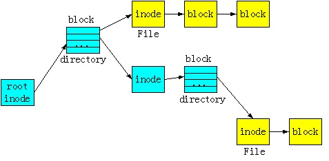

在打开一个文件的过程中，文件系统所要做的事情就是找到指定文件的inode，所以在这个过程中会有磁盘元数据读操作。一旦文件所属的inode被找到，那么需要在内存中初始化一个描述被打开文件的对象，这个对象就是file。所以，dentry，inode之类的信息在磁盘上是永久存储的，file对象是在内存中是临时存在的，它会随着文件的创建而生成，随着文件的关闭而消亡。

在Linux系统中文件类型是多种多样的，一个USB设备也是一个文件，一个普通的Word文档也是一个文件，一个RAID设备也是一个文件。虽然他们在系统中都是文件，但是，他们的操作方式是截然不同的。USB设备可能需要采用字符设备的方式和设备驱动交互；RAID设备可能需要采用块设备的方式和设备驱动进行交互；普通Word文件需要通过cache机制进行性能优化。所以，虽然都是文件，但是，文件表面下的这些设备是不相同的，需要采用的操作方法显然是截然不同的。作为一个通用的文件系统，如何封装不同的底层设备是需要考虑的问题。在Linux中，为了达到这个目的，推出了VFS概念。在VFS层次对用户接口进行了统一封装，并且实现了通用的文件操作功能。例如打开一个文件和关闭一个文件的操作都是相同的。在VFS下面会有针对不同需求的具体文件系统，例如针对Word文档可以采用EXT3文件系统进行操作，对于磁盘设备可以采用bdev块设备文件系统进行操作。在打开一个文件，对文件对象file进行初始化的时候，会将具体的文件系统操作方法关联到file->f_op和file->f_mapping对象。在后面的读写过程中，我们将会看到针对不同的文件类型，会采用不同的f_op和f_mapping方法。

## 读写文件
当一个文件被打开之后，用户态程序就可以得到一个文件对象，即文件句柄。一旦获取文件句柄之后就可以对其进行读写了。用户态的读写函数write对应内核空间的sys_write例程。通过系统调用可以陷入sys_write。Sys_write函数在VFS层做的工作及其有限，其会调用文件对象中指定的操作函数file->f_op->write。对于不同的文件系统，file->f_op->write指向的操作函数是不同的。对于EXT3文件系统而言，在文件inode初始化的时候会指定ext3_file_operations操作方法集。该方法集说明了EXT3文件系统的读写操作方法，说明如下：

```c
const struct file_operations ext3_file_operations = {
    .llseek= generic_file_llseek,
    .read= do_sync_read,
    .write= do_sync_write,
    .aio_read= generic_file_aio_read,
    .aio_write= ext3_file_write,
    .ioctl= ext3_ioctl,
#ifdef CONFIG_COMPAT
    .compat_ioctl= ext3_compat_ioctl,
#endif
    .mmap= generic_file_mmap,
    .open= generic_file_open,
    .release= ext3_release_file,
    .fsync= ext3_sync_file,
    .splice_read= generic_file_splice_read,
    .splice_write= generic_file_splice_write,
};
```
如果文件设备是一个USB设备，并且采用的是字符设备的接口，那么在初始化文件inode的时候会调用init_special_inode初始化这些特殊的设备文件。对于字符设备会采用默认的def_chr_fops方法集，对于块设备会采用def_blk_fops方法集。不同的文件类型会调用各自的方法集。下面章节会对EXT3文件写和块设备文件写进行详细阐述。由于字符设备类型比较简单，在此进行简单说明。

Def_chr_fops方法集其实就定义了open方法，其它的方法都没有定义。其实字符设备的操作方法都需要字符设备驱动程序自己定义，每个设备驱动程序都需要定义自己的write、read、open和close方法，这些方法保存在字符设备对象中。当用户调用文件系统接口open函数打开指定字符设备文件时，VFS会通过上述讲述的sys_open函数找到设备文件inode中保存的def_chr_fops方法，并且执行该方法中的open函数（chrdev_open），chrdev_open函数完成的一个重要功能就是将文件对象file中采用的方法替换成驱动程序设定的设备操作方法。完成这个偷梁换柱的代码是：

    filp->f_op = fops_get(p->ops)

一旦这个过程完成，后继用户程序通过文件系统的write方法都将会调用字符设备驱动程序设定的write方法。即对于字符设备文件而言，在VFS的sys_write函数将直接调用字符设备驱动程序的write方法。所以，对于字符设备驱动程序而言，整个过程很简单，用户态程序可以直接通过系统调用执行字符设备驱动程序的代码。而对于块设备和普通文件，这个过程将会复杂的多。

在用户程序发起写请求的时候，通常会考虑如下三个问题：第一个问题是用户态数据如何高效传递给内核？第二个问题是采用同步或者异步的方式执行IO请求。第三个问题是如果执行普通文件操作，需不需要文件Cache？

第一个问题是数据拷贝的问题。对于普通文件，如果采用了page cache机制，那么这种拷贝合并在很大程度上是避免不了的。但是对于网卡之类的设备，我们在读写数据的时候，需要避免这样的数据拷贝，否则数据传输效率将会变的很低。我第一次关注这个问题是在做本科毕业设计的时候，那时候我设计了一块PCI数据采集卡。在PCI采集卡上集成了4KB的FIFO，数据采集电路会将数据不断的压入FIFO，当FIFO半满的时候会对PCI主控芯片产生一个中断信号，通知PCI主控制器将FIFO中的2KB数据DMA至主机内存。CPU接收到这个中断信号之后，分配DMA内存，初始化DMA控制器，并且启动DMA操作，将2KB数据传输至内存。并且当DMA完成操作之后，会对CPU产生一个中断。板卡的设备驱动程序在接收到这个中断请求之后，面临一个重要的问题：如何将内核空间DMA过来的数据传输给用户空间？通常有两种方法：一种是直接将内核内存映射给用户程序；另一种是进行数据拷贝的方式。对于PCI数据采集卡而言，一个很重要的特性是实时数据采集，在板卡硬件FIFO很小的情况下，如果主机端的数据传输、处理耗费太多的时间，那么整条IO流水线将无法运转，导致FIFO溢出，数据采集出现漏点的情况。所以，为了避免这样的情况，在这些很严格应用的场合只能采用内存映射的方法，从而实现数据在操作系统层面的零拷贝。在Linux中，我们可以采用memory map的方法将内核空间内存映射给用户程序，从而实现用户程序对内核内存的直接访问。在Windows操作系统中，这种内核空间和用户空间的数据交互方式定义成两种：Map IO和Direct IO。Map IO就是采用内存拷贝的方式，Direct IO就是采用MDL内存映射的方式。在编写WDM Windows设备驱动程序的时候经常会用到这两种数据传输模式。值得注意的是，Windows中的Direct IO和Linux中的Direct IO是完全不同的两个概念。在Linux中Direct IO是指写穿page cache的一种IO方法。

第二个问题是异步IO和同步IO的问题。对于普通文件而言，为了提高效率，通常会采用page cache对文件数据在内存进行缓存。Cache虽然提高了效率，但是有些应用一旦发出写请求，并且执行完毕之后，其期望是将数据写入磁盘，而不是内存。例如，有些应用会有一些元数据操作，在元数据操作的过程中，通常期望将数据直接刷新至磁盘，而不是Cache在内存。这就提出了同步IO的需求。为了达到这个效果，可以在打开文件的时候设置O_SYNC标记。当数据在page cache中聚合之后，如果发现O_SYNC标记被设置，那么就会将page cache中的数据强制的刷新到磁盘。对于EXT3文件系统，该过程在ext3_file_write函数中实现。

第三个问题是普通文件的cache问题。对于普通文件，由于磁盘性能比较低，为了提高读写性能，通常会采用内存作为磁盘的cache。文件系统会采用预读等机制对文件读写性能进行优化，避免磁盘随机IO性能过低对文件读写性能造成影响。但是，page cache虽然提高了性能，但是也会对文件系统的可靠性造成一定影响。例如，当数据已经被写入内存之后，系统Crash，内存中的磁盘数据将会遭到破坏。为了避免这种情况，Linux文件系统提供了Direct IO的IO方式。该方式就是让一次IO过程绕过page cache机制，直接将文件内容刷新到磁盘。与上面的同步IO相比，Direct IO达到的效果似乎有点类似。其实，同步IO是一种write through的Cache机制，而Direct IO是完全把Cache抛弃了。同步IO的数据在内存还是有镜像的，而Direct IO是没有的，这是两者的区别。在Linux中的__generic_file_aio_write_nolock函数中，会判断O_DIRECT标记是否被设置，如果该标记被设置，那么调用generic_file_direct_write函数完成数据磁盘写入过程。如果该标记不存在，那么调用generic_file_buffered_write函数将数据写入page cache。

# EXT3文件写操作

如果应用层发起的是一个Word文档的写操作请求，那么通过上述分析，IO会走到sys_write的地方，然后执行file->f_op->write方法。对于EXT3 ，该方法注册的是do_sync_write。Do_sync_write的实现如下：

```c
ssize_t do_sync_write(struct file *filp, const char __user *buf, size_t len, loff_t *ppos)
{
    struct iovec iov = { .iov_base = (void __user *)buf, .iov_len = len };
    struct kiocb kiocb;
    ssize_t ret;
    init_sync_kiocb(&kiocb, filp);
    kiocb.ki_pos = *ppos;
    kiocb.ki_left = len;
    for (;;) {
        ret = filp->f_op->aio_write(&kiocb, &iov, 1, kiocb.ki_pos);
        if (ret != -EIOCBRETRY)
            break;
        wait_on_retry_sync_kiocb(&kiocb);
    }
    if (-EIOCBQUEUED == ret)
        ret = wait_on_sync_kiocb(&kiocb);
    *ppos = kiocb.ki_pos;
    return ret;
}
```

该方法会直接调用非阻塞写处理函数，然后等待IO完成。对于具体EXT3文件读写过程函数调用关系可以参考《Ext3文件系统读写过程分析》。对EXT3文件写操作主要考虑两种情况，一种情况是DIRECT IO方式；另一种情况是page cache的写方式。Direct IO方式会直接绕过缓存处理机制，page cache缓存方式是应用中经常采用的方式，性能会比Direct IO高出不少。对于每一个EXT3文件，都会在内存中维护一棵Radix tree，这棵radix tree就是用来管理来page cache页的。当IO想往磁盘上写入的时候，EXT3会查找其对应的radix tree，看是否已经存在与写入地址相匹配的page页，如果存在那么直接将数据合并到这个page 页中，并且结束一次IO过程，直接结束应用层请求。如果被访问的地址还没有对应的page页，那么需要为访问的地址空间分配page页，并且从磁盘上加载数据到page页内存，最后将这个page页加入到radix tree中。

对于一些大文件，如果不采用radix tree去管理page页，那么需要耗费大量的时间去查找一个文件内对应地址的page页。为了提高查找效率，Linux采用了radix tree的这种管理方式。Radix tree是通用的字典类型数据结构，radix tree又被称之为PAT位树（Patricia Trie or crit bit tree）。Radix tree是一种多叉搜索树，树的叶子节点是实际的数据条目。下图是一个radix tree的例子，该radix tree的分叉为4，树高为4，树中的每个叶子节点用来快速定位8位文件内偏移地址，可以定位256个page页。例如，图中虚线对应的两个叶子节点的地址值为0x00000010和0x11111010，通过这两个地址值，可以很容易的定位到相应的page缓存页。

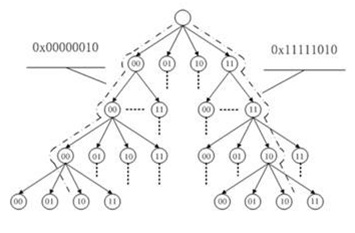

通过radix tree可以解决大文件page页查询问题。在Linux的实现过程中，EXT3写操作处理函数会调用generic_file_buffered_write完成page页缓存写过程。在该函数中，其实现逻辑说明如下：

```c
    ssize_t
generic_file_buffered_write(struct kiocb *iocb, const struct iovec *iov,
        unsigned long nr_segs, loff_t pos, loff_t *ppos,
        size_t count, ssize_t written)
{
    do {
        /* 找到缓存的page页 */
        page = __grab_cache_page(mapping,index,&cached_page,&lru_pvec);
        /* 处理ext3日志等事情 */
        status = a_ops->prepare_write(file, page, offset, offset+bytes);
        /* 将用户数据拷贝至page页 */
        copied = filemap_copy_from_user(page, offset,  buf, bytes);
        /* 设置page页为dirty */
        status = a_ops->commit_write(file, page, offset, offset+bytes);
    }
}
```

第一步通过radix tree找到内存中缓存的page页，如果page页不存在，重新分配一个。第二步通过ext3_prepare_write处理EXT3 日志，并且如果page是一个新页的话，那么需要从磁盘读入数据，装载进page页。第三步是将用户数据拷贝至指定的page页。最后一步将操作的Page页设置成dirty。便于writeback机制将dirty页同步到磁盘。

Page cache会占用Linux的大量内存，当内存紧张的时候，需要从page cache中回收一些内存页，另外，dirty page在内存中聚合一段时间之后，需要被同步到磁盘。应该在3.0内核之前，Linux采用pdflush机制将dirty page同步到磁盘，在之后的版本中，Linux采用了writeback机制进行dirty page的刷新工作。有关于writeback机制的一些源码分析可以参考《writeback机制源码分析》。总的来说，如果用户需要写EXT3文件时，默认采用的是writeback的cache算法，数据会首先被缓存到page页，这些page页会采用radix tree的方式管理起来，便于查找。一旦数据被写入page之后，会将该页标识成dirty。Writeback内核线程或者pdflush线程会周期性的将dirty page刷新到磁盘。如果，系统出现内存不足的情况，那么page回收线程会采用cache算法考虑回收文件系统的这些page缓存页。

# EXT3文件系统设计要点

EXT3文件系统是Linux中使用最为广泛的一个文件系统，其在EXT2的基础上发展起来，在EXT2的基础上加入了日志技术，从而使得文件系统更加健壮。考虑一下，设计一个文件系统需要考虑哪些因素呢？根据我的想法，我认为设计一个文件系统主要需要考虑如下几个方面的因素：

- 1）文件系统使用者的特征是什么？大文件居多还是小文件居多？如果基本都是大文件应用，那么数据块可以做的大一点，使得元数据信息少点，减少这方面的开销。

- 2）文件系统是读应用为主还是写应用为主？这点也是很重要的，如果是写为主的应用，那么可以采用log structured的方式优化IO pattern。例如在备份系统中，基本都是以写请求，那么对于这样的系统，可以采用log structured的方式使得底层IO更加顺序化。

- 3）文件系统的可扩展性，其中包括随着磁盘容量的增长，文件系统是否可以无缝扩展？例如以前的FAT文件系统由于元数据的限制，对支持的容量有着很强的限制。

- 4）数据在磁盘上如何布局？数据在磁盘上的不同布局会对文件系统的性能产生很大的影响。如果元数据信息离数据很远，那么一次写操作将会导致剧烈的磁盘抖动。

- 5）数据安全性如何保证？如果文件系统的元数据遭到了破坏，如何恢复文件数据？如果用户误删了文件，如何恢复用户的数据？这些都需要文件系统设计者进行仔细设计。

- 6）如何保证操作事务的一致性？对于一次写操作设计到元数据更新和文件数据的更新，这两者之间的操作次序如何设计？既能保证很好的性能，又能在系统crash的时候保证文件系统的一致性？在很多设计中采用数据先于元数据的方式，并且通过日志机制保证事务一致性。

- 7）文件系统元数据占用多少系统内存？如果一个文件系统占用太多的系统内存，那么会影响整个系统的性能。

在设计一个文件系统的时候，需要考虑很多方面的问题，上述仅仅是列出了一些基本点，针对不同的文件系统，会有很多的具体问题。例如对于淘宝的TFS集群文件系统，由于系统前端采用了大量的缓存，从而使得TFS的输入全是大文件，因此可以采用大文件设计思想对其进行优化。比如减少目录层次，这样在检索一个文件的时候，不需要花费太多的时间，这种处理可以提升系统性能。另一个例子是中科蓝鲸的BWFS在非线编领域的应用。BWFS是一个带外的集群存储系统，是一种SAN集群文件系统。这种文件系统架构的最大好处是可扩展性极高，由于元数据和数据IO流分离，所以，在很多应用中可以得到很高的集群性能。但是，这种架构也有一个问题，当应用文件以小文件为主的时候，元数据服务器会成为整个系统的性能瓶颈。因为，Client在访问一个文件的时候首先需要访问元数据服务器获取具体的块地址信息。

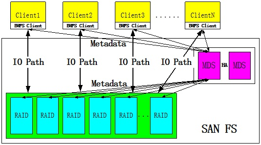

为了解决这个问题，文件系统设计人员需要对小文件这一个问题进行优化，其采用的策略是在Client进行元数据缓存。通过元数据缓存可以减少元数据访问的频率，自然就解决了这个系统性能瓶颈点问题。

从上述分析可以看出，文件系统设计是一个非常复杂的过程，其需要考虑很多应用的特征，特别是IO的Pattern和应用模式。很多文件系统的优化都是在深入分析了应用模式之后才得出的解决方案。

对于EXT3这样一个通用文件系统而言，其主要应用领域是个人桌面应用，个人以为可扩展性、性能并不是第一位的，而可靠性是比较重要的。要理解EXT3文件系统，我以为最好的方式是需要理解文件系统在磁盘上的布局，一旦理解了数据布局之后，就可以比较容易的去理解Linux中的很多ext3算法、策略了。

EXT3将整个磁盘空间划分成多个块组，每个块组都采用元数据信息对其进行描述。块组内的具体格式可以描述如下：

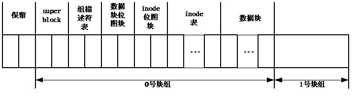

从上图我们可以看出一个块组内的基本信息包括：

- 1）Superblock（超级块）。Superblock描述了整个文件系统的信息。为了保证可靠性，可以在每个块组中对superblock进行备份。为了避免superblock冗余过多，可以采用稀疏存储的方式，即在若干个块组中对superblock进行保存，而不需要在所有的块组中都进行备份。

- 2）组描述符表。组描述符表对整个组内的数据布局进行了描述。例如，数据块位图的起始地址是多少？inode位图的起始地址是多少？inode表的起始地址是多少？块组中还有多少空闲块资源等。组描述符表在superblock的后面。

- 3）数据块位图。数据块位图描述了块组内数据块的使用情况。如果该数据块已经被某个文件使用，那么位图中的对应位会被置1，否则该位为0。

- 4）Inode位图。Inode位图描述了块组内inode资源使用情况。如果一个inode资源已经使用，那么对应位会被置1。

- 5）Inode表（即inode资源）和数据块。这两块占据了块组内的绝大部分空间，特别是数据块资源。

通过上述分析，我们了解了EXT3在磁盘上的数据布局。而一个文件是由inode进行描述的。一个文件占用的数据块是通过inode管理起来的。在inode结构中保存了直接块指针、一级间接块指针、二级间接块指针和三级间接块指针。对于一个小文件，直接可以采用直接块指针实现对文件块的访问。对于一个大文件，需要采用间接块指针实现对文件块的访问。

在理解数据布局之后，想要实现EXT3文件系统并非难事了。最主要的问题是结合Linux提供的页缓存机制实现page cache，另外通过设备的writeback机制同步dirty page。

# 数据回写

对于EXT3文件系统而言，在绝大多数情况下，IO请求走到page cache之后就认为这个IO处理已经完成了。用户的IO请求被放入Cache之后，用户操作结束。实际上，此时的IO处境非常的危险，如果系统在此时Crash，那么内存中缓存的数据将会彻底丢失。为了保证数据不丢失，需要有一种机制及时的将缓存中的数据同步（回写）到磁盘。对于2.6.23版本的Linux，采用了Pdflush的数据同步机制；在3.2版本的Linux中，采用了writeback的数据同步机制。这种机制的变革主要考虑了系统性能提升方面的因素。关于这两种机制的对比可以参考文章《Linux 3.2中回写机制的变革》。

在Linux3.2中，当一个IO数据被写入Page缓存之后，EXT3文件系统会调用ext3_ordered_write_end函数（注意，在Linux2.6.23中调用aops->commit_write，会有所差别）结束整个过程。在该函数中主要完成page页dirty标志位的设置、日志信息的清除工作。其中，设置page页为dirty的操作就是用来唤醒（或者创建）一个writeback线程去处理缓存中的脏数据。设置page页dirty标志的核心函数是__set_page_dirty（调用关系为：ext3_ordered_write_endàblock_write_endà__block_commit_writeàmark_buffer_dirtyà__set_page_dirty）。__set_page_dirty函数说明如下：

```c
static void __set_page_dirty(struct page *page,
        struct address_space *mapping, int warn)
{
    spin_lock_irq(&mapping->tree_lock);
    if (page->mapping) { /* Race with truncate? */
        WARN_ON_ONCE(warn && !PageUptodate(page));
        account_page_dirtied(page, mapping);
        /* 设置radix tree中的Tag标志 */
        radix_tree_tag_set(&mapping->page_tree,
                page_index(page), PAGECACHE_TAG_DIRTY);
    }
    spin_unlock_irq(&mapping->tree_lock);
    /* 将inode加入到writeback线程处理的事务队列中 */
    __mark_inode_dirty(mapping->host, I_DIRTY_PAGES);
}
```

在__set_page_dirty函数中主要完成了两件事情：

- 1）在radix tree中设置需要回写的page页为dirty。我们知道Linux为了加速dirty页的检索，在radix tree中采用了tag机制。Tag本质上就是一种flag，radix tree的每层都有tag，上层的tag信息是下层信息的汇总。所以，如果radix tree中没有脏页，那么最顶层的tag就不会被标识成dirty。如果radix tree中有脏页，脏页所在的那条分支tag才会出现dirty flag。显然，采用这种方法可以加速脏页的检索。如下图所示，如果0x00000010地址所在的page页为脏，那么其所在的访问路径会被标识成Dirty，而其他的路径不受影响。因此，文件系统在查询脏页的时候，会节省很多的检索时间。

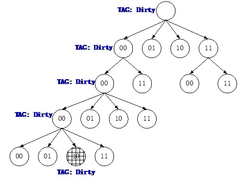

- 2）将文件inode标识成dirty。通过__mark_inode_dirty函数将文件inode设置成脏，并且将该inode交给回写线程进行处理。通知回写线程的处理方式比较简单，直接将该inode挂载到writeback线程调度处理的inode链表中。我们知道，每个设备都会有一个writeback线程处理脏页回写过程，每个writeback都会维护一条需要处理的inode链表。当writeback线程被唤醒之后，其会从inode链表中获取需要处理的inode，并且从该inode所在的radix树中获取脏页，然后生成IO将数据写入磁盘。对于EXT3文件系统而言，其一定会架构在一个块设备之上，因此，在mount文件系统的时候，会将底层块设备的writeback对象（bdi）告诉给EXT3文件系统的root_inode。这样文件系统内部的inode需要进行回写数据时，直接将该inode设置成dirty，然后通过root_inode获取writeback，并且将需要处理的inode挂载到任务链表中，最后唤醒writeback线程进行数据回写操作。

EXT3所在设备的writeback线程被唤醒之后会将文件中的dirty page页刷新到磁盘。Linux中处理完成该功能的函数是do_writepages（writeback_single_inodeà do_writepages）。由于EXT3文件系统没有注册自己的writepages方法，因此，直接调用系统提供的generic_writepages处理脏页。刷新处理一个inode中dirty page的核心函数是write_cache_pages。该函数的主要功能是搜索inode对应radix tree中的脏页，然后调用EXT3的writepage方法将脏页中的数据同步到磁盘。在刷新数据的过程中与块设备层相接口的的方法是submit_bh。每个page页都会对应一个buffer head，EXT3想要刷新数据的时候直接调用submit_bh将page页中生成若干个bio，然后转发至底层物理设备。至此，IO旅程从文件系统开始转向块设备层。

通过上述分析，我们可以了解到一个EXT3写操作基本可以分成如下两个步骤：

- 1）将数据写入page cache，每个文件都会采用一个radix tree对page页进行高效检索管理。当数据被写入page页之后，需要将该页标识成dirty，说明该页中有新的数据需要刷新到磁盘。为了提高radix tree检索dirty page的性能，Linux采用了Tag机制。当page页被标识成dirty之后，需要将该inode加入到对应的writeback线程任务处理队列中，等待writeback线程调度处理。Radix tree和writeback之间的关系如下图所示。


- 2）每个块设备都会有一个writeback内核线程处理page cache/buffer的回写任务。当该线程被调度后，会检索对应inode的radix tree，获取所有的脏页，然后调用块设备接口将脏数据回写到磁盘。

通过上述两大步骤，最常见的EXT3文件写操作完成。一个IO从用户态通过系统调用进入内核，然后在radix tree上小住了一段时间，即将踏上新的征程——块设备层。

# 块设备buffer cache机制

在EXT3文件IO踏上新的征程之前，需要介绍一位EXT3文件IO的同伴，他们即将踏上相同的旅程。只不过这位同伴没有经历过EXT3文件系统的精彩，却领略了另外一番略有差别的风情。这位同伴是在块设备写操作时创建诞生的，我们可以称它为块设备IO。

在很多应用中都会直接进行块设备操作，我们常用的命令dd就可以进行块设备的读写。例如：dd if=/dev/sda of=./abc bs=512 count=1 命令可以实现将/dev/sda设备的第一个扇区读入到当前目录的abc文件中。读到这里我们想一下：访问一个块设备文件和一个EXT3文件到底有何本质上的区别呢？说到区别还是可以列举一二的：

- 1）EXT3是一个通用的文件系统，数据在磁盘上的分布是采用元数据的形式进行描述的。所以，对于一个EXT3文件的读写操作会涉及到元数据和文件数据两种类型。由于这两种数据类型存在相关性，所以为了保证两者之间操作的原子性，EXT3通常会采用日志的方式保证操作的原子性。

- 2）块设备没有EXT3文件系统那么复杂，写入的数据直接在磁盘存储，不存在任何的元数据信息。

所以，比较块设备和EXT3文件系统，数据的读写方式存在差别。两者之间一个很大的共同点是都存在磁盘访问的性能问题，都可以采用内存对磁盘进行性能优化。EXT3采用page cache对IO性能进行优化，块设备同样可以采用page cache对其进行性能优化。前面我们已经了解到，每个EXT3文件都有一棵radix tree用于维护这个文件内容的page cache，而裸设备可以等价成一个EXT3文件，同样可以采用一棵radix tree对块设备上的数据进行cache维护。所以，在这两者之间是有很大共同点的。

正因为如此，Linux在实现块设备IO操作的时候和EXT3是类似的，对于块设备访问的这个子系统可以称之为bdev文件系统。VFS实现了所有类型文件访问的功能，应用程序所调用的API是完全相同的。对于块设备的访问，穿过VFS层会调用bdev文件系统提供的相关函数。

在初始化块设备的时候，会调用init_special_inode函数初始化这个块设备的inode：

```c
void init_special_inode(struct inode *inode, umode_t mode, dev_t rdev)
{
    inode->i_mode = mode;
    if (S_ISCHR(mode)) {
        /* 初始化字符设备操作方法 */
        inode->i_fop = &def_chr_fops;
        inode->i_rdev = rdev;
    } else if (S_ISBLK(mode)) {
        /* 初始化块设备操作方法 */
        inode->i_fop = &def_blk_fops;
        inode->i_rdev = rdev;
    } else if (S_ISFIFO(mode))
        inode->i_fop = &def_fifo_fops;
    else if (S_ISSOCK(mode))
        inode->i_fop = &bad_sock_fops;
    else
        printk(KERN_DEBUG "init_special_inode: bogus i_mode (%o) for"
                " inode %s:%lu\n", mode, inode->i_sb->s_id,
                inode->i_ino);
}
```

在用户程序调用open函数打开指定块设备的时候，会初始化一个file对象，并且采用上述inode对file对象进行初始化。因此，通过file对象的文件操作方法就可以调用通用的块设备操作函数。Linux中定义的通用块设备操作函数说明如下：

```c
const struct file_operations def_blk_fops = {
    .open       = blkdev_open,
    .release    = blkdev_close,
    .llseek     = block_llseek,
    .read       = do_sync_read,
    .write      = do_sync_write,
    .aio_read   = generic_file_aio_read,
    .aio_write  = blkdev_aio_write,
    .mmap       = generic_file_mmap,
    .fsync      = blkdev_fsync,
    .unlocked_ioctl = block_ioctl,
#ifdef CONFIG_COMPAT
    .compat_ioctl   = compat_blkdev_ioctl,
#endif
    .splice_read    = generic_file_splice_read,
    .splice_write   = generic_file_splice_write,
};
```

因此，对于一个块设备的写操作，通过write函数陷入内核执行do_sync_write。在do_sync_write函数中会调用blkdev_aio_write函数实现块设备的异步写入过程。blkdev_aio_write函数的核心是__generic_file_aio_write。到此为止，我们发现块设备的所有调用函数和EXT3文件系统基本一样。前面已经分析过，__generic_file_aio_write分成两种情况：Direct_IO和Buffer_IO。对于buffer_IO分成关键的几个步骤：

- 1）write_begin

- 2）copy buffer

- 3）write_end

write_begin和write_end函数是每类文件系统具体相关的方法，对于bdev文件系统，其定义为：

```c
static const struct address_space_operations def_blk_aops = {
    .readpage   = blkdev_readpage,
    .writepage  = blkdev_writepage,
    .write_begin    = blkdev_write_begin,
    .write_end  = blkdev_write_end,
    .writepages = generic_writepages,
    .releasepage    = blkdev_releasepage,
    .direct_IO  = blkdev_direct_IO,
};
```

对于EXT3文件而言，write_begin会进行日志操作，块设备文件系统没有这种操作，只会进行一些page页初始化方面的工作。对于write_end函数，EXT3文件系统会清除日志，并且需要通知writeback守护线程去回写数据。对于块设备文件系统而言，write_end函数的主要工作就是将page页标识成脏，然后通知回写线程去处理这个块设备中的脏页。实现设置脏页的函数说明如下：

```c
static int __block_commit_write(struct inode *inode, struct page *page,
        unsigned from, unsigned to)
{
    unsigned block_start, block_end;
    int partial = 0;
    unsigned blocksize;
    struct buffer_head *bh, *head;
    blocksize = 1 << inode->i_blkbits;
    for(bh = head = page_buffers(page), block_start = 0;
            bh != head || !block_start;
            block_start=block_end, bh = bh->b_this_page) {
        block_end = block_start + blocksize;
        if (block_end <= from || block_start >= to) {
            if (!buffer_uptodate(bh))
                partial = 1;
        } else {
            set_buffer_uptodate(bh);
            /*将page页和inode设置成脏，等待回写调度处理*/
            mark_buffer_dirty(bh);
        }
        clear_buffer_new(bh);
    }
    /*
     * If this is a partial write which happened to make all buffers
     * uptodate then we can optimize away a bogus readpage() for
     * the next read(). Here we 'discover' whether the page went
     * uptodate as a result of this (potentially partial) write.
     */
    if (!partial)
        SetPageUptodate(page);
    return 0;
}
```

从整个分析来看，裸块设备的写操作中Cache的机制、原理和EXT3并没有什么本质上的区别。大家都采用了radix tree管理的page cache。如果不采用Direct_IO的方式，那么都会首先将数据写入page cache，然后再通过writeback机制将数据回写到磁盘。整个机制是完全相同的。所不同的是，EXT3和块设备的缓存块大小是不相同的。对于EXT3而言，缓存块大小就是page size，对于块设备而言，缓存块大小会采用一定的策略得到。具体关于buffer cache的缓存块大小参考《Linux中Buffer cache性能问题一探究竟》。

虽然块设备和EXT3文件看上去差别很大，但是，由于系统所要解决的问题基本类似，因此，在IO处理的机制上是类似的。好！言归正传，到目前为止，EXT3文件IO以及块设备IO都已经准备完毕，writeback回写机制已经已经将这些IO统统回写到底层设备中。这些IO都将离开短暂的page cache，一同踏上块设备层，即将面临块设备层即公平又难以公平的调度处理过程。

# 块设备层分析

无论是经过EXT3文件系统还是块设备文件,最终都要通过writeback机制将数据刷新到磁盘，除非用户在对文件进行读写的时候采用了DirectIO的方式。为了提高性能，文件系统或者是裸设备都会采用Linux的cache机制对数据读写性能进行优化，因此都会采用writeback回写机制将数据写入磁盘。

通过上述分析我们已经知道，writeback机制会调用不同底层设备的address_space_operations函数将数据刷新到设备。例如，EXT3文件系统会调用blkdev_writepage函数将radix tree中的page页写入设备。在确认需要将一个page页写入设备时，最终都需要调用submit_bh函数，该函数描述如下：

```c
int submit_bh(int rw, struct buffer_head * bh)
{
    struct bio *bio;
    int ret = 0;
    BUG_ON(!buffer_locked(bh));
    BUG_ON(!buffer_mapped(bh));
    BUG_ON(!bh->b_end_io);
    BUG_ON(buffer_delay(bh));
    BUG_ON(buffer_unwritten(bh));
    /*
     * Only clear out a write error when rewriting
     */
    if (test_set_buffer_req(bh) && (rw & WRITE))
        clear_buffer_write_io_error(bh);
    /*
     * from here on down, it's all bio -- do the initial mapping,
     * submit_bio -> generic_make_request may further map this bio around
     */
    bio = bio_alloc(GFP_NOIO, 1);
    /* 封装BIO */
    bio->bi_sector = bh->b_blocknr * (bh->b_size >> 9);  /* 起始地址 */
    bio->bi_bdev = bh->b_bdev;                /* 访问设备 */
    bio->bi_io_vec[0].bv_page = bh->b_page;       /* 数据buffer地址 */
    bio->bi_io_vec[0].bv_len = bh->b_size;            /* 数据段大小 */
    bio->bi_io_vec[0].bv_offset = bh_offset(bh);     /* 数据在buffer中的offset */
    bio->bi_vcnt = 1;
    bio->bi_idx = 0;
    bio->bi_size = bh->b_size;
    /* 设定回调函数 */
    bio->bi_end_io = end_bio_bh_io_sync;
    bio->bi_private = bh;
    bio_get(bio);
    /* 提交BIO至对应设备，让该设备对应的驱动程序进行进一步处理 */
    submit_bio(rw, bio);
    if (bio_flagged(bio, BIO_EOPNOTSUPP))
        ret = -EOPNOTSUPP;
    bio_put(bio);
    return ret;
}
```

Submit_bh函数的主要任务是为page页分配一个bio对象，并且对其进行初始化，然后将bio提交给对应的块设备对象。提交给块设备的行为其实就是让对应的块设备驱动程序对其进行处理。在Linux中，每个块设备在内核中都会采用bdev（block_device）对象进行描述。通过bdev对象可以获取块设备的所有所需资源，包括如何处理发送到该设备的IO方法。因此，在初始化bio的时候，需要设备目标bdev，在Linux的请求转发层需要用到bdev对象对bio进行转发处理。

在通用块设备层，提供了一个非常重要的bio处理函数generic_make_request，通过这个函数实现bio的转发处理，该函数的实现如下：

```c
void generic_make_request(struct bio *bio)
{
    struct bio_list bio_list_on_stack;
    if (!generic_make_request_checks(bio))
        return;
    /*
     * We only want one ->make_request_fn to be active at a time, else
     * stack usage with stacked devices could be a problem.  So use
     * current->bio_list to keep a list of requests submited by a
     * make_request_fn function.  current->bio_list is also used as a
     * flag to say if generic_make_request is currently active in this
     * task or not.  If it is NULL, then no make_request is active.  If
     * it is non-NULL, then a make_request is active, and new requests
     * should be added at the tail
     */
    if (current->bio_list) {
        bio_list_add(current->bio_list, bio);
        return;
    }
    /* following loop may be a bit non-obvious, and so deserves some
     * explanation.
     * Before entering the loop, bio->bi_next is NULL (as all callers
     * ensure that) so we have a list with a single bio.
     * We pretend that we have just taken it off a longer list, so
     * we assign bio_list to a pointer to the bio_list_on_stack,
     * thus initialising the bio_list of new bios to be
     * added.  ->make_request() may indeed add some more bios
     * through a recursive call to generic_make_request.  If it
     * did, we find a non-NULL value in bio_list and re-enter the loop
     * from the top.  In this case we really did just take the bio
     * of the top of the list (no pretending) and so remove it from
     * bio_list, and call into ->make_request() again.
     */
    BUG_ON(bio->bi_next);
    bio_list_init(&bio_list_on_stack);
    current->bio_list = &bio_list_on_stack;
    do {
        /* 获取块设备的请求队列 */
        struct request_queue *q = bdev_get_queue(bio->bi_bdev);
        /* 调用对应驱动程序的处理函数 */
        q->make_request_fn(q, bio);
        bio = bio_list_pop(current->bio_list);
    } while (bio);
    current->bio_list = NULL; /* deactivate */
}
```

在generic_make_request函数中，最主要的操作是获取请求队列，然后调用make_request_fn方法处理bio。在Linux中一个块设备驱动通常可以分成两大类：有queue和无queue。有queue的块设备就是驱动程序提供了一个请求队列，make_request_fn方法会将bio放入请求队列中进行调度处理，调度处理的方法有CFQ、Deadline和Noop之分。设置请求队列的目的是考虑了磁盘介质的特性，普通磁盘介质一个最大的问题是随机读写性能很差。为了提高性能，通常的做法是聚合IO，因此在块设备层设置请求队列，对IO进行聚合操作，从而提高读写性能。关于IO scheduler的具体算法分析请见后续文章。

在Linux的通用块层，提供了一个通用的请求队列压栈方法：blk_queue_bio，在老版本的Linux中为__make_request。在初始化一个有queue块设备驱动的时候，最终都会调用blk_init_allocated_queue函数对请求队列进行初始化，初始化的时候会将blk_queue_bio方法注册到q->make_request_fn。在generic_make_request转发bio请求的时候会调用q->make_request_fn，从而可以将bio压入请求队列进行IO调度。一旦bio进入请求队列之后，可以好好的休息一番，直到unplug机制对bio进行进一步处理。

另一类块设备是无queue的。无queue的块设备我们通常可以认为是一种块设备过滤驱动，这类驱动程序可以自己实现请求队列，绝大多数是没有请求队列的，直接对bio进行转发处理。这类驱动程序一个很重要的特征是需要自己实现q->make_request_fn方法。这类驱动的make_request_fn方法通常可以分成如下几个步骤：

- 1）根据一定规则切分bio，不同的块设备可能存在不同的块边界，因此，需要对请求bio进行边界对齐操作。

- 2）找到需要转发的底层块设备对象。

- 3）直接调用generic_make_request函数转发bio至目标设备。

因此，无queue的块设备处理过程很直观。其最重要的作用是转发bio。在Linux中，device_mapper机制就是用来转发bio的一种框架，如果需要开发bio转发处理的驱动程序，可以在device_mapper框架下开发一个target，从而快速实现一个块设备驱动。

通过上述描述，我们知道，IO通过writeback或者DirectIO的方式可以抵达块设备层。到了块设备层之后遇到了两类块设备处理方法。如果遇到无queue块设备类型，bio马上被转发到其他底层设备；如果遇到了有queue块设备类型，bio会被压入请求队列，进行合并处理，等待unplug机制的调度处理。IO曾经在page cache游玩了很长时间，大家都很高兴。所有得请求在page cache受到得待遇是相同的，大家都会比较公平得被调度走，继续下面的旅程。但是，在块设备层情况就变的复杂了，不同IO受到的待遇会有所不同，这就需要看请求队列中的io scheduler具体算法了。因此，IO旅程在块设备这一站，最为重要的核心就是io scheduler。

# IO调度器

当IO旅行到调度器的时候，发现自己受到的待遇竟然很不一样，有些IO倚仗着特权很快就放行了；有些IO迟迟得不到处理，甚至在有些系统中居然饿死！面对这样的现状，IO显然是很不高兴的，凭什么别人就能被很快送到下一个旅程，自己需要在调度器上耗费青春年华？这里是拼爹的时代，人家出身好，人家是读请求，人家就可以很快得到资源。咱们是写请求，出生贫寒，只能等着，但也不会让你饿死。这就是我们常见的deadline策略。在更加糟糕的地方，deadline都没有，拼的是家族血脉关系，相邻的IO可以很快处理掉，其他的等着吧，那就会出现饿死的情况。这就是我们常说的noop策略，其实就是Linus电梯。在文明一点的社会，大家会比较公平，从应用的整体来看，大家会享有相同的IO带宽，但是，从IO的个体来看，公平性还是没有的。这个社会没有绝对的公平，只要保证所有家庭的公平性，那么社会就会比较和谐。当然，我们发现有些家庭（应用）不是特别合群，我们也可以对其进行惩罚，IO带宽的分配就会对其进行缩减。这就是我们常见的CFQ策略。在IO调度器层，可以有很多的策略，不同的系统可以定义不同的策略，目的都是在与更好的聚合IO，并且对不同的应用进行QOS控制。

在Linux系统中，可以注册自己的调度算法，如果不注册自己的调度器，那么可以采用上述提到的三种调度器之一。其中，deadline是在Linus电梯的基础上发展起来的，其对读写请求进行了有区别的调度，还会考虑到IO饥饿的情况。最为传统的调度器不能规避IO饥饿问题。CFQ调度器考虑了应用的公平性，在很多情况下可以得到最佳性能，有关于这三种调度器的设计比较会在下面篇章中详细阐述。

当IO请求通过generic_make_request进行转发时，如果被访问的设备是一个有queue的块设备，那么系统会调用blk_queue_bio函数进行bio的调度合并。blk_queue_bio函数说明如下：

```c
void blk_queue_bio(struct request_queue *q, struct bio *bio)
{
    const bool sync = !!(bio->bi_rw & REQ_SYNC);
    struct blk_plug *plug;
    int el_ret, rw_flags, where = ELEVATOR_INSERT_SORT;
    struct request *req;
    unsigned int request_count = 0;
    /*
     * low level driver can indicate that it wants pages above a
     * certain limit bounced to low memory (ie for highmem, or even
     * ISA dma in theory)
     */
    blk_queue_bounce(q, &bio);
    if (bio->bi_rw & (REQ_FLUSH | REQ_FUA)) {
        spin_lock_irq(q->queue_lock);
        where = ELEVATOR_INSERT_FLUSH;
        goto get_rq;
    }
    /*
     * Check if we can merge with the plugged list before grabbing
     * any locks.
     */
    /* 尝试将bio合并到当前plugged的请求队列中 */
    if (attempt_plug_merge(q, bio, &request_count))
        return;
    spin_lock_irq(q->queue_lock);
    /* elv_merge是核心函数，找到bio前向或者后向合并的请求 */
    el_ret = elv_merge(q, &req, bio);
    if (el_ret == ELEVATOR_BACK_MERGE) {
        /* 进行后向合并操作 */
        if (bio_attempt_back_merge(q, req, bio)) {
            if (!attempt_back_merge(q, req))
                elv_merged_request(q, req, el_ret);
            goto out_unlock;
        }
    } else if (el_ret == ELEVATOR_FRONT_MERGE) {
        /* 进行前向合并操作 */
        if (bio_attempt_front_merge(q, req, bio)) {
            if (!attempt_front_merge(q, req))
                elv_merged_request(q, req, el_ret);
            goto out_unlock;
        }
    }
    /* 无法找到对应的请求实现合并 */
get_rq:
    /*
     * This sync check and mask will be re-done in init_request_from_bio(),
     * but we need to set it earlier to expose the sync flag to the
     * rq allocator and io schedulers.
     */
    rw_flags = bio_data_dir(bio);
    if (sync)
        rw_flags |= REQ_SYNC;
    /*
     * Grab a free request. This is might sleep but can not fail.
     * Returns with the queue unlocked.
     */
    /* 获取一个empty request请求 */
    req = get_request_wait(q, rw_flags, bio);
    if (unlikely(!req)) {
        bio_endio(bio, -ENODEV);    /* @q is dead */
        goto out_unlock;
    }
    /*
     * After dropping the lock and possibly sleeping here, our request
     * may now be mergeable after it had proven unmergeable (above).
     * We don't worry about that case for efficiency. It won't happen
     * often, and the elevators are able to handle it.
     */
    /* 采用bio对request请求进行初始化 */
    init_request_from_bio(req, bio);
    if (test_bit(QUEUE_FLAG_SAME_COMP, &q->queue_flags))
        req->cpu = raw_smp_processor_id();
    plug = current->plug;
    if (plug) {
        /*
         * If this is the first request added after a plug, fire
         * of a plug trace. If others have been added before, check
         * if we have multiple devices in this plug. If so, make a
         * note to sort the list before dispatch.
         */
        if (list_empty(&plug->list))
            trace_block_plug(q);
        else {
            if (!plug->should_sort) {
                struct request *__rq;
                __rq = list_entry_rq(plug->list.prev);
                if (__rq->q != q)
                    plug->should_sort = 1;
            }
            if (request_count >= BLK_MAX_REQUEST_COUNT) {
                /* 请求数量达到队列上限值，进行unplug操作 */
                blk_flush_plug_list(plug, false);
                trace_block_plug(q);
            }
        }
        /* 将请求加入到队列 */
        list_add_tail(&req->queuelist, &plug->list);
        drive_stat_acct(req, 1);
    } else {
        /* 在新的内核中，如果用户没有调用start_unplug，那么，在IO scheduler中是没有合并的，一旦加入到request queue中，马上执行unplug操作，这个地方个人觉得有点不妥，不如以前的定时调度机制。对于ext3文件系统，在刷写page cache的时候，都需要首先执行start_unplug操作，因此都会进行request/bio的合并操作。 */
        spin_lock_irq(q->queue_lock);
        /* 将request加入到调度器中 */
        add_acct_request(q, req, where);
        /* 调用底层函数执行unplug操作 */
        __blk_run_queue(q);
out_unlock:
        spin_unlock_irq(q->queue_lock);
    }
}
```

对于blk_queue_bio函数主要做了三件事情：

- 1）进行请求的后向合并操作

- 2）进行请求的前向合并操作

- 3）如果无法合并请求，那么为bio创建一个request，然后进行调度

在bio合并过程中，最为关键的函数是elv_merge。该函数主要工作是判断bio是否可以进行后向合并或者前向合并。对于所有的调度器，后向合并的逻辑都是相同的。在系统中维护了一个request hash表，然后通过bio请求的起始地址进行hash寻址。Hash表的生成原理比较简单，就是将所有request的尾部地址进行分类，分成几大区间，然后通过hash函数可以寻址这几大区间。Hash函数是：

    hash_long(ELV_HASH_BLOCK((sec)), elv_hash_shift)

一旦通过hash函数找到所有位于这个区间的request之后，通过遍历的方式匹配到所需要的request。具体该过程的实现函数如下：

```c
static struct request *elv_rqhash_find(struct request_queue *q, sector_t offset)
{
    struct elevator_queue *e = q->elevator;
    /* 通过hash函数找到区间内的所有request */
    struct hlist_head *hash_list = &e->hash[ELV_HASH_FN(offset)];
    struct hlist_node *entry, *next;
    struct request *rq;
    /* 遍历地址区间内的所有request */
    hlist_for_each_entry_safe(rq, entry, next, hash_list, hash) {
        BUG_ON(!ELV_ON_HASH(rq));
        if (unlikely(!rq_mergeable(rq))) {
            __elv_rqhash_del(rq);
            continue;
        }
        /* 如果地址匹配，那么找到所需的request */
        if (rq_hash_key(rq) == offset)
            return rq;
    }
    return NULL;
}
```

采用hash方式维护request，有一点需要注意：当一个request进行合并处理之后，需要对该request在hash表中进行重新定位。这主要是因为request的尾地址发生了变化，有可能会超过一个hash区间的范围。

如果后向合并失败，那么调度器会尝试前向合并。不是所有的调度器支持前向合并，如果调度器支持这种方式，那么需要注册elevator_merge_fn函数实现前向调度功能。例如deadline算法采用了红黑树的方式实现前向调度。如果前向调度无法完成合并。那么调度器认为该合并失败，需要产生一个新的request，并且采用现有bio对其进行初始化，然后加入到request queue中进行调度处理。

当IO利用generic_make_request来到块设备层之后，对其进行处理的重要函数blk_queue_bio主要任务是合并IO。由于不同的调度器有不同的合并方法、IO分类方法，所以，具体调度器的算法会采用函数注册的方式实现。blk_queue_bio仅仅是一个上层函数，最主要完成后向合并、调用调度器方法进行前向合并以及初始化request准备调度。

# IO调度器设计考虑

通过前面的分析已经知道IO调度器主要是为了解决临近IO合并的问题。磁介质存储盘最大的性能瓶颈在于寻道。当用户访问一个指定地址时，磁盘首先需要进行寻道操作，找到访问地址所属的区域。这种操作往往是毫秒级别的，相对于性能不断提升的CPU而言，这种性能显然是不可接受的。所以，磁盘最大的问题在于机械操作引入的寻道时间过长，对外表现就是随机读写性能太差了。

为了弥补这种性能弱点，Linux操作系统系统在设计的时候引入了IO调度器，尽最大可能将随机读写转换成大块顺序读写，减少磁盘抖动，降低若干IO操作之间的寻道时间。IO调度器的目的就在于此，它的初衷是面向存储介质设计的。因此，当一个系统的存储介质发生变化之后，IO调度器就需要改变。例如，针对SSD存储介质，传统意义上的IO调度算法就不再适用了。SSD不存在机械操作，不存在漫长的寻道时间问题，因此，不存在传统磁介质的随机读写问题。但是，SSD存在写放大的问题，一个小写会引入大量的数据读写操作，从而使得IO性能下降。所以，传统磁盘的IO调度器在SSD面前就没有价值了，可以采用最简单的Noop调度器对IO进行后向合并就可以了，而写放大等问题往往都在SSD内部的Firmware解决了。

考虑一下，如果设计的IO调度器完全面向存储介质，那么设计的调度算法只需要考虑IO请求的前向/后向合并就可以了，这样的IO合并减少了磁头的抖动，就像一部电梯一样，一直往一个方向移动。这种算法看上去很完美，但是，在实践中我们会发现有些请求会长时间得不到服务，就像一辆电梯厂时间停在一个楼层，其他楼层的人长时间得不到服务。特别对于一些读操作，往往是同步请求，如果长时间得不到服务，那么会大大影响应用的性能。所以，仅仅简单的考虑存储介质的特性，进行IO的前向/后向合并是不够的，还需要考虑IO的本身属性。

从IO的属性来看，最需要区分的是读写请求，读写请求的优先级是不一样的，大多数写请求可以异步完成，读请求需要同步完成，所以，对于读写请求可以分开处理。虽然分开之后可能会引入更多的磁盘抖动，但是，应用的整体性能还是会提高。

考虑了IO的基本属性之外，是不是就够了呢？其实还是不够的。例如在一个服务器中存在多个应用，这些应用会访问相同的存储，有些应用读请求多，有些应用写请求多，如果仅仅考虑IO的基本属性，那么对于这些不同的应用就会表现出不同的IO性能。有些应用得到较多的IO带宽，性能较好；有些应用得到较少的带宽，性能较差。这显然是不合理的，由于调度算法的策略问题，导致一个系统中，不同应用具有不同的IO性能。为了解决这个问题，需要考虑应用属性。

在现有的Linux系统中，提供了多种IO调度器，这些调度器有些仅仅考虑了存储介质属性（Noop），有些考虑了IO属性（Deadline），还有的考虑了应用属性（cfq）。不同调度器的设计考虑范畴不同，所以复杂度也有很大差别。下面会对Linux中的这几种调度器进行阐述。

# Elevator子系统介绍

Elevator子系统是IO 路径上非常重要的组成部分，前面已经分析过，elevator中实现了多种类型的调度器，用于满足不同应用的需求。那么，从整个IO路径的角度来看，elevator这层主要解决IO的QoS问题，通常需要解决如下两大问题：

- 1）Bio的合并问题。主要考虑bio是否可以和scheduler中的某个request进行合并。因为从磁盘的角度来看，临近的请求需要合并，所有的IO需要顺序化处理，这样磁头才能往一个方向运行，避免无规则的乱序运行。

- 2）Request的调度问题。request在何时可以从scheduler中取出，并且送入底层驱动程序继续进行处理？不同的应用可能需要不同的带宽资源，读写请求的带宽、延迟控制也可以不一样，因此，需要解决request的调度处理，从而可以更好的控制IO的QoS。

通过上面分析，一个IO在经过块设备层处理之后，终于来到了elevator层。我们熟知，一个request在送往设备之前会被放入到每个设备所对应的request queue。其实，通过分析一个IO在elevator层其实会经过很多request queue，不同的request queue会有不同的作用。如下图所示，一个IO在经历很多层queue的调度处理之后，最后才能达到每个设备的request queue。Linux中各个request queue之间的关系如下图所示：

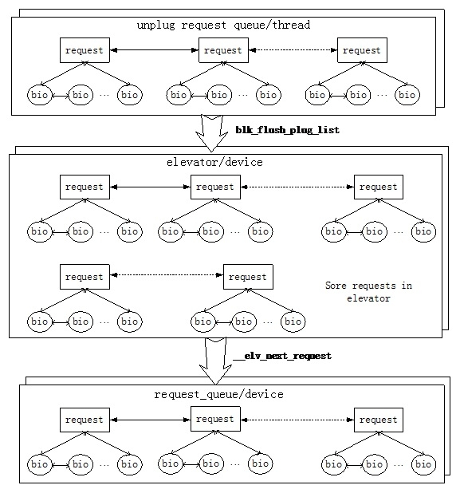

在Linux-3.2中，已经采用新的unplug机制对请求进行批量unplug处理，相对于2.6.23 kernel这是新的一层。在老Kernel中，没有这层unplug机制，request请求可以直接进入elevator，然后通过内核中的unplug定时器对elevator中的request进行unplug调度处理。在新kernel中，每个线程可以对自己的request进行unplug调度处理。例如，ext3文件系统的writeback线程可以主动unplug自己的request，这种application awareness的方法可以最大限度的减少请求处理的延迟时间。

从上图可以看出，一个IO请求首先进入每个线程域所在的unplug请求队列。如果这个线程没有unplug请求队列，那么IO request直接被送入elevator。在unplug请求队列中等待的request会在请求unplug的过程中被送入elevator的请求队列。每个设备可以采用不同类型的IO调度方法，因此，在elevator中的IO分类方法会有所不同。这里Elevator的类型也就是我们通常所说的Noop、deadline以及CFQ方法。最后，Elevator中的request会在一定的策略控制下被送入每个设备的request queue。从这个结构中，我们可以看出，只要控制住了elevator的调度器，那么我们就可以控制每个设备IO的优先级，从而达到IO QoS的目的。

通过分析，我们已经知道Request在三类request queue中被调度处理，其主要处理时机点可以描述如下：

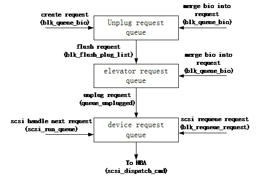

在一般的请求处理过程中，request被创建并且会被挂载到unplug request queue中，然后通过flush request方法将request从unplug request queue中移至elevator request queue中。当一个新的BIO需要被处理时，其可以在unplug request queue或者elevator request queue中进行合并。当需要将请求发送到底层设备时，可以通过调用run_queue的方法将elevator分类处理过的request转移至device request queue中，最后调用scsi_dispatch_cmd方法将请求发送到HBA。在这个过程有一些问题需要处理：底层设备可能存在故障；HBA的处理队列是有长度限制的。因此，如何连续调度device request queue及重新调度request成了一个需要考虑的问题。在Linux中，如果scsi层需要重新调度一个request，可以通过blk_requeue_request接口来完成。通过该接口，可以把request重新放回到device request queue中。另外，在一个request结束之后的回调函数中，需要通过scsi_run_queue函数来再次调度处理device request queue中的剩余请求，从而可以保证批量处理device request queue中的请求，HBA也一直运行在最大的queue depth深度。

# Elevator层关键函数分析

## Elv_merge

当一个IO离开块设备层，需要发送到底层设备时，首先需要判断该IO是否可以和正在等待处理的request进行合并。这一步主要是通过elv_merge()函数来实现的，需要注意的是，在调用elv_merge进行合并操作之前，首先需要判断unplug request queue是否可以进行合并，如果不能合并，那么才调用elv_merge进行elevator request queue的合并操作。一旦bio找到了可以合并的request，那么，这个IO就会合并放入对应的request中，否则需要创建一个新的request，并且放入到unplug request queue中。

Elevator层提供的bio合并函数分析如下：

```c
int elv_merge(struct request_queue *q, struct request **req, struct bio *bio)
{
    struct elevator_queue *e = q->elevator;
    struct request *__rq;
    int ret;
    /*
     * Levels of merges:
     *  nomerges:  No merges at all attempted
     *  noxmerges: Only simple one-hit cache try
     *  merges:    All merge tries attempted
     */
    if (blk_queue_nomerges(q))
        return ELEVATOR_NO_MERGE;
    /*
     * First try one-hit cache.
     * 尝试和最近的request进行合并
     */
    if (q->last_merge) {
        ret = elv_try_merge(q->last_merge, bio);
        if (ret != ELEVATOR_NO_MERGE) {
            /* 可以和last_merge进行合并 */
            *req = q->last_merge;
            return ret;
        }
    }
    if (blk_queue_noxmerges(q))
        return ELEVATOR_NO_MERGE;
    /*
     * See if our hash lookup can find a potential backmerge.
     * 查找elevator中的后向合并的hash table，获取可以合并的request
     */
    __rq = elv_rqhash_find(q, bio->bi_sector);
    if (__rq && elv_rq_merge_ok(__rq, bio)) {
        *req = __rq;
        return ELEVATOR_BACK_MERGE;
    }
    /* 查找scheduler检查是否可以进行前向合并，如果可以，那么进行前向合并 */
    if (e->ops->elevator_merge_fn)
        return e->ops->elevator_merge_fn(q, req, bio);
    return ELEVATOR_NO_MERGE;
}
```

### __elv_add_request

需要将一个request加入到request queue中时，可以调用__elv_add_request函数。通过该函数可以将request加入到elevator request queue或者device request queue中。该函数的实现如下：

```c
void __elv_add_request(struct request_queue *q, struct request *rq, int where)
{
    trace_block_rq_insert(q, rq);
    rq->q = q;
    if (rq->cmd_flags & REQ_SOFTBARRIER) {
        /* barriers are scheduling boundary, update end_sector */
        if (rq->cmd_type == REQ_TYPE_FS ||
                (rq->cmd_flags & REQ_DISCARD)) {
            q->end_sector = rq_end_sector(rq);
            q->boundary_rq = rq;
        }
    } else if (!(rq->cmd_flags & REQ_ELVPRIV) &&
            (where == ELEVATOR_INSERT_SORT ||
             where == ELEVATOR_INSERT_SORT_MERGE))
        where = ELEVATOR_INSERT_BACK;
    switch (where) {
        case ELEVATOR_INSERT_REQUEUE:
        case ELEVATOR_INSERT_FRONT:
            /* 将request加入到device request queue的队列前 */
            rq->cmd_flags |= REQ_SOFTBARRIER;
            list_add(&rq->queuelist, &q->queue_head);
            break;
        case ELEVATOR_INSERT_BACK:
            /* 将request 加入到device request queue的队列尾 */
            rq->cmd_flags |= REQ_SOFTBARRIER;
            elv_drain_elevator(q);
            list_add_tail(&rq->queuelist, &q->queue_head);
            /*
             * We kick the queue here for the following reasons.
             * - The elevator might have returned NULL previously
             *   to delay requests and returned them now.  As the
             *   queue wasn't empty before this request, ll_rw_blk
             *   won't run the queue on return, resulting in hang.
             * - Usually, back inserted requests won't be merged
             *   with anything.  There's no point in delaying queue
             *   processing.
             */
            __blk_run_queue(q);
            break;
        case ELEVATOR_INSERT_SORT_MERGE:
            /* 尝试对request进行合并操作，如果无法合并将request加入到elevator request queue中 */
            /*
             * If we succeed in merging this request with one in the
             * queue already, we are done - rq has now been freed,
             * so no need to do anything further.
             */
            if (elv_attempt_insert_merge(q, rq))
                break;
        case ELEVATOR_INSERT_SORT:
            /* 将request加入到elevator request queue中 */
            BUG_ON(rq->cmd_type != REQ_TYPE_FS &&
                    !(rq->cmd_flags & REQ_DISCARD));
            rq->cmd_flags |= REQ_SORTED;
            q->nr_sorted++;
            if (rq_mergeable(rq)) {
                elv_rqhash_add(q, rq);
                if (!q->last_merge)
                    q->last_merge = rq;
            }
            /*
             * Some ioscheds (cfq) run q->request_fn directly, so
             * rq cannot be accessed after calling
             * elevator_add_req_fn.
             */
            q->elevator->ops->elevator_add_req_fn(q, rq);
            break;
        case ELEVATOR_INSERT_FLUSH:
            rq->cmd_flags |= REQ_SOFTBARRIER;
            blk_insert_flush(rq);
            break;
        default:
            printk(KERN_ERR "%s: bad insertion point %d\n",
                    __func__, where);
            BUG();
    }
}
```

###  Elv_dispatch_sort

当elevator request queue中的request需要发送到device request queue中时，可以调用elv_dispatch_sort函数，通过该函数可以对request进行排序，插入到合适的位置。Elv_dispatch_sort函数的实现如下：

```c
void elv_dispatch_sort(struct request_queue *q, struct request *rq)
{
    sector_t boundary;
    struct list_head *entry;
    int stop_flags;
    if (q->last_merge == rq)
        q->last_merge = NULL;
    elv_rqhash_del(q, rq);
    q->nr_sorted--;
    boundary = q->end_sector;
    stop_flags = REQ_SOFTBARRIER | REQ_STARTED;
    list_for_each_prev(entry, &q->queue_head) {
        struct request *pos = list_entry_rq(entry);
        if ((rq->cmd_flags & REQ_DISCARD) !=
                (pos->cmd_flags & REQ_DISCARD))
            break;
        if (rq_data_dir(rq) != rq_data_dir(pos))
            break;
        if (pos->cmd_flags & stop_flags)
            break;
        if (blk_rq_pos(rq) >= boundary) {
            if (blk_rq_pos(pos) < boundary)
                continue;
        } else {
            if (blk_rq_pos(pos) >= boundary)
                break;
        }
        if (blk_rq_pos(rq) >= blk_rq_pos(pos))
            break;
    }
    list_add(&rq->queuelist, entry);
}
```

## Elevator子系统小结

Elevator子系统是实现IO调度处理的框架，功能不同的scheduler可以做为一种elevator type加入到这个框架中来。所以，如果需要设计实现一个自定义的scheduler，那么首先必须需要了解elevator子系统。

## Linux中常见IO调度器

### Noop调度器算法

Noop是Linux中最简单的调度器，这个调度器基本上没做什么特殊的事情，就是把邻近bio进行了合并处理。从IO的QoS角度来看，这个Noop调度器就是太简单了，但是从不同存储介质的特性来看，这个Noop还是有一定用武之地的。例如，对于磁盘介质而言，为了避免磁头抖动，可以通过调度器对写请求进行合并。对于SSD存储介质而言，这个问题不存在了，或者说不是那么简单的存在了。如果SSD内部能够很好的处理了写放大等问题，那么调度器这一块就不需要做什么特殊处理了，此时Noop就可以发挥作用了。

通过阅读Noop调度器的代码，我们可以了解到一个调度器是如何实现的，对外的接口是什么？所以，了解一个调度器的框架，从Noop开始是非常好的一个选择。

Noop调度器的实现非常简单，其主要完成了一个elevator request queue，这个request queue没有进行任何的分类处理，只是对输入的request进行简单的队列操作。但是，需要注意的是，虽然Noop没有做什么事情，但是elevator还是对bio进行了后向合并，从而最大限度的保证相邻的bio得到合并处理。Noop调度器实现了elevator的基本接口函数，并将这些函数注册到linux系统的elevator子系统中。

需要注册到elevator子系统中的基本接口函数声明如下：

```c
static struct elevator_type elevator_noop = {
    .ops = {
        /* 合并两个request */
        .elevator_merge_req_fn      = noop_merged_requests,
        /* 调度一个合适的request进行发送处理 */
        .elevator_dispatch_fn       = noop_dispatch,
        /* 将request放入调度器的queue中 */
        .elevator_add_req_fn        = noop_add_request,
        /* 获取前一个request */
        .elevator_former_req_fn     = noop_former_request,
        /* 获取后一个request */
        .elevator_latter_req_fn     = noop_latter_request,
        .elevator_init_fn       = noop_init_queue,
        .elevator_exit_fn       = noop_exit_queue,
    },
    .elevator_name = "noop",
    .elevator_owner = THIS_MODULE,
};
```

由于Noop调度器没有对request进行任何的分类处理、调度，因此上述这些函数的实现都很简单。例如，当调度器需要发送request时，会调用noop_dispatch。该函数会直接从调度器所管理的request queue中获取一个request，然后调用elv_dispatch_sort函数将请求加入到设备所在的request queue中。Noop dispatch函数实现如下：

```c
static int noop_dispatch(struct request_queue *q, int force)
{
    struct noop_data *nd = q->elevator->elevator_data;
    if (!list_empty(&nd->queue)) {
        struct request *rq;
        /* 从调度器的队列头中获取一个request */
        rq = list_entry(nd->queue.next, struct request, queuelist);
        list_del_init(&rq->queuelist);
        /* 将获取的request放入到设备所属的request queue中 */
        elv_dispatch_sort(q, rq);
        return 1;
    }
    return 0;
}
```

当需要往noop调度器中放入request时，可以调用noop_add_request，该函数的实现及其简单，就是将request挂入调度器所维护的request queue中。Noop_add_request函数实现如下：

```c
static void noop_add_request(struct request_queue *q, struct request *rq)
{
    struct noop_data *nd = q->elevator->elevator_data;
    /* 将request挂入noop调度器的request queue */
    list_add_tail(&rq->queuelist, &nd->queue);
}
```

由此可见，noop调度器的实现是很简单的，仅仅实现了一个调度器的框架，用一条链表把所有输入的request管理起来。通过noop调度器的例子，我们可以了解到实现一个调度器所需要的基本结构：

```c
/* 包含基本的头文件 */
#include <linux/blkdev.h>
#include <linux/elevator.h>
#include <linux/bio.h>
#include <linux/module.h>
#include <linux/slab.h>
#include <linux/init.h>
/* 定义调度器所需要的数据结构，一条管理request的队列是必须的 */
struct noop_data {
    struct list_head queue;
};
/* 实现调度器的接口函数 */
static struct elevator_type elevator_noop = {
    .ops = {
        /* 调度器的功能函数 */
        .elevator_merge_req_fn      = noop_merged_requests,
        ……
            /* 初始化/注销调度器，通常在下面这些函数初始化调度器内部的一些数据结构，例如noop_data */
            .elevator_init_fn       = noop_init_queue,
        .elevator_exit_fn       = noop_exit_queue,
    },
    .elevator_name = "noop",
    .elevator_owner = THIS_MODULE,
};
/* 注册调度器 */
static int __init noop_init(void)
{
    elv_register(&elevator_noop);
    return 0;
}
/* 销毁调度器 */
static void __exit noop_exit(void)
{
    elv_unregister(&elevator_noop);
}
/* 模块加载时调用noop_init */
module_init(noop_init);
/* 模块退出时调用noop_exit */
module_exit(noop_exit);
```


### Deadline调度器算法

Deadline这种调度器对读写request进行了分类管理，并且在调度处理的过程中读请求具有较高优先级。这主要是因为读请求往往是同步操作，对延迟时间比较敏感，而写操作往往是异步操作，可以尽可能的将相邻访问地址的请求进行合并，但是，合并的效率越高，延迟时间会越长。因此，为了区别对待读写请求类型，deadline采用两条链表对读写请求进行分类管理。但是，引入分类管理之后，在读优先的情况下，写请求如果长时间得到不到调度，会出现饿死的情况，因此，deadline算法考虑了写饿死的情况，从而保证在读优先调度的情况下，写请求不会被饿死。

Deadline这种调度算法的基本思想可以采用下图进行描述：

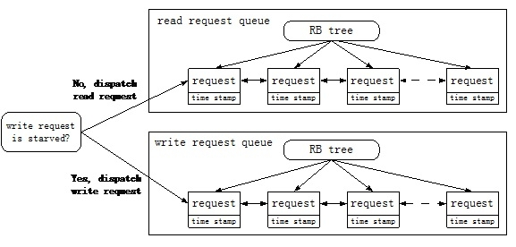

读写请求被分成了两个队列，并且采用两种方式将这些request管理起来。一种是采用红黑树（RB tree）的方式将所有request组织起来，通过request的访问地址作为索引；另一种方式是采用队列的方式将request管理起来，所有的request采用先来后到的方式进行排序，即FIFO队列。每个request会被分配一个time stamp，这样就可以知道这个request是否已经长时间没有得到调度，需要优先处理。在请求调度的过程中，读队列是优先得到处理的，除非写队列长时间没有得到调度，存在饿死的状况。

在请求处理的过程中，deadline算法会优先处理那些访问地址临近的请求，这样可以最大程度的减少磁盘抖动的可能性。只有在有些request即将被饿死的时候，或者没有办法进行磁盘顺序化操作的时候，deadline才会放弃地址优先策略，转而处理那些即将被饿死的request。

总体来讲，deadline算法对request进行了优先权控制调度，主要表现在如下几个方面：

- 1）读写请求分离，读请求具有高优先调度权，除非写请求即将被饿死的时候，才会去调度处理写请求。这种处理可以保证读请求的延迟时间最小化。

- 2）对请求的顺序批量处理。对那些地址临近的顺序化请求，deadline给予了高优先级处理权。例如一个写请求得到调度后，其临近的request会在紧接着的调度过程中被处理掉。这种顺序批量处理的方法可以最大程度的减少磁盘抖动。

- 3）保证每个请求的延迟时间。每个请求都赋予了一个最大延迟时间，如果达到延迟时间的上限，那么这个请求就会被提前处理掉，此时，会破坏磁盘访问的顺序化特征，回影响性能，但是，保证了每个请求的最大延迟时间。

与deadline相关的请求调度发送函数是deadline_dispatch_requests，该函数的实现、分析如下：

```c
static int deadline_dispatch_requests(struct request_queue *q, int force)
{
    struct deadline_data *dd = q->elevator->elevator_data;
    const int reads = !list_empty(&dd->fifo_list[READ]);
    const int writes = !list_empty(&dd->fifo_list[WRITE]);
    struct request *rq;
    int data_dir;
    /*
     * batches are currently reads XOR writes
     请求批量处理入口
     */
    if (dd->next_rq[WRITE])
        rq = dd->next_rq[WRITE];
    else
        rq = dd->next_rq[READ];
    /* 如果批量请求处理存在，并且还没有达到批量请求处理的上限值，那么继续请求的批量处理 */
    if (rq && dd->batching < dd->fifo_batch)
        /* we have a next request are still entitled to batch */
        goto dispatch_request;
    /*
     * at this point we are not running a batch. select the appropriate
     * data direction (read / write)
     */
    /* 优先处理读请求队列 */
    if (reads) {
        BUG_ON(RB_EMPTY_ROOT(&dd->sort_list[READ]));
        /* 如果写请求队列存在饿死的现象，那么优先处理写请求队列 */
        if (writes && (dd->starved++ >= dd->writes_starved))
            goto dispatch_writes;
        data_dir = READ;
        goto dispatch_find_request;
    }
    /*
     * there are either no reads or writes have been starved
     */
    /* 没有读请求需要处理，或者写请求队列存在饿死现象 */
    if (writes) {
dispatch_writes:
        BUG_ON(RB_EMPTY_ROOT(&dd->sort_list[WRITE]));
        dd->starved = 0;
        data_dir = WRITE;
        goto dispatch_find_request;
    }
    return 0;
dispatch_find_request:
    /*
     * we are not running a batch, find best request for selected data_dir
     */
    if (deadline_check_fifo(dd, data_dir) || !dd->next_rq[data_dir]) {
        /* 如果请求队列中存在即将饿死的request，或者不存在需要批量处理的请求，那么从FIFO队列头获取一个request */
        /*
         * A deadline has expired, the last request was in the other
         * direction, or we have run out of higher-sectored requests.
         * Start again from the request with the earliest expiry time.
         */
        rq = rq_entry_fifo(dd->fifo_list[data_dir].next);
    } else {
        /* 继续批量处理，获取需要批量处理的下一个request */
        /*
         * The last req was the same dir and we have a next request in
         * sort order. No expired requests so continue on from here.
         */
        rq = dd->next_rq[data_dir];
    }
    dd->batching = 0;
dispatch_request:
    /* 将request从调度器中移出，发送至设备 */
    /*
     * rq is the selected appropriate request.
     */
    dd->batching++;
    deadline_move_request(dd, rq);
    return 1;
}
```

Deadline调度器需要处理的核心数据结构是deadline_data，该结构描述如下：
```c
struct deadline_data {
    /*
     * run time data
     */
    /*
     * requests (deadline_rq s) are present on both sort_list and fifo_list
     */
    /* 采用红黑树管理所有的request，请求地址作为索引值 */
    struct rb_root sort_list[2];
    /* 采用FIFO队列管理所有的request，所有请求按照时间先后次序排列 */
    struct list_head fifo_list[2];
    /*
     * next in sort order. read, write or both are NULL
     */
    /* 批量处理请求过程中，需要处理的下一个request */
    struct request *next_rq[2];
    /* 计数器：统计当前已经批量处理完成的request */
    unsigned int batching;      /* number of sequential requests made */
    sector_t last_sector;       /* head position */
    /* 计数器：统计写队列是否即将饿死 */
    unsigned int starved;       /* times reads have starved writes */
    /*
     * settings that change how the i/o scheduler behaves
     */
    /* 配置信息：读写请求的超时时间值 */
    int fifo_expire[2];
    /* 配置信息：批量处理的request数量 */
    int fifo_batch;
    /* 配置信息：写饥饿值 */
    int writes_starved;
    int front_merges;
};
```

总体而言,Noop和Deadline算法实现是比较简单的.

### CFQ调度器算法

在相对比较老的Linux中，CFQ机制的实现还比较简单，仅仅是针对不同的thread进行磁盘带宽的公平调度。但是，自从新Kernel引入Cgroup机制之后，CFQ的机制就显得比较复杂了，因为，此时的CFQ不仅可以对IO带宽进行公平调度，更重要的是对磁盘IO进行QoS控制。

IO的QoS控制是非常必要的，在同一系统中，不同进程/线程所享有的IO带宽可以是不同的，为了达到此目的，Linux在Cgroup框架下引入了blkio_cgroup对不同线程的带宽资源进行调度控制。由于cgroup的引入，CFQ算法中引入了cfq_group的概念，所以使得整个IO资源调度的算法看起来复杂多了。

为了更好的理解CFQ算法的整个框架，需要理清几个关键数据结构之间的关系，下图是cfq_group，cfq_data，cfq_queue，ioc，cfq_ioc，blkio_cgroup以及blkio_group数据结构之间的关系图。


通过上图，我们可以知道ioc是每个线程所拥有的IO上下文（context），由于一个线程可以对多个磁盘设备进行操作，因此，每个线程会对每个正在操作的磁盘对象创建一个cfq_ioc。在cfq_ioc中会保存与这个磁盘设备相关的策略对象cfq_group以及IO调度对象cfq_queue。因此，当一个线程往一个磁盘设备进行写操作时，可以通过IO上下文获取这个request所应该附属的策略对象cfq_group和调度对象cfq_queue。

IO上下文是线程相关的，多个线程可以定义相同的策略行为，因此，在Linux Cgroup机制中为每个IO策略集定义了一个blkio_cgroup对象，该对象负责管理IO的控制策略。例如，控制IO的策略主要有带宽、延迟。由于一个线程需要对多个磁盘设备进行IO操作，因此，每个blkio_cgroup对象管理了针对每个磁盘设备的策略集，该对象为blkio_group。假设系统中有两个线程ThreadA和ThreadB，他们拥有相同的策略并且都在对同一个设备Sda进行操作，那么在blkio_cgroup中只存在一个和sda相关的blkio_group。如果ThreadA和ThreadB分别对sda和sdb进行操作，那么在blkio_cgroup中将会存在两个blkio_group对象。在CFQ算法中，对blkio_group对象进行了封装，形成了cfq_group对象。因此，可以认为cfq_group和blkio_group对象是一一对应的。也就是说cfq_group对象是针对一个磁盘设备的一种策略，当然同一个磁盘设备会存在多种IO策略，他们分别归属不同的线程。因此，一个磁盘的cfq对象中会管理多个cfq_group对象。

CFQ算法是针对一个磁盘设备的，即每个磁盘设备都会管理一个cfq对象。在磁盘设备的request queue对象中会保存这个cfq对象，这点和其他的调度算法是相同的。Cfq_data就是那个cfq对象。前面提到，由于一个磁盘设备会被多个线程进行访问，因此可以存在多种IO策略，所以，一个cfq对象需要管理多个cfq_group，每个cfq_group管理了一种IO策略。在cfq算法中，每个按时间片调度的基本单元是线程，由于多个线程可以共享一种策略，即共享cfq_group，因此，在cfq_group对象中为每个线程独立管理了一个request队列，这个队列对象是cfq_queue。Cfq_queue是与线程相关的调度对象，cfq算法在调度的过程中会给被调度的cfq_queue分配时间片，然后在这个时间片内处理cfq_queue中的request。

调度cfq_queue中的request方法和deadline算法是基本一致的。因此，在cfq_queue中会维护一棵红黑树以及一条FIFO队列，FIFO队列中的request按照时间先后次序排列，红黑树上的request采用LBA访问地址进行索引。并且在处理的过程中，也会考虑临近IO优先处理的策略，使得磁盘临近IO批量处理，提高了IO性能。

从上面的数据结构关系图，我们可以发现，和老版本的cfq算法相比，新版本的CFQ引入了blkio_cgroup以及blkio_group对象，在cfq中的体现为cfq_group。引入cfq_group之后，IO的调度处理将变的更加灵活。例如，如果ThreadA被定义成PolicyA，其访问sda将有80%的带宽，ThreadB被定义成PolicyB，其访问sda将有20%的带宽。对于上述情况，将会创建两个blkio_cgroup，并且拥有两个cfq_group对象，这两个cfq_group对象都会被加入到sda设备的cfq_data对象中进行管理。Cfq_groupA对应着policyA，管理threadA的IO请求，cfq_groupB对应着policyB，管理threadB的IO请求。由于cfq_groupA策略占有80%带宽，那么在调度过程中，cfq算法会把80%的时间片分给cfq_groupA，而cfq_groupB只能分到20%的时间片，因此达到了对ThreadA和B的IO QoS控制目的。

理清楚cfq算法中关键数据结构之间的关系之后，最重要的问题就是如何实现request的调度处理。下图展示了cfq中各层对象的调度处理方法。


在调度一个request时，首先需要选择一个一个合适的cfq_group。Cfq调度器会为每个cfq_group分配一个时间片，当这个时间片耗尽之后，会选择下一个cfq_group。每个cfq_group都会分配一个vdisktime，并且通过该值采用红黑树对cfq_group进行排序。在调度的过程中，每次都会选择一个vdisktime最小的cfq_group进行处理。

一个cfq_group管理了7棵service tree，每棵service tree管理了需要调度处理的对象cfq_queue。因此，一旦cfq_group被选定之后，需要选择一棵service tree进行处理。这7棵service tree被分成了三大类，分别为RT、BE和IDLE。这三大类service tree的调度是按照优先级展开的，即RT的优先级高于BE，BE的高于IDLE。通过优先级可以很容易的选定一类Service tree。当一类service tree被选定之后，采用service time的方式选定一个合适的cfq_queue。每个Service tree是一棵红黑树，这些红黑树是按照service time进行检索的，每个cfq_queue都会维护自己的service time。分析到这里，我们知道，cfq算法通过每个cfq_group的vdisktime值来选定一个cfq_group进行服务，在处理cfq_group的过程通过优先级选择一个最需要服务的service tree。通过该Service tree得到最需要服务的cfq_queue。该过程在cfq_select_queue函数中实现。

一个cfq_queue被选定之后，后面的过程和deadline算法有点类似。在选择request的时候需要考虑每个request的延迟等待时间，选择那种等待时间最长的request进行处理。但是，考虑到磁盘抖动的问题，cfq在处理的时候也会进行顺序批量处理，即将那些在磁盘上连续的request批量处理掉。

在cfq调度的过程中，选择cfq_queue的重要函数实现如下：

```c
static struct cfq_queue *cfq_select_queue(struct cfq_data *cfqd)
{
    struct cfq_queue *cfqq, *new_cfqq = NULL;
    /* 如果cfq调度器当前没有服务的对象，那么直接跳转去选择一个新的cfq_queue */
    cfqq = cfqd->active_queue;
    if (!cfqq)
        goto new_queue;
    /* 如果在cfq中没有request，直接返回 */
    if (!cfqd->rq_queued)
        return NULL;
    /*
     * We were waiting for group to get backlogged. Expire the queue
     */
    if (cfq_cfqq_wait_busy(cfqq) && !RB_EMPTY_ROOT(&cfqq->sort_list))
        goto expire;
    /*
     * The active queue has run out of time, expire it and select new.
     当前的cfq_queue已经服务到限，重新选择一个新的cfq_queue
     */
    if (cfq_slice_used(cfqq) && !cfq_cfqq_must_dispatch(cfqq)) {
        /*
         * If slice had not expired at the completion of last request
         * we might not have turned on wait_busy flag. Don't expire
         * the queue yet. Allow the group to get backlogged.
         *
         * The very fact that we have used the slice, that means we
         * have been idling all along on this queue and it should be
         * ok to wait for this request to complete.
         */
        if (cfqq->cfqg->nr_cfqq == 1 && RB_EMPTY_ROOT(&cfqq->sort_list)
                && cfqq->dispatched && cfq_should_idle(cfqd, cfqq)) {
            cfqq = NULL;
            goto keep_queue;
        } else
            goto check_group_idle;
    }
    /*
     * The active queue has requests and isn't expired, allow it to
     * dispatch.
     Cfq_queue还存在很多需要处理的request，继续处理这个cfq_queue
     */
    if (!RB_EMPTY_ROOT(&cfqq->sort_list))
        goto keep_queue;
    /*
     * If another queue has a request waiting within our mean seek
     * distance, let it run.  The expire code will check for close
     * cooperators and put the close queue at the front of the service
     * tree.  If possible, merge the expiring queue with the new cfqq.
     当前处理的cfq_queue已经超时，需要选择一个在磁盘上与当前处理的request临近的cfq_queue
     */
    new_cfqq = cfq_close_cooperator(cfqd, cfqq);
    if (new_cfqq) {
        if (!cfqq->new_cfqq)
            cfq_setup_merge(cfqq, new_cfqq);
        goto expire;
    }
    /*
     * No requests pending. If the active queue still has requests in
     * flight or is idling for a new request, allow either of these
     * conditions to happen (or time out) before selecting a new queue.
     */
    if (timer_pending(&cfqd->idle_slice_timer)) {
        cfqq = NULL;
        goto keep_queue;
    }
    /*
     * This is a deep seek queue, but the device is much faster than
     * the queue can deliver, don't idle
     **/
    if (CFQQ_SEEKY(cfqq) && cfq_cfqq_idle_window(cfqq) &&
            (cfq_cfqq_slice_new(cfqq) ||
             (cfqq->slice_end - jiffies > jiffies - cfqq->slice_start))) {
        cfq_clear_cfqq_deep(cfqq);
        cfq_clear_cfqq_idle_window(cfqq);
    }
    if (cfqq->dispatched && cfq_should_idle(cfqd, cfqq)) {
        cfqq = NULL;
        goto keep_queue;
    }
    /*
     * If group idle is enabled and there are requests dispatched from
     * this group, wait for requests to complete.
     */
check_group_idle:
    if (cfqd->cfq_group_idle && cfqq->cfqg->nr_cfqq == 1 &&
            cfqq->cfqg->dispatched &&
            !cfq_io_thinktime_big(cfqd, &cfqq->cfqg->ttime, true)) {
        cfqq = NULL;
        goto keep_queue;
    }
expire:
    /* 将当前cfq_queue设置成超时 */
    cfq_slice_expired(cfqd, 0);
new_queue:
    /*
     * Current queue expired. Check if we have to switch to a new
     * service tree
     如果没有找到一个临近的cfq_queue，那么选择一个新的service tree进行处理
     */
    if (!new_cfqq)
        cfq_choose_cfqg(cfqd);
    /* 初始化一个调度处理的cfq_queue */
    cfqq = cfq_set_active_queue(cfqd, new_cfqq);
keep_queue:
    return cfqq;
}
```

# 块设备层软件堆栈概述

辗转反侧，一个IO终于从应用层达到了IO Scheduler层，并且经过scheduler调度处理之后准备前往SCSI层，向目的地Disk方向前进。一个IO历尽千辛万苦从应用层来到IO调度器，正准备调度走，回眸往事，不禁潸然泪下，路漫漫，一路走来真是不易！从应用层走到文件系统；在文件系统的Cache中停留许久之后，又被Writeback线程写入到块设备层；经过块设备层的调度处理之后，终于来到IO调度层；经过IO层严格调度之后，最终得到机会往SCSI协议层奔去。不就是一个IO操作吗？居然要经过这么多层的调度处理，想到这里，IO难免会觉得委屈，但不管怎样，从IO调度器出来之后，IO还是可以春风得意地奔向SCSI协议层的怀抱，在那里准备打包，并梦想着乘坐高速列车驶向心仪已久的目的地——Disk Drive。


春风得意的IO那里知道，他其实是一个幸运儿，他才走了很短的路程，未来的路还很漫长。更为幸运的是，他前面走过的路非常的平顺，其实没有太多的波折，是每个IO都会经历的过程。通常来讲，在很多高端的存储系统中，一个IO在块设备层会经历更多的软件层，这些软件层可以被称之为块设备层的IO堆栈。

块设备的IO堆栈包括SSD缓存系统、卷管理器、Snapshot快照系统、CDP持续数据保护系统、RAID磁盘阵列系统。这些软件层可以堆叠在一起，也可以单独存在。在一个后端存储系统中，SSD缓存系统、Snapshot、卷管理、RAID磁盘阵列往往会被堆叠在一起，从而构成一套高性能、高可用、易管理的存储系统。一个具有完整IO堆栈的系统层次结构如下图所示：

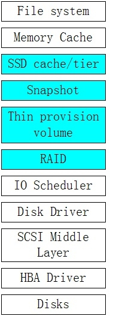

近几年SSD的发展的确飞速迅猛，其最大表现在于大容量的Nand Flash存储芯片的研发和SSD Firmware的推进发展。Nand Flash技术在电子技术领域其实不是一个新东西，很早就采用了。但是，那时候的Nand Flash性能和容量远远不如现在，那时Nand Flash仅仅作为电子系统设计中的一个持久化数据保存地，我在10多年前就西门子合作采用Nand Flash来设计存储高速公路收费信息的系统，将Nand Flash作为一个裸磁盘使用。另外，在航天航空领域也会采用Nand Flash来替代机械硬盘，但是性能很一般，诸如DOM卡、USB存储之类的东西。随着Nand Flash制造工艺的不断突破，存储容量不断增大。基于Nand Flash的SSD终于诞生了，并且曾经一度想替代存储领域的主角——机械硬盘。SSD的最大优点在于随机读写性能强，不存在机械寻道时间，因此具有很高的IOPS和带宽。当然，节能、可靠性也是SSD一大优点。SSD的最大缺点在于使用寿命，每个Flash块都存在擦写次数的限制，会影响数据存储的安全性。另外，Nand Flash在写操作时会存在写放大等问题，这个问题会影响到SSD的小写性能以及使用寿命。因此，如何解决SSD本身存在的这些问题是SSD研发的重点，各个SSD公司都会设计自己的Firmware来应对这些问题。正是因为这个原因，SSD Firmware是一个SSD公司的核心技术机密。从外部使用者的角度来看，SSD比机械磁盘具有更好的随机/顺序读写性能，但是容量远远小于磁盘，所以在短时间内无法采用SSD整体替换磁盘系统，除非是一些规模不是很大的存储应用系统。为了更好的结合SSD和磁盘，可以将SSD作为一种缓存系统应用于磁盘存储系统之上。大家知道，在现有的存储架构下，内存作为磁盘存储系统的Cache，那么引入SSD之后，可以将SSD作为磁盘存储的二级Cache。正是这个原因，在目前的很多存储系统中都会加入SSD缓存系统作为读Cache，或者作为数据自动分层的高效存储资源。SSD缓存层加入之后，对于很多应用可以极大提高系统的IOPS和IO带宽。

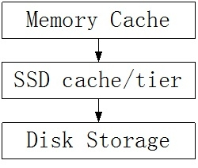

大家知道snapshot是一种快照系统，为了达到数据在时间轴上可回滚的目的，可以采用snapshot的技术对数据在时间轴上做切片。如果用户想要回滚到历史上某个时间点的数据集，那么可以采用这个时间点的快照。快照可以在文件系统层实现，也可以在块层达到相同的目的。由于文件系统本身采用inode tree之类的树维护了数据块的映射信息，因此，实现起来相对容易。在块层如果需要实现快照，那么需要数据块映射机制作为支撑。块层快照往往在卷管理器之上实现快照语义，卷管理器可以作为资源块分配机制为快照进行资源动态分配。快照算法通常有写时拷贝COW和写时映射ROW两种，对于不同的应用需求，这两种算法有各自的优缺点。从结构上分，快照有草型快照和链式快照之分，不同的结构有不同的效率和性能。

卷管理器是一个老生常谈的话题，Linux中的逻辑卷管理LVM名声在外，很多系统都会采用LVM作为卷管理器。LVM可以整合不同厂商的存储资源，然后根据用户的需求形成逻辑卷供应用层使用，在LVM中物理卷池和逻辑卷都可以动态扩容，从而简化了存储资源的管理。在现代存储系统中，为了提高IO性能、存储资源的使用率，在卷管理层引入了Thin provisioning的功能。Thin Provisioning的最大特点在于可以对存储资源进行按需动态分配，即对存储进行了虚拟化管理。从用户的角度来看，一个逻辑卷有100TB的空间，但是，实际的资源可能只有10TB，这就是Thin Provisioning的核心思想。存储虚拟化的另外一大好处在于可以优化IO性能。在多用户的一个系统中，从单个用户的角度来看，可能都是顺序写操作，但是，到了存储后端，由于多用户并发的效果，导致这些顺序IO会混合在一起，从而对后端存储系统而言形成了随机IO。多用户并发操作使得存储系统的性能极为降低，从而导致诸如VMware虚拟化环境下出现的多用户并发操作导致每个用户的性能体验都很差。为了解决这个问题，可以在卷管理层引入虚拟化机制，将这种随机IO顺序化，从而提高整体存储性能。

磁盘阵列RAID技术是大家非常熟悉的技术，其主要目的是用来保护用户数据和提高读写性能。由于RAID技术可以在多个磁盘之间并发IO，因此使得应用IO性能大为提高。另外，在RAID技术中可以采用XOR、RS编码以及擦除码等编解码技术进行数据信息冗余，因此，可以提高数据可靠性。RAID技术从诞生之初到现在已经发展的极为成熟，几乎所有的存储系统都会采用RAID作为系统的数据保护层和性能优化层。下图是1988年Patterson, Gibson和Katz联合发表的RAID学术论文：

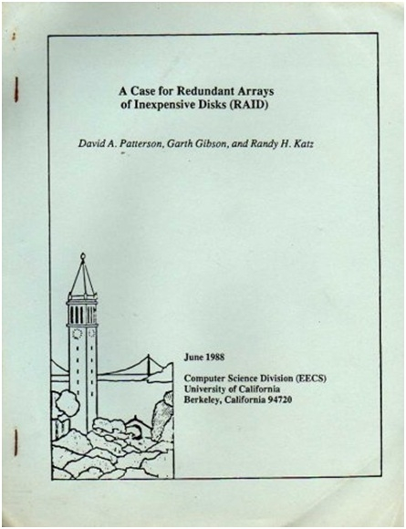


通常来讲，一个系统可以采用硬件RAID卡或者纯软件的技术手段来实现RAID功能，在中低端系统中通常都会采用硬件RAID方案来实现RAID功能，但是在高端系统中，都会考虑采用软件的方式来实现RAID功能。软件方式实现RAID功能的优点在于可以根据应用特征实现复杂的数据保护方式。例如，在备份系统中对数据保护的要求比较高，实现的RAID需要比其它RAID具有更强的数据保护能力，因此，软件RAID的方案是一个比较好的选择。伴随着磁盘容量的不断增大，RAID本身存在的问题也越来越突出：一个问题是RAID的数据重构时间变的越来越长；另一个问题是RAID数据重构IO对应用IO性能造成严重影响。为了解决上述RAID问题，传统RAID正面临着架构转型。

由此可见在存储系统中，块设备层具有很多的软件层，这些软件层用于解决性能、灵活性、数据可靠性等问题。前面讲到春风得意的IO准备离开IO Scheduler层，通过磁盘驱动程序前往SCSI协议层。回过头来，我们还是有必要细细探讨SSD缓存、快照系统、卷管理器以及RAID系统，从中体验IO旅程的不易。后面我们将对块设备层的这些主要功能层的设计实现进行详细剖析。


# 磁盘阵列

## 从技术研发者角度看RAID

在一个IO的旅程中基本上都会经历一个非常重要站点，他就是RAID。提起RAID，基本上是无人不晓，每个人都能说上一点。例如RAID5、RAID6之类的概念，此外，RAID可以提高数据可靠性，但是考虑到IO 性能等问题，很多人都会采用硬件RAID卡对IO进行加速。诸如此类的东西，或许大家都知道。从表面上看，RAID似乎很简单，多块磁盘聚合在一起，采用一定的数据分布算法将数据分布到多块磁盘上，这就构成了RAID。是的，从外表来看，RAID的确很简单，经过这么多年的发展，很多人也将RAID放入了古老技术的行列。但是，从技术研发者的角度来看，RAID其实很复杂，为什么这么说呢？这主要是因为在设计RAID的时候，有很多棘手的问题需要解决。这些棘手的问题主要包括如下几个方面：

- 1）数据小写问题。RAID把多块磁盘绑定在一起，并且在水平方向进行条带切分，每个条带都会横跨多块磁盘。重要的是每个条带会生成一个或者多个校验冗余数据。在写入操作的时候，需要更新校验冗余数据。在写入数据量比较小的情况下，为了生成校验冗余数据，那么需要读取条带中没有被更新过的数据，然后计算得到校验数据，最后将条带数据写入磁盘。显然，在整个过程中，存在一个写放大的问题，一个简单的写操作变成了“读-更新-写”的操作。所以，小写问题对RAID的性能带来极大的影响。

- 2）校验数据计算问题。对于常用的RAID5、RAID6，是需要计算校验数据的。这些校验数据的计算看起来不是很复杂，其实是很耗CPU时间的。常用的CPU不擅长数值计算，如果直接将乘法等运算交给CPU来做，那么RAID6的复杂度就会变得很高。大量的计算会使得IO延迟大为增加，从而使得RAID很难在对实时性和吞吐量要求比较高的场合应用。

- 3）数据重构问题。随着磁盘容量的不断增加，数据重构的时间会变得越来越长。较长的数据重构时间会使得数据可靠性变得越来越差。数据重构时间是一个RAID非常棘手的问题，该问题导致现有RAID技术很难在大数据环境下应用。要想解决该问题，需要从架构设计上颠覆现有RAID技术，并且打破现有RAID在数据重构过程中的读、写性能瓶颈。只有这样，才有可能解决RAID数据重构的性能问题。

- 4）一致性性能问题。当RAID处于降级模式时，系统中不仅会存在上层应用的IO，而且还会存在数据重构的IO，并且这两类IO会交织融合在一起，使得双方的性能都变得很差。这主要是因为，应用IO和数据重构IO的交织，使得磁盘读写出现抖动，从而应用IO和数据重构IO的性能都急剧下降。所以，如何保证应用IO性能在正常模式下和降级模式下都达到一个比较均衡的水平，是RAID设计者需要考虑的问题。

上述的四个问题是RAID研发过程中面临的最大问题，有些问题至今都很难完满解决。所以，RAID技术不是一种古老技术，而是一个欣欣向荣的存储底层技术。抛开RAID这个传统的概念，剖析一下RAID技术所要解决的问题究竟是什么？其实，大家也知道，RAID主要是为了解决存储性能问题和数据可靠性问题。存储性能问题的解决其实是一个附加值的体现，数据可靠性问题的解决才是RAID的精华所在。所以，简单来看，RAID技术的本质是想解决数据可靠性问题。那么为了解决这个问题，技术研发者是可以抛开现有RAID架构，采用新的架构、方法实现数据冗余，从而达到数据可靠性的效果。所以，在大数据环境下，广义RAID还会有其重要作用的。

## RAID数据分布

RAID的数据分布是很讲究的。在RAID5之前，所有的校验数据集中在一块磁盘上，此时，这个磁盘就成了校验数据瓶颈。为了解除这种瓶颈，RAID5、RAID将校验数据采用分布是存储的方式。下图是RAID的校验数据分布。

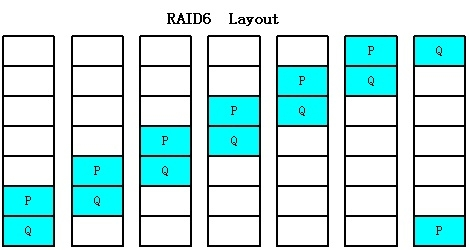

这种数据分布被称之为左循算法，PQ分布是可以通过条带号计算出来的。从上图我们也可以知道RAID的数据分布和物理磁盘是一一对应的，通过逻辑条带号就可以知道数据在每个物理磁盘上的分布情况。仔细考虑一下，RAID6之类的算法其实是一种数据保护算法，是一种数据编解码算法。传统的RAID将这种数据保护算法和物理磁盘进行了紧耦合绑定，这是传统RAID的一大特征。

其实，数据保护算法完全可以在一种逻辑域中完成，物理磁盘的管理可以在一种物理域中实现。逻辑域和物理域可以通过某种映射关系联系在一起。逻辑域和磁盘物理域拆分的最主要目的是加速数据重构过程，并且可以优化应用层性能一致性的问题。拆分之后的两个域之间关系可以表示如下：

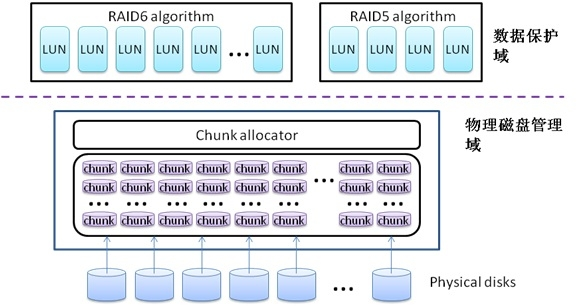

通过这种架构上的拆分，RAID中的数据分布将会发生本质上的变化。例如一个盘阵系统中有20块磁盘，其中创建了一个RAID5和一个RAID6。那么，通过物理磁盘管理域中allocator的资源分配，RAID5和RAID6 中的数据将会均匀分布在所有的20块磁盘中，而不是RAID5的数据分布在固定10块磁盘上，而RAID6的数据分布在另外10块磁盘上。这种数据布局打破了传统RAID的规则数据分布，带来的最大好处就是提升数据重构性能。通过上述描述，我们可以知道一块物理磁盘上存储的数据涉及到所有数据保护域的RAID。所以，当一块物理磁盘损坏之后，所有的RAID都会参与到数据重构的过程中，而不仅仅是一个RAID的事情了。这就好比传统RAID在处理数据重构时，都是“自家各扫门前雪”，但是，引入新型架构之后，数据重构过程就变成了“众人拾材火焰高”。

随着磁盘容量的进一步增大，数据重构和一致性性能将会变成RAID的两大最重要问题。在现有RAID基础上，如果不改变RAID架构，那么这个问题将会变得很棘手，难于解决。除非采用影响性能的擦除码来增强冗余度。

## RAID算法实现

RAID6算法是RAID实现过程中需要考虑的重要问题，从算法本身来看，RAID6算法是比较简单的：

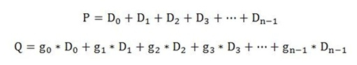

P码运算很简单，只需要把所有的数据累加起来就可以了。Q略有复杂，需要涉及到乘法运算。将上面的算式表示成矩阵的形式，表示如下：

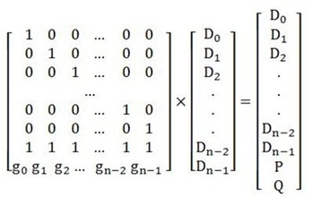

输入数据和编码矩阵的乘积就是我们需要存储的RAID数据。

我们知道CPU的强项不在于算术运算，一次乘法运算需要耗费很多个指令周期，因此，如何避免编解过程中的乘法运算成了RAID技术实现的重点。要做到高效编码，需要引入一个有限域——加逻华域。在加逻华域中，加法运算变成了异或XOR运算，显然能够提高效率。但是，在加逻华域中，乘法运算还是二进制乘法，还具有一定的复杂度，为了将这种乘法运算转换成简单的异或操作，又引入了对数/反对数操作。我们知道，通过对数操作可以将乘法转换成加法操作，这个特性被RAID编解码采用了。例如，A*B的操作就可以通过如下方式进行转换：

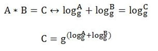

所以，A*B的计算过程可以分解成如下四步：

- 1）通过对数表查到logA的值A1

- 2）通过对数表查到logB的值B1

- 3）将A1和B1进行异或运算，得到C1 

- 4）通过反对数表查到C1对应的值C

通过上述方法，可以将RAID的所有编解码操作转换成了异或XOR操作，从而可以提高IO效率。


# Linux中的MD开源RAID

## 1、前言

RAID是IO路径中的关键模块，甚至在整个存储系统中，RAID是最为核心和复杂的模块。在Linux操作系统中，提供了一个开源的RAID，那就是MD RAID。该RAID可以实现RAID0、RAID1、RAID5和RAID6的功能，在产业界得到了广泛的应用。MD RAID对外采用块设备的形式导出，因此，通过块设备层的调度，BIO请求会被发送到RAID模块进行进一步的IO处理。在MD RAID一层，请求会被按照条带的方式进行切分，然后再按照RAID中磁盘的个数进行磁盘请求的映射。在请求的处理过程中，会存在条带小写问题，因此会引入“读-修改-写”的过程。在一个写请求发送往多个磁盘之前，校验信息（Parity）需要被计算处理，并且按照left-asymmetric或者right-asymmetric的数据布局方式将校验信息放置到多个磁盘中。

多年前，本人对MD-RAID进行了深入的代码分析，从中可以一窥RAID的实现机制。本代码分析基于Linux-2.6.18版本。

## 2、标记定义

MD-RAID中定义了很多标记，这些标记其实是一个Stripe在处理过程中所处的状态信息。具体的标记定义如下所示：

```c
#define R5_UPTODATE  0    /* 缓存页中有当前数据 */

#define R5_LOCKED    1    /* IO请求已经被分发下去 */

#define R5_OVERWRITE 2    /* 整页写操作 */

/* and some that are internal to handle_stripe */

#define R5_Insync    3    /* rdev && rdev->in_sync at start */

#define R5_Wantread 4    /*调度一个读IO的过程 */

#define R5_Wantwrite 5    /*调度一个写IO的过程 */

#define R5_Syncio 6    /* this io need to be accounted as resync io */

#define R5_Overlap 7    /* There is a pending overlapping request on this block */
```

#### 标记说明：

R5_UPTODATE和R5_LOCKED组合代表的操作状态

Empty：

！R5_UPTODATE，！R5_LOCKED：没有任何数据，也没有活动的请求

Want：

！R5_UPTODATE， R5_LOCKED：一个read请求已经被分发到相应的逻辑块

Dirty：

R5_UPTODATE， R5_LOCKED：缓存区中有新的数据，并且需要往磁盘上写

Clean：

R5_UPTODATE，！R5_LOCKED：缓存区中有数据，用户可以读取，和磁盘上的数据一致

#### 写方法定义：

更新写：

#define RECONSTRUCT_WRITE       1

读-修改-写

#define READ_MODIFY_WRITE       2

条带状态定义：

#define STRIPE_ERROR 1 ：条带出现错误

#define STRIPE_HANDLE 2 ：条带正在处理

#define STRIPE_SYNCING 3 ：条带数据正在同步之中

#define STRIPE_INSYNC 4 ：条带已经同步

#define STRIPE_PREREAD_ACTIVE 5 ：条带准备活动/有效

#define STRIPE_DELAYED 6 ：条带删除

## 3、主要数据结构

### 3.1  Stripe_head数据结构

条带头部信息定义如下：

```c
struct stripe_head {

    /* hash表的指针，连接所有stripe结构 */

    struct stripe_head  *hash_next, **hash_pprev;

    struct list_head    lru;  /* RAID5的私有配置信息 */

    sector_t            sector;    /* sector of this row */   

    int                pd_idx;    /* 校验盘的索引号 */

    unsigned long    state;    /* 操作状态标记信息 */                          

    atomic_t        count;    /* nr of active thread/requests */

    spinlock_t    lock;    /* 自旋锁 */

    struct r5dev {

        struct bio    req;

        struct bio_vec    vec;

        struct page    *page;    /* page缓存 */

        /* toread: MD设备的读请求bio
         * towrite: MD设备的写请求bio，第一阶段写的bio指针
         * written: MD设备的写请求bio，已经开始被调度写，第二阶段写的bio指针
         */

        /* towrite: MD设备的写请求bio，第一阶段写的bio指针
         * written: MD设备的血请求bio，已经开始被调度写，第二阶段写的bio指针
         */

        struct bio    *toread, *towrite, *written;    /* three kinds of queue */

        sector_t   sector;    /* 这一页中的块 */

        unsigned long  flags;    /* 操作标记 */

    } dev[1];    /* allocated with extra space depending of RAID geometry */

};
```

RAID5的写过程分成两个阶段：首先从stripe上读取数据，然后通过校验和计算之后，再往相应的stripe上写入数据。towrite这个bio对应于前一阶段的写，即从stripe上读取数据，written对应于后一阶段的写，即将计算完毕的数据写到相应的stripe（磁盘）上去。towrite和written结构体的交换发生在compute_parity（）函数中，以便调度函数处理。

这个数据结构很重要，RAID5的操作采用条带化的方式，即每个磁盘上面分出一个chunk，多个磁盘的chunk组成一个stripe，在n个chunk中，有一个chunk用作校验盘。从RAID5开始，stripe的思想被应用到磁盘阵列中。

在stripe_head结构体中，定义了*toread，*towrite，*written三个bio结构体，用于数据读写缓存。将读写缓存分开简化了读写操作，

条带是RAID5操作的最基本单元，其采用hash表的方式将多个条带信息组织在一起。

### 3.2  Private_data数据结构

在MD驱动中，每类RAID都定义了一个private_data的数据结构体，在该结构体中包含了操作磁盘阵列的链表、属性参数等内容。RAID5的结构体定义如下：

```c
struct raid5_private_data {

    struct stripe_head  **stripe_hashtbl;    /* 条带操作的hash链表 */

    mddev_t    *mddev;    /* MD的扩展设备结构体指针 */

    struct disk_info    *spare;

    /* chunk_size：RAID5设备的chunk长度，可能包括一个或者多个扇区，
     * chunk_size >> 9将返回每个chunk包含的扇区数（sectors per chunk）。RAID5
     * 设备对磁盘的操作是以扇区为单位的，但是，单位条带的长度为chunk，因此，
     * 必须完成扇区和chunk之间的转换
     */
    /* algorithm：该域描述了RAID5所采用的校验分布算法，通过该算法RAID5可以
     * 得到parity disk的分布。RAID5支持四种不同的校验分布算法，即：
     * 1、向左非对称算法  ALGORITHM_LEFT_ASYMMETRIC
     * 2、向右非对称算法  ALGORITHM_RIGHT_ASYMMETRIC
     * 3、向左对称算法    ALGORITHM_LEFT_SYMMETRIC
     * 4、向右对称算法    ALGORITHM_RIGHT_SYMMETRIC
     */

    int    chunk_size, level, algorithm;


    /* raid_disks：磁盘总数
     * working_disks：工作盘的数量
     * failed_disks：失效盘的数量
     */

    int    raid_disks, working_disks, failed_disks;

    int    max_nr_stripes;


    /*下面这些list是条带列表*/

    struct list_head    handle_list; /* 需要信息处理的条带列表 */

    struct list_head    delayed_list; /* 已经发送请求，延迟处理的条带列表 */

    atomic_t    preread_active_stripes; /* */


    char    cache_name[20];

    kmem_cache_t    *slab_cache; /* for allocating stripes */

    /*
     * Free stripes pool
     */

    atomic_t           active_stripes;

    /* inactive的stripe列表，当stripe hash中没有需要的stripe时，
     * 可以在inactive_list中申请一个stripe。
     */

    struct list_head    inactive_list;

    wait_queue_head_t    wait_for_stripe;

    wait_queue_head_t    wait_for_overlap;

    /* release of inactive stripes blocked,
     * waiting for 25% to be free
     */

    int    inactive_blocked;     

    spinlock_t    device_lock;

    struct disk_info    disks[0];

};
```

## 4、主要函数说明

### 4.1 RAID5中主要函数总结

- 1、              error( )，该函数用来出错处理，出错处理的过程是设置标志位，然后守护进程调用recovery的时候检测到标志位，就对出错信息进行处理。

- 2、              raid5_computer_sector( )，compute_blocknr( )函数用来将上层的逻辑块映射成物理设备的逻辑块号，另外还用来计算逻辑块号对应的stripe索引以及校验盘的索引号，这个函数应该实现了parity-algorithm。

- 3、              handle_stripe( )，该函数是处理stripe中IO请求的关键函数

- 4、              make_request( )，进行设备的I/O操作

- 5、              sync_request( )，进行设备的数据同步操作

- 6、              raid5d( )，内核的RAID管理守护进程

- 7、              run( )，RAID运行函数，这个函数在personality中

从上面的总结可以看出，系统中最重要的函数是handle_stripe( )。与RAID磁盘阵列打交道的函数都要通过该函数。

## 4.2  raid5_compute_sector

该函数实现了RAID5条带（stripe）的管理，通过这个函数可以实现如下三个方面的功能：

- 1、  计算逻辑块号在实际物理设备中的块号

- 2、  设备块号在raid磁盘阵列中的索引号

- 3、  计算得到校验盘在磁盘中的索引号

对RAID5设备的块I/O请求最终映射到一个或多个成员磁盘上，这个映射是在函数raid5_compute_sector（）中完成的，函数原型如下：

```c
static unsigned long raid5_compute_sector(unsigned long r_sector, unsigned int raid_disks, unsigned int data_disks, unsigned int * dd_idx, unsigned int * pd_idx, raid5_conf_t *conf);
```

##### 参数说明如下：

- r_sector：请求I/O的逻辑扇区号

- raid_disks：RAID5设备的磁盘总数

- data_disks：数据磁盘数，data_disks=raid_disks-1

- conf：RAID5设备的私有数据结构体

raid5_compute_sector（）函数的目的是计算出响应该IO请求的数据磁盘索引和校验磁盘索引，以及在这些磁盘上的物理扇区索引。前两者的计算结果通过指针dd_idx和pd_idx返回，物理扇区索引值直接返回。

##### 函数执行过程：

- 1、  根据逻辑扇区编号r_sector计算出扇区所在的chunk编号和在chunk内的扇区偏移

    chunk_number = r_sector / sectors_per_chunk
    chunk_offset = r_sector % sectors_per_chunk

- 2、  如果不考虑校验数据的因素，编号为chunk_number的数据块所在的磁盘编号为：

    dd_idx = chunk_number % data_disks

chunk在对应磁盘上的物理stripe号为：stripe = chunk_number / data_disks。由此，可以计算出逻辑扇区号在目标磁盘上的编号：

    new_sector = (sector_t)stripe * sectors_per_chunk + chunk_offset

在数据操作的时候，可以直接往dd_idx盘的new_sector位置处写数据。

- 3、  以raid_disk为一组，则对应chunk在组中的编号为：stripe % raid_disks。

根据不同的算法得到不同的parity disk和 data disk的索引。

向左算法的parity disk的编号为：data_disks – stripe % raid_disks

向右算法的parity disk的编号为：stripe % raid_disks

- 4、  数据盘编号计算如下：

    - 不对称算法：chunk_number % data_disks，如果该值大于/等于校验磁盘编号，则数据盘需要加1

    - 对称算法：( 校验磁盘号 + 1 + chunk_number % data_disks ) % raid_disks

## 4.3  compute_block

函数原型：static void compute_block(struct stripe_head *sh, int dd_idx);

输入参数：

*sh：需要操作的条带

dd_idx：数据盘索引号，需要恢复数据的盘

无论是从故障盘上恢复数据，还是在同步过程中将故障盘的信息恢复到备用盘，都需要从磁盘条带上将故障信息恢复出来，这一过程可以在compute_block函数中完成。

其中sh指向要计算的条带单元所在的条带头结构体，dd_idx为故障磁盘的编号。需要注意的是，dd_idx所处的条带单元在条带头结构体中可能代表一个数据条带，或者一个校验条带。

计算方法采用异或算法，所有操作都是在成员磁盘缓冲头结构体（page）上进行。为保证计算正确，在调用前，已经将所有其它磁盘上条带单元的数据读取到对应这个磁盘的缓冲头结构体所关联的缓冲区中。在计算过程中，进行检查，如果缺少任何一个磁盘的数据，则打印内核错误消息。在计算完成后，修改故障磁盘对应缓冲头结构体的状态标志位，以表明其中的条带数据是有效的。

## 4.4  compute_parity

compute_parity（）函数实现如下两个方面的功能：

- 1、  RAID5校验和的计算

- 2、  将towrite结构体挂接到written中，使得写操作进入第二个阶段

在RAID5程序中，完成数据校验有两种方法：

- 1、  read-modefy-write：读-修改-写

采用这种方法的基本运算过程如下：[（旧校验数据）XOR（旧数据）]XOR（新数据）=新校验值。

- 2、  reconstruct-write：更新写

采用这种方法的基本运算过程如下：（好的旧数据）XOR（新数据）=新的校验值

这两种方法实现的示意图如下：

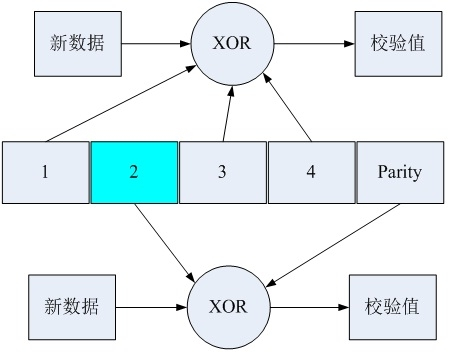

（图中假设第2块数据需要更新）

RAID5校验算法的实现：

RAID5在写的时候有两种方法，一种是读-修改-写操作，另一种是更新写操作。

在读-修改-写操作过程中，需要将旧的校验值、旧的更新数据读出来，然后需要做两次XOR操作，其算法的基本过程如下：[（旧校验数据）XOR（旧数据）]XOR（新数据）=新校验值。

更新写过程需要将无须更新的旧数据读出来，做一次XOR操作（这里所说的一次XOR操作是指调用check_xor()这个宏一次），其算法的基本过程如下：（好的旧数据）XOR（新数据）=新的校验值。

## 4.5  handle_stripe

handle_stripe函数是RAID5驱动中最重要的函数。在RAID5驱动中有三个函数会调用handle_stripe（），如下图所示：

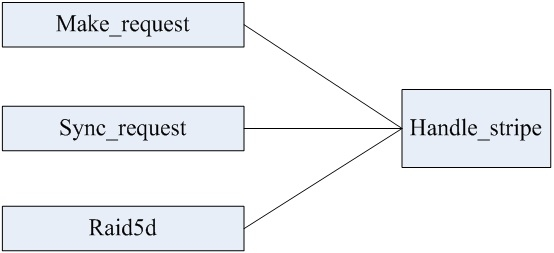

访问该函数的话可能返回的结果：

- 1、      如果有数据，那么返回读请求的数据

- 2、      如果数据被成功的写入磁盘，那么返回写请求

- 3、      调度读进程

- 4、      调度写进程

- 5、      返回奇偶校验的确认信息

        handle_stripe函数实现了IO读写等功能，主要功能说明如下：

- 1、              当Page页（缓存）中存在数据的时候，可以将缓存中的数据拷贝到bio中，实现IO的正常读写，并且返回

- 2、              当RAID出现故障的时候，不需要进行任何操作了，但是需要将系列IO读写请求取消掉。

- 3、              实现IO写操作，RAID5的IO写操作比较复杂，其分为满块写和非满块写，当为非满块写的时候需要首先读取stripe中的数据，然后再计算校验和写入磁盘（置相应的标志位）。调度一个写过程。

- 4、              实现IO读操作，完成一个读过程的调度，其操作过程是置相应的标志位want_read。

- 5、              实现IO request的请求分发，构造bio，调用generic_make_request ( )函数。

下面对handle_stripe函数中实现的功能单元进行分析。

- 1、IO读完成操作

当handle_stripe（）调用generic_make_request（）函数向底层驱动程序分发bio请求以后，接下来的读数据操作就由底层的驱动和硬件设备完成。当驱动程序完成读操作之后回调读完成函数：raid5_end_read_request（）。在这个回调函数中，清除IO读标记R5_LOCKED，并且有可能置读数据有效标记R5_UPTODATE（如果此次操作没有错误的话）。关键代码如下：

set_bit(R5_UPTODATE, &sh->dev[i].flags);

clear_bit(R5_LOCKED, &sh->dev[i].flags);

并且设定list挂接标记STRIPE_HANDLE，代码如下：

set_bit(STRIPE_HANDLE, &sh->state);

最后调用list分配函数release_stripe（）。

在release_stripe（）函数中，将sh挂接到handle_list中，并且唤醒守护线程Raid5d（）。通过Raid5d（）函数调用handle_stripe（）。

此时，程序满足条件 toread  R5_UPTODATE，因此，进入IO读完成代码区，该代码的实现比较简单，通过copy_data（）函数调用将page缓存中的数据拷贝到bio中，并且返回给上层。

具体的操作过程可以描述如下：

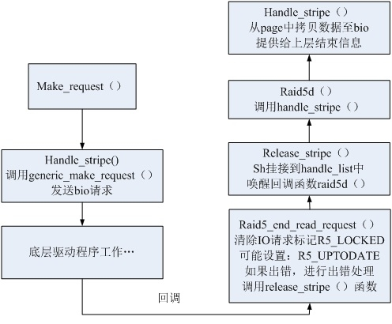

- 2、故障发生时清除IO请求

RAID5只能处理最多坏一个盘的情况，如果坏盘数目大于1的话，那么IO请求等操作将变得没有任何意义。

在handle_stripe（）中，会统计所有的标记位数量和坏盘的数目，但出现failed > 1的情况时，停止一切的IO读写操作，调用结束函数直接结束IO读写操作。

当驱动程序正在进行syncing的时候，如果发现坏盘数据大于1，那么立即停止sync操作，调用md_done_sync(conf->mddev, STRIPE_SECTORS,0)函数来停止同步操作。

- 3、写操作完成功能

写操作是一个比较复杂的过程，守护进程raid5d（）第二次调用handle_stripe（）函数，即第三次进入handle_stripe（）函数时（第一次由make_request（）调用，第二次由raid5d（）调用），会执行写操作完成功能。

写操作结束时的条件如下：

    - 1、  written有效

    - 2、  RAID盘阵同步，R5_Insync

    - 3、  没有IO请求操作，!R5_LOCKED

    - 4、  数据是有效的，R5_UPTODATE

在（1）满足的条件下，或者满足如下两个条件：

    存在一个故障盘，failed == 1

    故障盘的索引号正确，failed_num == sh->pd_idx

- 4、读调度功能

在以下四种情况下，内核需要调度读操作：

u  正常数据读。标记的状态为：!R5_LOCKED   !R5_UPTODATE   toread

u  非整页写的时候，需要读取数据，标记状态为：towrite    !R5_OVERWRITE

u  同步的时候需要读取数据，标记的状态为：syncing

u  出错的时候需要读取数据，标记的状态为：failed toread || ( towrite && !R5_OVERWRITE )

如果在降级模式下，即存在一块坏盘的情况下，可以通过compute_block（）来计算得到所需要的数据。如果在同步的情况下，首先设定相应的标记，来调度一个读数据过程，关键代码如下：

set_bit(R5_LOCKED, &dev->flags);

set_bit(R5_Wantread, &dev->flags);

在handle_stripe（）函数的最后，通过R5_Wantread标记构造一个读bio，并且调用generic_make_request（）函数将这个读bio请求分发到底层驱动程序，那么具体的读操作就由低层驱动程序和硬件来实现了。实现完毕之后再调用回调函数r5_end_read_request（）。接下来的过程就回到IO读完成操作这个地方了。

- 5、写调度功能

RAID5写操作是驱动程序中比较复杂的一块。他通过多次调用handle_stripe（）函数来实现一个完整的写过程。

对于RAID5的写操作有多种方式，包括满块写和非满块写，又有read_modefy-write和reconstruct_write两种写方法，这两种写方法和盘阵的具体数据校验方法相关。

整个RAID5的写操作可以分为两个阶段，第一个阶段实际上是数据读阶段，标记为towrite，等到将磁盘里的旧数据读上来之后，调用compute_parity（）函数进行相应的数据校验，得到新的校验值。然后进入第二阶段，将towrite挂接到written上，开始将实际缓存中有效的数据写到磁盘上去，完成整个IO写过程。

这两个IO写过程可以用图表示如下：


写过程的具体描述：

上层发起ＩＯ请求，通过make_request_fn（）->make_request（）来调用handle_stripe（）函数，这是写过程第一次进入这个函数。由于没有此时的状态处于Empty（！R5_LOCKED，！R5_UPTODATE），因此，程序需要判断其需要进行的读写方法，即读-修改-写还是更新写，用两个变量来表示，即rmw和rcw。

选择好读写方法之后，程序会调度一个写进程，因为他需要读取磁盘上的旧数据，关键代码为：

    set_bit(R5_LOCKED, &dev->flags);

    set_bit(R5_Wantread, &dev->flags);

在handle_stripe（）函数的最后会根据这些设定的标志来构造一个读bio，最后会将这个读请求bio通过gengeric_make_request（）函数发送到底层驱动程序。

接下来的事情由低层驱动程序和硬件完成…

读操作完成之后，底层驱动程序回调raid5_end_read_request（）函数，该函数是读请求结束处理函数。在该函数中将R5_LOCKED置位无效，并且如果没有读错误的情况下，设定R5_UPTODATE标记有效（实际上，该标记有没有效，并不是说还要去将page缓存中的数据读到bio中，后面所涉及到的数据校验操作都是在page缓存中完成的）。另外，需要设置STRIPE_HANDLE标记，如下：

    set_bit(STRIPE_HANDLE, &sh->state);

该标记的作用是将sh挂接到handle_list中，然后由raid5d（）守护进程对sh进行操作。

因此接下来的操作为：

    raid5_end_read_request（）-> release_stripe（）-> 唤醒 raid5d（）

raid5d（）守护进程调用handle_stripe（），这是第二次进入handle_stripe（）。

此次进入handle_stripe（）函数，满足如下条件：

towirte    rmw == 0   rcw == 0

此时可以开始一个正常的写过程调度…

首先需要进行缓存区的数据校验，调用compute_parity（），通过该函数一方面得到了正确的校验数据，另一方面使得写过程进入第二个阶段，towrite已近挂接到written。

标记R5_Wantwrite调度一个写过程，即：

    set_bit(R5_Wantwrite, &sh->dev[i].flags);

在handle_stripe（）函数的最后通过上面的标记构造一个写IO的bio数据块，并且调用generic_make_request（）函数将该请求发送到底层驱动程序。

接下来的工作就让底层驱动程序和硬件来完成吧…

请求完成之后，底层驱动程序会调用raid5_end_write_request（）回调函数，该回调函数清除请求标记R5_LOCKED，设置STRIPE_HANDLE标记，然后调用release_stripe（）函数，该函数又将sh挂接到handle_list上，然后唤醒守护进程raid5d（），raid5d（）会第二次调用handle_stripe（）。

第三次进入handle_stripe（）。

此次进入handle_stripe（）完成写操作结束处理。

写过程的详细描述见下图：

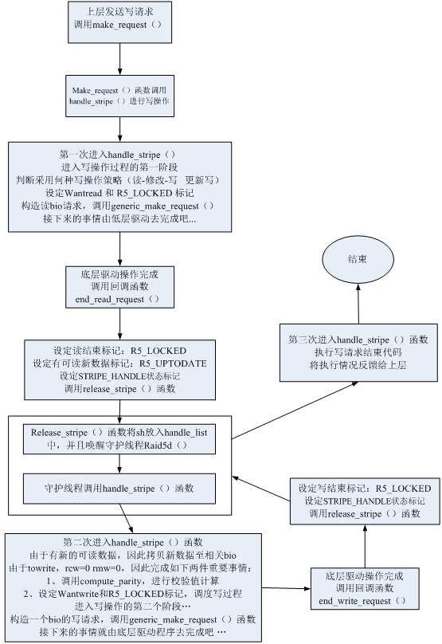

- 6、IO请求分发功能

在handle_stripe（）函数中实现IO请求分发功能。构造读写IO的bio。

调用generic_make_request（）函数将请求分发给底层驱动程序。

- 7、同步操作的支持

    Raid5d() -> md_check_recovery() -> md_do_sync() -> sync_request() -> handle_stripe()

上述过程是一个同步操作过程的函数调用关系链。从这个关系链中可以知道，同步操作最后是由handle_stripe（）函数来实现的。

程序会判断如下三个标记来决定是否执行同步数据处理程序段：

  syncing：该标记说明驱动程序此刻需要完成同步的操作

  STRIPE_INSYNC：该标记说明磁盘阵列是否处于同步的状态，如果!(test_bit(STRIPE_INSYNC))，那么说明磁盘处于非同步状态。

  failed：标记了故障磁盘实效的数目

满足数据同步的条件之后，驱动进入数据同步的代码段。

该代码段有三种功能：

- 1、              校验和的确认，if(failed == 0)。当md_check_recovery（）程序结束同步操作的时候，会仍然置RECOVERY_NEEDED标记，这看起来很奇怪，实际上做一次校验确认罢了。这时候，需要用到if(failed == 0){}下面的代码。

在这段代码中，调用compute_parity(sh, CHECK_PARITY)来计算校验和，然后通过memcmp（）函数进行比较确认。

- 2、              调用compute_block（）函数计算恢复数据，然后设置R5_LOCKED和R5_Wantwrite标记来调度一个写过程。

- 3、              结束stripe同步操作。当处于同步操作时，数据已经处于同步状态后调用md_done_sync（）函数结束整个同步过程，并且清除STRIPE_SYNCING标记。

## 4.6  make_request函数说明

函数原型：static int make_request (request_queue_t *q, struct bio * bi)

参数：*q，请求队列

           *bi，IO请求数据结构

各个RAID Level的IO请求函数相同，但是他们的实现是不一样的。RAID1中make_request（）函数的主要功能是将上层的bio分发到底层驱动中去，但是，RAID5中的函数并没有实现这样的功能，其主要实现的功能如下：

- 1.       通过raid5_compute_sector（）函数得到逻辑块号所对应的实际物理块号，另外还得到了RAID磁盘阵列中所对应的数据盘索引和校验盘索引。

- 2.       通过get_active_stripe（）函数得到一个stripe，如果在stripe的hash表中无法找到sector对应的条带，那么就从inactive_list中分配一个stripe，如果没有多余的条带，那么整个操作无法进行。如果能够得到一个active的stripe，那么将输入的bio直接挂接到active_stripe上。

- 3.       调用handle_stripe（）函数实现真正的IO读写请求操作。

从上面的分析可以看出，RAID5的make_request（）函数实际上实现了条带（stripe）的查找/申请和bio请求数据结构的挂接事情。真正的读写操作由handle_stripe（）实现。

## 4.7  sync_request函数说明

Sync_request（）这个函数是RAID5的同步处理函数。

该函数注册到md的mdk_personality_s结构体下的sync_request中。

因此，在md_do_sync（）函数中可以采用如下方法来调用RAID5的同步处理函数：

mddev->pers->sync_request(mddev, j, currspeed < sysctl_speed_limit_min);

在分析md_check_recovery（）这个函数的时候，我们可以看到，当需要做数据同步或者数据恢复的时候，md_check_recovery（）是需要调用md_do_sync（）过程的。

函数原型：static int sync_request (mddev_t *mddev, sector_t sector_nr, int go_faster)

输入参数：   *mddev，md设备

                            Sector_nr，起始扇区

                            go_faster，需不需要延迟操作

返回值：这一次完成的扇区数目

## 4.8  raid5d函数说明

这是RAID5的守护线程，该函数在RAID5初始化的时候被注册：

    mddev->thread = md_register_thread(raid5d, mddev, "%s_raid5");

在守护线程运行的一开始会调用md_check_recovery（），通过该函数来检查存储是否有故障，如果有故障，那么调用md_do_sync（）函数。md_do_sync（）函数实际上是不会完成具体同步工作的，它会调用相应级别的RAID同步处理函数sync_request（）去实现具体功能。

Raid5d（）守护线程是一个while(1)的死循环，他的退出条件是：list_empty(&conf->handle_list)。即当handle_list为空的情况下，raid5d退出睡眠。

Raid5d（）守护线程从handle_list中得到active stripe，然后调用handle_stripe（）函数对该stripe进行处理。

Handle_stripe（）处理完之后，该stripe又被挂接到不活动的list（inactive list）上。

## 4.9  两个IO读写回调函数说明

RAID5中有两个请求结束回调函数，他们为：

- 1、raid5_end_read_request（）

- 2、raid5_end_write_request（）

这两个回调函数在generic_make_request（）的时候被注册到bio中。

Raid5_end_read_request（）函数实现如下功能：

u  清除IO请求标志：R5_LOCKED

u  如果数据有效（update），那么设置数据有效标记：R5_UPTODATE

u  如果数据读写错误，那么调用md_error（），需要recovery。

u  设置stripe的handle_list标记，STRIPE_HANDLE，说明要让Raid5d（）调用handle_stripe进行处理

Raid5_end_write_request（）函数实现如下功能：

u  清除IO请求标记：R5_LOCKED

u  如果写发生错误（uptodate == 0），那么调用md_error（），需要recovery。

u  设置stripe的标记STRIPE_HANDLE，说明要让raid5d（）调用handle_stripe（）进行处理。

## 4.10 出错函数error说明

error（）函数是RAID5出错处理函数，其被注册到mdk_personality_t的error_handler函数上，所以在MD驱动程序中当出现IO读写错误的时候，直接调用md_error（）函数即可。

在raid5.c文件中，有两个地方调度md_error（），他们是raid_end_read_request（）和raid_end_write_request（）这两个回调函数。当读写I/O错误的时候，回调函数就会调用md_error（），然后设置相应的标志位，进行recovery操作。

函数原型：static void error(mddev_t *mddev, mdk_rdev_t *rdev)

参数： *mddev，md设备的数据结构

            *rdev，具体出错的设备

## 4.11  list链表处理函数release_stripe说明

release_stripe（）函数封装了_release_stripe（）。因此，讨论_release_stripe（）。

函数原型：static inline void __release_stripe(raid5_conf_t *conf, struct stripe_head *sh)

参数：*conf，RAID5私有数据结构体

           *sh，需要处理的stripe

该函数实现了handle_list，delayed_list和inactive_list链表之间的转换关系处理。

首先需要讲一下几个重要的状态标记：

1、              STRIPE_PREREAD_ACTIVE：该标记为预读标记，当RAID5 进行IO写的时候需要进行该标记的判断，即在读的第一阶段需要判断该标记。实际上根据字面意思也知道，在写操作的时候需要一个pre_read过程，即读操作的第一个步骤。

2、              STRIPE_DELAYED：该标记为延迟处理标记，该标记有效时，release_stripe（）函数会将list挂接到delayed_list中。

从上面的分析中，我们可以看到写操作的第一个步骤是一个pre_read的过程，并且是一个延迟操作的过程。延迟操作往往需要等到handle_list中的stripe处理完成之后，再从delayed_list挂接到handle_stripe中。因为在写操作的第一阶段需要置Wantread标记，调度一个读操作，那么STRIPE_PREREAD_ACTIVE标记必须有效。而该标记的设置在raid5_activate_delayed（）函数中实现。该函数的调用又需要等到handle_list为空（raid5d（）中实现）。这个过程可以描述成如下流程：

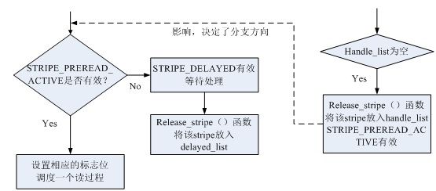

Release_stripe（）函数执行过程：

1、  当STRIPE_HANDLE标记有效的时候，可以将stripe挂接到handle_list或者delayed_list上，否则这个stripe将会被挂接到inactive_list上。

2、  当STRIPE_DELAYED标记有效的时候，stripe将会被挂接到delayed_list上，实现一个延迟处理。否则，stripe将会被挂接到handle_list上。

3、  挂接到handle_list或者delayed_list上之后，调用md_wakeup_thread（conf->mddev->thread）函数唤醒守护进程。

5、RAID5 中I/O读写方法
RAID5中I/O的读写操作由make_request发起，该函数被注册到mdk_personality_s结构的make_request函数中，当操作系统调用make_request_fn函数进行块设备读写操作的时候，直接调用make_request()函数实现相应功能。

在RAID1的make_request函数中直接将上层的bio分发下去，实现IO读写操作，但是在RAID5中的实现方法有所不同，其调用了handle_stripe函数实现读写操作。

RAID5中实现IO读写操作的函数主要有：

- 1、  make_request（）。该函数传递上层发送的IO请求
 
- 2、  handle_stripe（）。实现IO读写请求的主干函数
 
- 3、  generic_make_request（）。发送IO请求至底层驱动程序
 
- 4、  raid5_end_read_request（）。读操作结束回调函数
 
- 5、  raid5_end_write_request（）。写操作结束回调函数
 
- 6、  release_stripe（）。Sh挂接至handle_list处理函数
 
- 7、  raid5d（）。守护线程

#### I/O写操作过程：

写操作过程历经如下函数调用过程：

读取数据过程：

    Make_request（）-> handle_stripe（）->generic_make_request（）底层驱动工作…

计算/写数据过程：

    Raid5_end_read_request（）-> release_stripe（）-> raid5d ()-> handle_stripe（）底层驱动工作…

结束写过程：

    Raid5_end_write_request（）->release_stripe（）->raid5d（）->handle_stripe（）

         具体的IO写过程参考handle_stripe（）写过程分析。

#### I/O读操作过程：

IO读过程比较简单，其经历的函数调用过程如下：

调度一个读过程：

    Make_request（）-> handle_stripe（）-> generic_make_request（）底层驱动工作…

从page缓存中拷贝数据：

    Raid5_end_read_request（）-> release_stripe（）-> raid5d（）-> handle_stripe（）

具体的分析可以参考handle_stripe（）读过程分析。

### 6、几个list的关系及数据挂接关系

RAID5中涉及的几个list：

1、  handle_list：这个list中的stripe需要分发执行

2、  delayed_list：这个list中的stripe延迟分发执行

3、  inactive_list：这个list中的stripe为不活动的条带

当需要进行一个IO操作的时候，首先要获取一个active stripe（get_active_stripe（）函数实现），这个stripe可以从hash表中找到，当找不到的时候，可以从inactive_list中请求一个（get_free_stripe（）函数实现）。当handle_stripe（）函数将stripe处理完毕之后，release_stripe（）函数又将stripe放入inactive_list。

几个list的挂接关系可以基本描述如下：

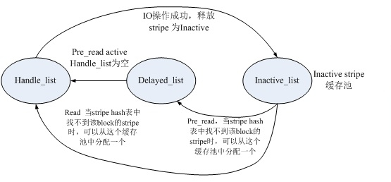

### 7、错误处理数据恢复方法

RAID需要进行IO的出错处理。在RAID5这个级别可以纠正由于一个磁盘故障导致的错误，在raid驱动中通过error（）函数来报错，然后通过md_check_recovery（）函数来检错，通过md_do_sync（）、sync_request（）函数来纠错。他的运行机制和相互之间的逻辑关系又是怎样的呢？

基本的数据恢复过程如下图所示：

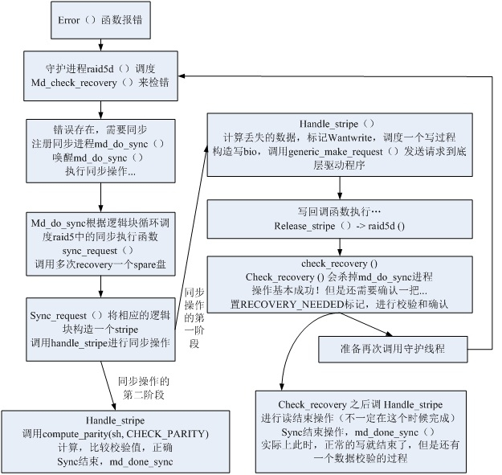

在RAID5系统中，其数据同步/恢复操作分为两个阶段：

- 1、  数据写阶段，将有效数据写到spare盘上去。

- 2、  数据校验阶段，确认校验和是否正确，如果正确，那么整个recovery操作才算真正的结束。
